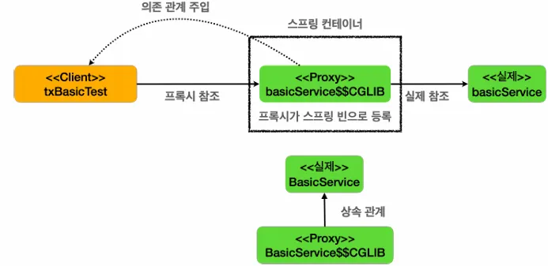
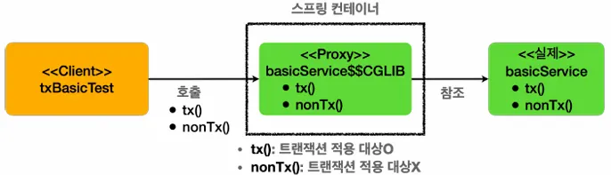
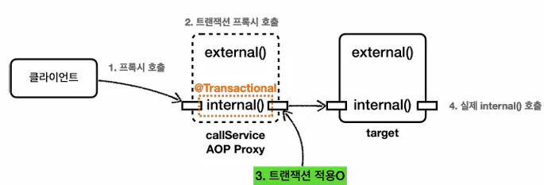
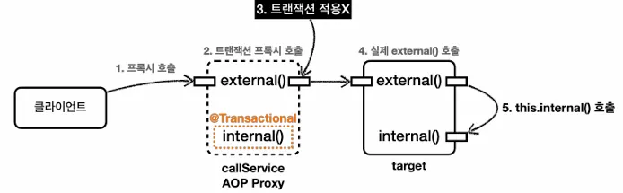
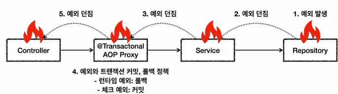

프로젝트는 다음과 같은 설정에서 진행했습니다.

- Boot : 3.5.4
- Dependencies : Lombok, Spring Data JPA, Lombok

```java
plugins {
    id 'java'
    id 'org.springframework.boot' version '3.5.4'
    id 'io.spring.dependency-management' version '1.1.7'
}

group = 'stduy'
version = '0.0.1-SNAPSHOT'
description = 'springtx'

java {
    toolchain {
        languageVersion = JavaLanguageVersion.of(17)
    }
}

configurations {
    compileOnly {
        extendsFrom annotationProcessor
    }
}

repositories {
    mavenCentral()
}

dependencies {
    implementation 'org.springframework.boot:spring-boot-starter-data-jpa'
    compileOnly 'org.projectlombok:lombok'
    runtimeOnly 'com.h2database:h2'
    annotationProcessor 'org.projectlombok:lombok'
    testImplementation 'org.springframework.boot:spring-boot-starter-test'
    testRuntimeOnly 'org.junit.platform:junit-platform-launcher'

    // 테스트에서 Lombok 사용
    testCompileOnly 'org.projectlombok:lombok'
    testAnnotationProcessor 'org.projectlombok:lombok'
}

tasks.named('test') {
    useJUnitPlatform()
}
```

## 트랜잭션 적용 확인

`@Transactional`을 통해 선언적 트랜잭션 방식을 사용하면 단순히 어노테이션 하나로 트랜잭션을 적용할 수 있습니다. 그런데 이 기능은 트랜잭션 관련 코드가 눈에 보이지 않고, AOP를 기반으로 동작하기 때문에, 실제 트랜잭션이 적용되고 있는지 아닌지를 확인하기가 어렵습니다.

코드를 통해 스프링 트랜잭션이 실제 적용되고 있는지 확인하는 방법을 알아보겠습니다.

**TxApplyBasicTest**

```java
package stduy.springtx;

import static org.assertj.core.api.AssertionsForClassTypes.*;

import org.junit.jupiter.api.Test;
import org.springframework.aop.support.AopUtils;
import org.springframework.beans.factory.annotation.Autowired;
import org.springframework.boot.test.context.SpringBootTest;
import org.springframework.boot.test.context.TestConfiguration;
import org.springframework.context.annotation.Bean;
import org.springframework.transaction.support.TransactionSynchronizationManager;

import jakarta.transaction.Transactional;
import lombok.extern.slf4j.Slf4j;

@Slf4j
@SpringBootTest
public class TxApplyBasicTest {

	@Autowired
	BasicService basicService;

	@Test
	void proxyCheck() {
		log.info("aop class={}", basicService.getClass());
		assertThat(AopUtils.isAopProxy(basicService)).isTrue();
	}

	@Test
	void txTest() {
		basicService.tx();
		basicService.nonTx();
	}

	@TestConfiguration
	static class TxApplyBasicTestConfiguration {
		@Bean
		BasicService basicService() {
			return new BasicService();
		}
	}

	@Slf4j
	static class BasicService {

		@Transactional
		public void tx() {
			log.info("call tx");
			boolean txActive = TransactionSynchronizationManager.isActualTransactionActive();
			log.info("tx active={}", txActive);
		}

		public void nonTx() {
			log.info("call nonTx");
			boolean txActive = TransactionSynchronizationManager.isActualTransactionActive();
			log.info("tx active={}", txActive);
		}
	}

}
```

### proxyCheck() - 실행

`AopUtils.isAopProxy()` : 선언적 트랜잭션 방식에서 스프링 트랜잭션은 AOP를 기반으로 동작합니다. `@Transactional`을 메서드나 클래스에 붙이면 해당 객체는 트랜잭션 AOP 적용의 대상이 되고, 결과적으로 실제 객체 대신에 트랜잭션을 처리해주는 프록시 객체가 스프링 빈에 등록됩니다. 그리고 주입을 받을 때도 실제 객체 대신에 프록시 객체가 주입됩니다.

클래스 이름을 출력해보면 `TxApplyBasicTest$BasicService$$SpringCGLIB$$0` 라고 프록스 클래스의 이름이 출력되는 것을 확인할 수 있습니다.

### 스프링 컨테이너에 트랜잭션 프록시 등록



`@Transactional` 어노테이션이 특정 클래스나 메서드에 하나라도 있으면 트랜잭션 AOP는 프록시를 만들어서 스프링 컨테이너에 등록합니다. 그리고 실제 `basicSerivce` 객체 대신에 프록시인 `basicService$$CGLIB`를 스프링 빈에 등록합니다. 그리고 프록시는 내부에 실제 `basicService`를 참조하게 되는데 핵심은 실제 객체 대신 프록시가 스프링 컨테이너에 등록되었다는 점입니다.

클라이언트인 `txBasicTest`는 스프링 컨테이너에 `@Autowired BasicService basicService`로 의존관계 주입을 요청합니다. 스프링 컨테이너에 실제 객체 대신에 프록시가 스프링 빈으로 등록되어 있기 때문에 프록시를 주입합니다.

프록시는 `BasicService`를 상속하게 만들어지기 때문에 다형성을 활용할 수 있습니다. 따라서 `BasicService` 대신 프록시인 `BasicService$$CGLIB`를 주입할 수 있습니다.

### 트랜잭션 프록시 동작 방식



- 클라이언트가 주입 받은 `baiscService$$CGLIB`는 트랜잭션을 적용하는 프록시

※ application.yml에 다음과 같은 설정으로 트랜잭션 시작과 종료 로그 출력가능

```java
logging:
  level:
    org:
      springframework:
        transaction:
          interceptor: TRACE
          
=================================================
// txTest() 실행
... Getting transaction for [stduy.springtx.TxApplyBasicTest$BasicService.tx]
... call tx
... tx active=true
... Completing transaction for [stduy.springtx.TxApplyBasicTest$BasicService.tx]
... call nonTx
... tx active=false
```

로그를 통해 `tx()` 호출시에는 `tx active=true`를 통해 트랜잭션이 적용된 것을 확인할 수 있으며 상세 로그를 통해 시작하고 완료한 내용 또한 확인할 수 있습니다.

## 트랜잭션 적용 위치

`@Transactional`은 적용 위치에 따른 우선순위가 있습니다.

스프링에서 우선순위는 항상 **더 구체적이고 자세한 것이 높은 우선순위**를 가지게 됩니다. 이것만 기억하면 스프링에서 발생하는 대부분의 우선순위를 쉽게 기억할 수 있습니다. 그리고 더 구체적인 것이 더 높은 우선순위를 가지는 것이 상식적으로도 자연스럽습니다.

예를 들어서 메서드와 클래스에 어노테이션을 붙일 수 있다면 더 구체적인 메서드가 더 높은 우선순위를 가지게됩니다. 인터페이스와 해당 인터페이스를 구현한 클래스에 어노테이션을 붙일 수 있다면 더 구체적인 클래스가 더 높은 우선순위를 가집니다.

**TxLevelTest**

```java
package stduy.springtx;

import org.junit.jupiter.api.Test;
import org.springframework.beans.factory.annotation.Autowired;
import org.springframework.boot.test.context.SpringBootTest;
import org.springframework.boot.test.context.TestConfiguration;
import org.springframework.context.annotation.Bean;
import org.springframework.transaction.annotation.Transactional;
import org.springframework.transaction.support.TransactionSynchronizationManager;

import lombok.extern.slf4j.Slf4j;

@SpringBootTest
public class TxLevelTest {

	@Autowired
	LevelService levelService;

	@Test
	void orderTest() {
		levelService.write();
		levelService.read();
	}

	@TestConfiguration
	static class TxApplyLevelConfig {
		@Bean
		LevelService levelService() {
			return new LevelService();
		}
	}

	@Slf4j
	@Transactional(readOnly = true)
	static class LevelService {
		@Transactional(readOnly = false)
		public void write() {
			log.info("call write");
			printTxInfo();
		}

		public void read() {
			log.info("call read");
			printTxInfo();
		}
		private void printTxInfo() {
			boolean txActive = TransactionSynchronizationManager.isActualTransactionActive();
			log.info("txActive=" + txActive);

			boolean readOnly = TransactionSynchronizationManager.isCurrentTransactionReadOnly();
			log.info("readOnly=" + readOnly);
		}
	}
}
```

스프링의 `@Transactional`은 다음 두 가지 규칙이 있습니다.

- 우선순위 규칙
- 클래스에 적용하면 메서드는 자동 적용

### **우선순위**

트랜잭션을 사용할 때는 다양한 옵션을 사용할 수 있습니다. 그런데 어떤 경우에는 옵션을 주고, 어떤 경우에는 옵션을 주지 않으면 어떤 것이 선택될까요? 예를 들어 읽기 전용 트랜잭션 옵션을 사용하는 경우와 아닌 경우를 비교해보겠습니다. (읽기 전용 옵션에 대한 자세한 내용은 이후에 다루니 적용 순서에 집중하겠습니다)

- `LevelService`의 타입에 `@Transactional(readOnly = true)`이 붙어있다.
- `write()` : 해당 메서드에 `@Transactional(readOnly = false)`이 붙어있다.
    - 이렇게 되면 타입에 있는 `@Transactional(readOnly = true)`와 해당 메서드에 있는 `@Transactional(readOnly = false)` 둘 중 하나를 적용해야 한다.
    - 클래스 보다는 메서드가 더 구체적이므로 메서드에 있는 `@Transactional(readOnly = false)` 옵션을 사용한 트랜잭션이 적용된다.

### 클래스에 적용하면 메서드는 자동 적용

- `read()` : 해당 메서드에 `@Transactional`이 없다. 이 경우 더 상위인 클래스를 확인한다.
    - 클래스에 `@Transactional (readOnly = true)` 이 적용되어 있다. 따라서 트랜잭션이 적용되고 `(readOnly = true)` 옵션을 사용하게 된다.

참고로 `(readOnly = false)` 는 기본 옵션이기 때문에 보통 생략하지만 이해를 위해 기본 옵션을 적어두었습니다.

### 실행 결과

```java
// write() 호출
Getting transaction for [stduy.springtx.TxLevelTest$LevelService.write]
call write
txActive=true
readOnly=false
Completing transaction for [stduy.springtx.TxLevelTest$LevelService.write]

// read() 호출
Getting transaction for [stduy.springtx.TxLevelTest$LevelService.read]
call read
txActive=true
readOnly=true
Completing transaction for [stduy.springtx.TxLevelTest$LevelService.read]
```

- `write()`에서는 `tx readOnly=false` : 읽기 쓰기 트랜잭션이 적용됨. `readOnly`가 아님
- `read()`에서는 `tx readOnly=true` : 읽기 전용 트랜잭션 옵션인 `readOnly` 적용

**※ 인터페이스에서도 `@Transactional`을 적용할 수는 있지만 AOP를 적용하는 방식에 따라 AOP가 적용이 되지 않는 경우가 있기 때문에 스프링 공식 매뉴얼에 따라 가급적 구체적 클래스에 어노테이션을 사용해야합니다.**

## 트랜잭션 AOP 주의 사항 - 프록시 내부 호출1

**`@Transactional`**  을 사용하면 스프링의 트랜잭션 AOP가 적용되며 기본적으로 프록시 방식의 AOP를 사용합니다. 앞서 배운 것처럼 `@Transactional`을 적용하면 프록시 객체가 요청을 먼저 받아서 트랜잭션을 처리하고, 실제 객체를 호출합니다.

따라서 트랜잭션을 적용하려면 항상 프록시를 통해서 대상 객체(target)을 호출해야 프록시에서 먼저 트랜잭션을 적용하고, 이후에 대상 객체를 호출하게 됩니다.

만약 프록시를 거치지 않고 대상 객체를 직접 호출하게 되면 AOP가 적용되지 않고, 트랜잭션도 적용되지 않습니다.


AOP를 적용하면 스프링은 대상 객체 대신에 프록시를 스프링 빈으로 등록합니다. 따라서 스프링은 의존관계 주입시에 항상 실제 객체 대신에 프록시 객체를 주입합니다. 프록시 객체가 주입되기 때문에 대상 객체를 직접 호출하는 문제는 일반적으로 발생하지 않습니다. 하지만 **대상 객체의 내부에서 메서드 호출이 발생하면 프록시를 거치지 않고 대상 객체를 직접 호출하는 문제가 발생**합니다. 이렇게 되면 `@Transactional`이 있어도 트랜잭션이 적용되지 않습니다.

에제를 통해 내부 호출이 발생할 때 어떤 문제가 발생하는지 확인해보겠습니다.

**InternalCallV1Test**

```java
package stduy.springtx;

import org.junit.jupiter.api.Test;
import org.springframework.beans.factory.annotation.Autowired;
import org.springframework.boot.test.context.SpringBootTest;
import org.springframework.boot.test.context.TestConfiguration;
import org.springframework.context.annotation.Bean;
import org.springframework.transaction.annotation.Transactional;
import org.springframework.transaction.support.TransactionSynchronizationManager;

import lombok.extern.slf4j.Slf4j;

@Slf4j
@SpringBootTest
public class InternalCallV1Test {

	@Autowired
	CallService callService;

	@Test
	void printProxy() {
		log.info("callService class={}", callService.getClass());
	}

	@Test
	void internalCall() {
		callService.internal();
	}

	@Test
	void externalCall() {
		callService.external();
	}

	@TestConfiguration
	static class InternalCallV1Config {
		@Bean
		CallService callService() {
			return new CallService();
		}
	}

	@Slf4j
	static class CallService {
		public void external() {
			log.info("call external");
			printTxInfo();
			internal();
		}

		@Transactional
		public void internal() {
			log.info("call internal");
			printTxInfo();
		}

		private void printTxInfo() {
			boolean txActive = TransactionSynchronizationManager.isActualTransactionActive();
			log.info("txActive: {}", txActive);
		}
	}
}
```

**CallService**

- `external()`은 트랜잭션이 없다
- `internal()`은 `@Transactional`을 통해 트랜잭션을 적용한다.

`@Transactional`이 하나라도 있으면 트랜잭션 프록시 객체가 만들어집니다. 그리고 `callService` 빈을 주입 받으면 트랜잭션 프록시 객체가 대신 주입됩니다.

다음 코드를 실행해보겠습니다

```java
@Test
void printProxy() {
	log.info("callService class={}", callService.getClass());
}
```

여기서는 테스트에서 `callService`를 주입 받는데, 해당 클래스를 출력해보면 뒤에 CGLIB…이 붙은 것을 확인할 수 있습니다. 원본 객체 대신에 트랜잭션을 처리하는 프록시 객체를 주입 받은 것입니다.

```java
callService class=class stduy.springtx.InternalCallV1Test$CallService$$SpringCGLIB$$0
```

**internalCall() 실행**

`internalCall()`은 트랜잭션이 있는 코드인 `internal()`을 호출합니다.

**internal()**

```java
@Transactional
public void internal() {
	log.info("call internal");
	printTxInfo();
}
```



1. 클라이언트인 테스트 코드는 `callService.internal()`을 호출. 여기서 `callService`는 트랜잭션 프록시
2. `callService`의 트랜잭션 프록시 호출
3. `internal()` 메서드에 `@Transactional`이 붙어있으므로 트랜잭션 프록시는 트랜잭션을 적용
4. 트랜잭션 적용 후 실제 `callService` 객체 인스턴스의 `internal()`을 호출
5. 실제 `callService`가 처리를 완료하면 응답이 트랜잭션 프록시로 돌아오고, 트랜잭션 프록시는 트랜잭션을 완료

**실행 로그 - internalCall()**

```java
Getting transaction for [stduy.springtx.InternalCallV1Test$CallService.internal]
call internal
txActive: true
Completing transaction for [stduy.springtx.InternalCallV1Test$CallService.internal]
```

- `TransactionalInterceptor`가 남긴 로그를 통해 트랜잭션 프록시가 트랜잭션을 적용한 것을 확인할 수 있음
- `CallService`가 남긴 `tx active=true` 로그를 통해 트랜잭션이 적용되어 있음을 확인할 수 있음

**externalCall() 실행**

`externalCall()`은 트랜잭션이 없는 코드인 `external()`을 호출합니다.

**external()**

```java
public void external() {
	log.info("call external");
	printTxInfo();
	internal();
}

@Transactional
public void internal() {
	log.info("call internal");
	printTxInfo();
}
```

`external()`은 `Transactional` 어노테이션이 없기 때문에 트랜잭션 없이 시작합니다. 그런데 내부에서 `Transactional`이 있는 `internal()`을 호출하는 것을 확인할 수 있습니다. 이 경우 `external()`은 트랜잭션이 없지만, `internal()`에서는 트랜잭션이 적용되는 것처럼 보입니다.

**실행 로그 - externalCall()**

```java
call external
txActive: false
call internal
txActive: false
```

실행 로그를 보면 트랜잭션 관련 코드가 전혀 보이지 않습니다. 프록시가 아닌 실제 `callService`에서 남긴 로그만 확인됩니다. 추가로 `internal()` 내부에서 호출한 `tx active=false` 로그를 통해 확실히 트랜잭션이 수행되지 않은 것을 확인할 수 있습니다.

기대와 다르게 `internal()`에서 트랜잭션이 적용되지 않고 있는데 왜 이런 문제가 발생할까요?

### 프록시와 내부 호출



실제 호출되는 흐름을 천천히 분석해보겠습니다.

1. 클라이언트인 테스트 코드는 `callService.external()`을 호출합니다. 여기서 `callService`는 트랜잭션 프록시입니다.
2. `callService`의 트랜잭션 프록시가 호출
3. `external()` 메서드에는 `@Transactional`이 없으니 트랜잭션 프록시는 트랜잭션을 적용하지 않음.
4. 트랜잭션을 적용하지 않고, 실제 `callService` 객체 인스턴스의 `external()`을 호출
5. `external()`은 내부에서 `internal()` 메서드를 호출하지만 여기서 문제 발생

**문제 원인**

자바 언어에서 메서드 앞에 별도의 참조가 없으면 `this`라는 뜻으로 자기 자신의 인스턴스를 가리킵니다. 결과적으로 자기 자신의 내부 메서드를 호출하는 `this.internal()`이 되는데, 여기서 `this`는 자기 자신을 가리키므로, 실제 대상 객체(`target`)의 인스턴스를 뜻합니다. 결과적으로 이러한 내부 호출은 프록시를 거치지 않기 때문에 트랜잭션을 적용할 수 없습니다. 결과적으로 `target`에 있는 `internal()`을 직접 호출하게 된 것입니다.

**프록시 방식의 AOP 한계**

`@Transactional`를 사용하는 트랜잭션 AOP는 프록시를 사용합니다. 프록시를 사용하면 메서드 내부 호출에 프록시를 적용할 수 없기 때문입니다.

그렇다면 이 문제를 어떻게 해결할 수 있을까요?

가장 단순한 방법은 내부 호출을 피하기 위해 `internal()` 메서드를 별도의 클래스로 분리하는 것입니다.

## 트랜잭션 AOP 주의 사항 - 프록시 내부 호출2

메서드 내부 호출 때문에 트랜잭션 프록시가 적용되지 않는 문제를 해결하기 위해 `internal()` 메서드를 별도의 클래스로 분리하겠습니다.

**InternalCallV2Test**

```java
package stduy.springtx;

import org.junit.jupiter.api.Test;
import org.springframework.beans.factory.annotation.Autowired;
import org.springframework.boot.test.context.SpringBootTest;
import org.springframework.boot.test.context.TestConfiguration;
import org.springframework.context.annotation.Bean;
import org.springframework.transaction.annotation.Transactional;
import org.springframework.transaction.support.TransactionSynchronizationManager;

import lombok.RequiredArgsConstructor;
import lombok.extern.slf4j.Slf4j;

@SpringBootTest
public class InternalCallV2Test {

	@Autowired
	CallService callService;

	@Test
	void externalCallV2() {
		callService.external();
	}

	@TestConfiguration
	static class InternalCallV2Config {
		@Bean
		CallService callService() {
			return new CallService(innerService());
		}
		@Bean
		InternalService innerService() {
			return new InternalService();
		}
	}

	@Slf4j
	@RequiredArgsConstructor
	static class CallService {

		private final InternalService internalService;

		public void external() {
			log.info("call external");
			printTxInfo();
			internalService.internal();
		}

		private void printTxInfo() {
			boolean txActive = TransactionSynchronizationManager.isActualTransactionActive();
			log.info("txActive: {}", txActive);
		}
	}

	@Slf4j
	static class InternalService {
		@Transactional
		public void internal() {
			log.info("call internal");
			printTxInfo();
		}

		private void printTxInfo() {
			boolean txActive = TransactionSynchronizationManager.isActualTransactionActive();
			log.info("txActive: {}", txActive);
		}
	}
}
```

- `InternalService` 클래스를 만들고 `internal()` 메서드를 여기로 옮김
- 이렇게 메서드 내부 호출을 외부 호출로 변경
- `CallService`에는 트랜잭션 관련 코드가 전혀 없으므로 트랜잭션 프록시가 적용되지 않음
- `InternalService`에는 트랜잭션 관련 코드가 있으므로 트랜잭션 프록시가 적용


실제 호출되는 흐름을 분석해보겠습니다.

1. 클라이언트인 테스트 코드는 `callService.external()`을 호출
2. `callService`는 실제 `callService` 객체 인스턴스
3. `callService`는 주입 받은 `internalService.internal()`을 호출
4. `internalService`는 트랜잭션 프록시로 메서드에 `@Transactional`이 붙어 있으므로 트랜잭션 프록시는 트랜잭션을 적용
5. 트랜잭션 적용 후 실제 `internalService` 객체 인스턴스의 `internal()`을 호출

**실행 로그 - externalCallV2()**

```java
// external()
call external
txActive: false

// internal()
Getting transaction for [stduy.springtx.InternalCallV2Test$InternalService.internal]
call internal
txActive: true
Completing transaction for [stduy.springtx.InternalCallV2Test$InternalService.internal]
```

- `TransactionInterceptor`를 통해 트랜잭션이 적용되는 것을 확인할 수 있음
- `InternalService`의 `tx active=true` 로그를 통해 `internal()` 호출에서 트랜잭션이 적용된 것을 확인할 수 있음

여러가지 다른 해결방안도 있지만, 실무에서는 이렇게 별도의 클래스로 분리하는 방법을 주로 사용합니다.

### public 메서드만 트랜잭션 적용

스프링의 트랜잭션 AOP 기능은 `public` 메서드에만 트랜잭션을 적용하도록 기본 설정이 되어있습니다. 그래서 `protected`, `private`, `package-visible`에는 트랜잭션이 적용되지 않습니다. 생각해보면 `protected`, `package-visible`도 외부에서 호출이 가능합니다. 따라서 이 부분은 앞서 설명한 프록시의 내부 호출과는 무관하고, 스프링이 막아둔 것입니다.

스프링이 `public`에만 트랜잭션을 적용하는 이유는 다음과 같습니다.

```java
@Transactional
	public class Hello {
	public method1();
	method2():
	protected method3();
	private method4();
}
```

- 이렇게 클래스 레벨에 트랜잭션을 적용하면 모든 메서드에 트랜잭션이 걸릴 수 있습니다. 그러면 트랜잭션을 의도하지 않는 곳까지 트랜잭션이 과도하게 적용됩니다. 트랜잭션은 주로 비즈니스 로직의 시작점에 걸기 때문에 대부분 외부에 열어준 곳을 시작점으로 사용합니다. 이런 이유로 `public` 메서드에만 트랜잭션을 적용하도록 설정되어 있습니다.
- 앞서 실행했던 코드를 `package-visible`로 변경해보면 적용되지 않는 것을 확인할 수 있습니다.

참고로 `public`이 아닌곳에 `@Transactional`이 붙어 있으면 예외가 발생하지는 않고, 트랜잭션 적용만 무시됩니다.

**※ Spring Boot 3.0 이상부터 `protected`, `package-visible`(default 접근제한자)에도 트랜잭션이 적용됨**

## 트랜잭션 AOP 주의 사항 - 초기화 시점

스프링 초기화 시점에는 트랜잭션 AOP가 적용되지 않을 수 있습니다.

**InitTxTest**

```java
package stduy.springtx;

import org.junit.jupiter.api.Test;
import org.springframework.beans.factory.annotation.Autowired;
import org.springframework.boot.context.event.ApplicationReadyEvent;
import org.springframework.boot.test.context.SpringBootTest;
import org.springframework.boot.test.context.TestConfiguration;
import org.springframework.context.annotation.Bean;
import org.springframework.context.event.EventListener;
import org.springframework.transaction.annotation.Transactional;
import org.springframework.transaction.support.TransactionSynchronizationManager;

import jakarta.annotation.PostConstruct;
import lombok.extern.slf4j.Slf4j;

@SpringBootTest
public class InitTxTest {

	@Autowired
	Hello hello;

	@Test
	void go() {
		// 초기화 코드는 스프링이 초기화 시점에 호출
	}

	@TestConfiguration
	static class InitTxTestConfig {
		@Bean
		Hello hello() {
			return new Hello();
		}
	}

	@Slf4j
	static class Hello {

		@PostConstruct
		@Transactional
		public void initV1() {
			boolean isActive = TransactionSynchronizationManager.isActualTransactionActive();
			log.info("Hello init @PostConstruct tx active={}", isActive);
		}

		@EventListener(value = ApplicationReadyEvent.class)
		@Transactional
		public void initV2() {
			boolean isActive = TransactionSynchronizationManager.isActualTransactionActive();
			log.info("Hello init ApplicationReadyEvent tx active={}", isActive);
		}
	}
}
```

초기화 코드(예: `@PostConstruct`)와 `@Transactional`을 함께 사용하면 트랜잭션이 적용되지 않습니다.

```java
@PostConstruct
@Transactional
public void initV1() {
	boolean isActive = TransactionSynchronizationManager.isActualTransactionActive();
	log.info("Hello init @PostConstruct tx active={}", isActive);
}
```

왜냐하면 초기화 코드가 먼저 호출되고, 그 다음에 트랜잭션 AOP가 적용되기 때문입니다. 따라서 초기화 시점에는 해당 메서드에서 트랜잭션을 획득할 수 없습니다.

**initV1() 로그**

```java
Hello init @PostConstruct tx active=false
```

가장 확실한 대안은 `ApplicationReadyEvent` 이벤트를 사용하는 것입니다.

```java
@EventListener(value = ApplicationReadyEvent.class)
@Transactional
public void initV2() {
	boolean isActive = TransactionSynchronizationManager.isActualTransactionActive();
	log.info("Hello init ApplicationReadyEvent tx active={}", isActive);
}
```

이 이벤트는 트랜잭션 AOP를 포함한 스프릉이 컨테어니가 완전히 생성되고 난 다음에 이벤트가 붙은 메서드를 호출해줍니다. 따라서 `init2()`는 트랜잭션이 적용된 것을 확인할 수 있습니다.

**initV2 로그**

```java
Getting transaction for [stduy.springtx.InitTxTest$Hello.initV2]
Hello init ApplicationReadyEvent tx active=true
Completing transaction for [stduy.springtx.InitTxTest$Hello.initV2]
```

## 트랜잭션 옵션 소개

스프링 트랜잭션은 다양한 옵션을 제공합니다. 이번 시간에는 각각의 옵션들을 간략하게 소개합니다. 그리고 주요한 옵션들은 이후에 하나씩 자세히 설명하겠습니다.

### @Transactional- 코드

```java
public @interface Transactional {
	@AliasFor("transactionManager")
	String value() default "";
	@AliasFor("value")
	String transactionManager() default "";
	String[] label() default {};
	Propagation propagation() default Propagation.REQUIRED;
	Isolation isolation() default Isolation.DEFAULT;
	int timeout() default TransactionDefinition.TIMEOUT_DEFAULT;
	String timeoutString() default "";
	boolean readOnly() default false;
	Class<? extends Throwable>[] rollbackFor() default {};
	String[] rollbackForClassName() default {};
	Class<? extends Throwable>[] noRollbackFor() default {};
	String[] noRollbackForClassName() default {};
}
```

### **value, transactionManager**

트랜잭션을 사용하려면 먼저 스프링 빈에 등록된 어떤 트랜잭션 매니저를 사용할지 알아야 합니다. 생각해보면 코드로 직접 트랜잭션을 사용할 때 분명 트랜잭션 매니저를 주입 받아서 사용했습니다. `@Transactional`에서도 트랜잭션 프록시가 사용할 트랜잭션 매니저를 지정해주어야 합니다.

사용할 트랜잭션 매니저를 지정할 때는 `value`, `transactionManager` 둘 중 하나에 트랜잭션 매니저의 스프링 빈의 이름을 적어주면 됩니다.

이 값을 생략하면 기본으로 등록된 트랜잭션 매니저를 사용하기 때문에 대부분 생략합니다. 그런데 사용하는 트랜잭션 매니저가 둘 이상이라면 다음과 같이 트랜잭션 매니저의 이름을 지정해서 구분하면 됩니다.

**TxService**

```java
public class TxService {
	@Transactional("memberTxManager")
	public void member() {...}
	@Transactional("orderTxManager")
	public void order() {...}
}
```

어노테이션에서 속성이 하나인 경우 위 예처럼 `value`는 생략하고 값을 바로 넣을 수 있습니다.

### rollbackFor

예외 발생시 스프링 트랜잭션의 기본 정책은 다음과 같다.

- 언체크 예외인 `RuntimeException`, `Error`와 그 하위 예외가 발생하면 롤백한다.
- 체크 예외인 `Exception`과 그 하위 예외들은 커밋한다.

이 옵션을 사용하면 기본 정책에 추가로 어떤 예외가 발생할 때 롤백할 지 지정할 수 있습니다.

```java
@Transactional(rollbackFor = Exception.class)
```

예를 들어 위와 같이 지정하면 체크 예외인 `Exception`이 발생해도 롤백하게 됩니다. (하위 예외 포함)

`rollbackForClassName`도 있는데, `rollackFor`는 예외 클래스를 직접 지정하고, `rollbackForClassName`는 예외 이름을 문자로 넣으면 됩니다.

### noRollbackFor

앞서 설명한 `rollbackFor`와 반대입니다. 기본 정책에 추가로 어떤 예외가 발생했을 때 롤백하면 안되는지 지정할 수 있습니다. 예외 이름을 문자로 넣을 수 있는 `noRollbackForClassName`도 있습니다.

### propagation

트랜잭션 전파에 대한 옵션으로 중요하기 때문이 이후에 자세히 설명하겠습니다.

### isolation

트랜잭션 격리 수준을 지정할 수 있습니다. 기본 값을 데이터페이스에 설정한 트랜잭션 격리 수준울 사용하는 `DEFAULT`입니다. 대부분 데이터베이스에서 설정한 기준을 따르기 때문에 개발자가 직접 격리 수준을 지정하는 경우는 드뭅니다.

- `DEFAULT`: 데이터베이스에서 설정한 격리 수준을 따름
- `READ_UNCOMMITTED` : 커밋되지 않은 읽기
- `READ_COMMITTED` : 커밋된 읽기
- `REPEATABLE_READ` : 반복 가능한 읽기
- `SERIALIZABLE` : 직렬화 가능

### timeout

트랜잭션 수행 시간에 대한 타임아웃을 초 단위로 지정합니다. 기본 값은 트랜잭션 시스템의 타임아웃을 사용합니다. 운영 환경에 따라 동작하는 경우도 있고 그렇지 않은 경우도 있기 때문에 꼭 확인하고 사용해야 합니다. `timeoutString`도 있는데, 숫자 대신 문자 값으로 지정할 수 있습니다.

### label

트랜잭션 어노테이션에 있는 값을 직접 읽어서 어떤 동작을 하고 싶을 때 사용할 수 있습니다. 일반적으로 사용하지 않습니다.

### readOnly

트랜잭션은 기본적으로 읽기 쓰기가 모두 가능한 트랜잭션이 생성됩니다. `readOnly=true` 옵션을 사용하면 읽기 전용 트랜잭션이 생성됩니다. 이 경우 등록, 수정, 삭제가 안되고 읽기 기능만 작동합니다. (드라이버나 데이터베이스에 따라 정상 동작하지 않는 경우도 있음) 그리고 `readOnly` 옵션을 사용하면 읽기에서 다양한 성능 최적화가 발생할 수 있습니다.

`readOnly` 옵션은 크게 세 곳에서 적용됩니다.

**프레임워크**

- JdbcTemplate은 읽기 전용 트랜잭션 안에서 변경 기능을 실행하면 예외를 던짐
- JPA(하이버네이트)는 읽기 전용 트랜잭션의 경우 커밋 시점에 플러시를 호출하지 않음. 읽기 전용이니 변경에 사용되는 플러시를 호출할 필요가 없음. 추가로 변경이 필요 없으니 변경 감지를 위한 스냅샷 객체도 생성하지 않음. 이렇게 JPA에서는 다양한 최적화가 발생

**JDBC 드라이버**

- 여기서 설명하는 내용들은 DB와 드라이버 버전에 따라서 다르게 동작하기 때문에 사전에 확인이 필요
- 읽기 전용 트랜잭션에서 변경 쿼리가 발생하면 예외 발생
- 읽기, 쓰기(마스터, 슬레이브) 데이터베이스를 구분해서 요청. 읽기 전용 트랜잭션의 경우 읽기(슬레이브) 데이터베이스의 커넥션을 획득해서 사용

**데이터베이스**

- 데이터베이스에 따라 읽기 전용 트랜잭션의 경우 읽기만 하면 되므로, 내부에서 성능 최적화 발생

## 예외와 트랜잭션 커밋, 롤백 - 기본

예외가 발생했는데, 내부에서 예외를 처리하지 못하고, 트랜잭션 범위(`@Transactional가 적용된 AOP`) 밖으로 예외를 던지면 어떻게 될까요?



예외 발생시 스프링 트랜잭션 AOP는 예외의 종류에 따라 트랜잭션을 커밋하거나 롤백합니다.

- 언체크 예외인 `RuntimeException`, `Error`와 그 하위 예외가 발생하면 트랜잭션을 롤백
- 체크 예외인 `Exception`과 그 하위 예외가 발생하면 트랜잭션을 커밋
- 정상 응답(리턴)하면 트랜잭션을 커밋

**RollbackTest**

```java
package stduy.springtx.exception;

import org.junit.jupiter.api.Test;
import org.springframework.beans.factory.annotation.Autowired;
import org.springframework.boot.test.context.SpringBootTest;
import org.springframework.boot.test.context.TestConfiguration;
import org.springframework.context.annotation.Bean;
import org.springframework.transaction.annotation.Transactional;

import lombok.extern.slf4j.Slf4j;

@SpringBootTest
public class RollbackTest {

	@Autowired
	RollbackService rollbackService;

	@Test
	void runtimeException() {
		rollbackService.runtimeException();
	}

	@TestConfiguration
	static class RollbackTestConfig {

		@Bean
		RollbackService rollbackService() {
			return new RollbackService();
		}
	}

	@Slf4j
	static class RollbackService {

		// 런타임 예외 발생: 롤백
		@Transactional
		public void runtimeException() {
			log.info("call runtimeException");
			throw new RuntimeException();
		}

		// 체크 예외 발생: 커밋
		@Transactional
		public void checkedException() throws MyException {
			log.info("call checkedException");
			throw new MyException();
		}

		// 체크 예외 rollbackFor 지정: 롤백
		@Transactional(rollbackFor = MyException.class)
		public void checkedExceptionRollback() throws MyException {
			log.info("call rollbackFor");
			throw new MyException();
		}
	}

	static class MyException extends Exception {}
}
```

실행 전 로그 레벨 조정을 통해 트랜잭션이 커밋 되었는지 롤백 되었는지 확인할 수 있습니다.

**application.yml**

```java
logging:
  level:
    org:
      springframework:
        transaction:
          interceptor: TRACE
        jdbc:
          datasource:
            DataSourceTransactionManager: DEBUG
        orm:
          jpa:
            JpaTransactionManager: DEBUG
      hibernate:
        resource:
          transaction: DEBUG
```

이제 하나씩 실행하며 결과를 확인해보겠습니다.

### runtimeException() 실행 - 런타임 예외

```java
// 런타임 예외 발생: 롤백
@Transactional
public void runtimeException() {
	log.info("call runtimeException");
	throw new RuntimeException();
}
```

- `RuntimeException`이 발생하므로 트랜잭션이 롤백

### 실행 결과

```java
Getting transaction for [stduy.springtx.exception.RollbackTest$RollbackService.runtimeException]
call runtimeException
Completing transaction for [stduy.springtx.exception.RollbackTest$RollbackService.runtimeException] after exception: java.lang.RuntimeException
Initiating transaction rollback
Rolling back JPA transaction on EntityManager [SessionImpl(2138645808<open>)]
```

### checkedException() 실행 - 체크 예외

```java
// 체크 예외 발생: 커밋
@Transactional
public void checkedException() throws MyException {
	log.info("call checkedException");
	throw new MyException();
}
```

### 실행 결과

```java
Getting transaction for [stduy.springtx.exception.RollbackTest$RollbackService.checkedException]
call checkedException
Completing transaction for [stduy.springtx.exception.RollbackTest$RollbackService.checkedException] after exception: stduy.springtx.exception.RollbackTest$MyException
Initiating transaction commit
Committing JPA transaction on EntityManager [SessionImpl(823635085<open>)]
```

### rollbackFor() 실행 - 체크 예외를 강제로 롤백

```java
// 체크 예외 rollbackFor 지정: 롤백
@Transactional(rollbackFor = MyException.class)
public void checkedExceptionRollback() throws MyException {
	log.info("call rollbackFor");
	throw new MyException();
}
```

- 기본 정책과 무관하게 특정 예외를 강제로 롤백하고 싶으면 `rollbackFor`를 사용하면 됨. (해당 예외의 자식도 포함)
- `rollbackFor = MyException.class`을 지정했기 때문에 `MyException`이 발생하면 체크 예외이지만 트랜잭션이 롤백됨.

### 실행 결과

```java
Getting transaction for [stduy.springtx.exception.RollbackTest$RollbackService.checkedExceptionRollback]
call rollbackFor
Completing transaction for [stduy.springtx.exception.RollbackTest$RollbackService.checkedExceptionRollback] after exception: stduy.springtx.exception.RollbackTest$MyException
Initiating transaction rollback
Rolling back JPA transaction on EntityManager [SessionImpl(450868664<open>)]
```

## 예외와 트랜잭션 커밋, 롤백 - 활용

스프링은 왜 체크 예외는 커밋하고, 언체크(런타임) 예외는 롤백할까요?

스프링 기본적으로 체크 예외는 비즈니스 의미가 있을 때 사용하고, 런타임(언체크) 예외는 복구 불가능한 예외로 가정합니다.

- 체크 예외 : 비즈니스 의미가 있을 때 사용
- 언체크 예외 : 복구 불가능한 예외

참고로 꼭 이런 정책을 따를 필요는 없고 앞서 배운 `rollbackFor`라는 옵션을 사용해서 체크 예외도 롤백하면 됩니다.

여기서 비즈니스 의미가 있는 **비즈니스 예외**라는 것이 무슨 뜻인지 간단한 예제로 알아보겠습니다.

## 비즈니스 요구사항

주문을 하는데 상황에 따라 다음과 같이 조치한다고 가정하겠습니다.

1. **정상 :** 주문시 결제를 성공하면 주문 데이터를 저장하고 결제 상태를 `완료`로 처리
2. **시스템 예외 :** 주문시 내부에 복구 불가능한 예외가 발생하면 전체 데이터를 롤백
3. **비즈니스 예외 :** 주문시 결제 잔고가 부족하면 주문 데이터를 저장하고, 결제 상태를 `대기`로 처리
    1. 이 경우 **고객에게 잔고 부족을 알리고 별도의 계좌로 입금하도록 안내**

이 때 결제 잔고가 부족하면 `NotEnoughMoneyException`이라는 체크 예외가 발생한다고 가정하겠습니다. 이 예외는 시스템에 문제가 있어서 발생하는 시스템 에외가 아닙니다. 시스템은 정상 동작했으나, 비즈니스 상황에서 문제가 되기 때문에 발생한 예외입니다. 더 자세히 설명하자면, 고객의 잔고가 부족한 것은 시스템에 문제가 있는 것이 아닙니다. 오히려 시스템은 문제 없이 동작한 것이고,, 비즈니스 상황이 예외인 것입니다. 이런 예외를 비즈니스 예외라 합니다. 그리고 비즈니스 예외는 매우 중요하고, 반드시 처리해야 하는 경우가 많으므로 체크 예외를 고려할 수 있습니다.

실제 코드로 알아보겠습니다.

**NotEnoughMoneyException**

```java
package stduy.springtx.order;

public class NotEnoughMoneyException extends Exception {
	public NotEnoughMoneyException(String message) {
		super(message);
	}
}
```

- 결제 잔고가 부족하면 발생하는 비지니스 예외로 `Exception`을 상속 받아 체크 예외가 됨

**Order**

```java
package stduy.springtx.order;

import jakarta.persistence.Entity;
import jakarta.persistence.GeneratedValue;
import jakarta.persistence.Id;
import jakarta.persistence.Table;
import lombok.Getter;
import lombok.Setter;

@Entity
@Table(name = "orders")
@Getter
@Setter
public class Order {

	@Id
	@GeneratedValue
	private Long id;

	private String username; // 정상, 예외, 잔고부족
	private String payStatus; // 대기, 완료

}
```

- 예제를 단순하게 하기 위해 `@Setter`를 사용했으나 실무에선 불필요한 변경 포인트를 노출하는 것은 좋지 않음
- `@Table(name = “orders”)`라고 했는데, 테이블 이름을 지정하지 않으면 클래스명인 `order`로 생성되기 때문에 데이터베이스의 예약어인 `order`를 사용할 수 없기에 `orders`라고 따로 지정

**OrderRepository**

```java
package stduy.springtx.order;

import org.springframework.data.jpa.repository.JpaRepository;

public interface OrderRepository extends JpaRepository<Order, Long> {
}
```

- 스프링 데이터 JPA를 사용

**OrderService**

```java
package stduy.springtx.order;

import org.springframework.stereotype.Service;

import jakarta.transaction.Transactional;
import lombok.RequiredArgsConstructor;
import lombok.extern.slf4j.Slf4j;

@Slf4j
@Service
@RequiredArgsConstructor
public class OrderService {

	private final OrderRepository orderRepository;

	// JPA는 트랜잭션 커밋 시점에 Order 데이터를 DB에 반영
	@Transactional
	public void order(Order order) throws NotEnoughMoneyException {
		log.info("order 호출");
		orderRepository.save(order);

		log.info("결제 프로세스 진입");
		if (order.getUsername().equals("예외")) {
			log.info("시스템 예외 발생");
			throw new RuntimeException("시스템 예외");
		} else if (order.getUsername().equals("잔고부족")) {
			log.info("잔고 부족 비즈니스 예외 발생");
			order.setPayStatus("대기");
			throw new NotEnoughMoneyException("잔고가 부족합니다.");
		} else {
			// 정상 승인
			log.info("정상 승인");
			order.setPayStatus("완료");
		}
		log.info("결제 프로세스 완료");
	}
}
```

- 여러 상황을 만들기 위해 사용자 이름(`username`)에 따라서 처리 프로세스를 다르게 처리
    - `기본` : `payStatus`를 `완료` 상태로 처리하고 정상 처리됨
    - `예외` : `RuntimeException("시스템 예외")` 런타임 예외가 발생
    - `잔고부족`:
        - `payStatus`를 `대기` 상태로 처리
        - `NotenoughMoneyException("잔고가 부족합니다")` 체크 예외가 발생
        - 잔고 부족은 `payStatus`를 `대기` 상태로 두고, 체크 예외가 발생하지만, `order` 데이터는 커밋

**OrderServiceTest**

```java
package stduy.springtx.order;

import static org.assertj.core.api.Assertions.*;

import java.util.Optional;

import org.junit.jupiter.api.Test;
import org.springframework.beans.factory.annotation.Autowired;
import org.springframework.boot.test.context.SpringBootTest;

import lombok.extern.slf4j.Slf4j;

@Slf4j
@SpringBootTest
class OrderServiceTest {

	@Autowired
	OrderService orderService;

	@Autowired
	OrderRepository orderRepository;

	@Test
	void complete() throws NotEnoughMoneyException {
		// given
		Order order = new Order();
		order.setUsername("정상");

		// when
		orderService.order(order);

		// then
		Order findOrder = orderRepository.findById(order.getId()).get();
		assertThat(findOrder.getPayStatus()).isEqualTo("완료");
	}

	@Test
	public void runtimeException() throws Exception {
	    // given
		Order order = new Order();
		order.setUsername("예외");

	    // when
		assertThatThrownBy(() -> orderService.order(order)).isInstanceOf(RuntimeException.class);

	    // then
		Optional<Order> orderOptional = orderRepository.findById(order.getId());
		assertThat(orderOptional.isEmpty()).isTrue();
	}

	@Test
	public void bizException() throws Exception {
	    // given
		Order order = new Order();
		order.setUsername("잔고부족");

	    // when
		try {
			orderService.order(order);
			fail("잔고 부족 예외가 발생해야 합니다.");
		} catch (NotEnoughMoneyException e) {
			log.info("고객에게 잔고 부족을 알리고 별도의 계좌로 입금하도록 안내");
		}

	    // then
		Order findOrder = orderRepository.findById(order.getId()).get();
		assertThat(findOrder.getPayStatus()).isEqualTo("대기");
	}

}
```

아직 테이블을 생성하지 않았지만 메모리 DB를 통해 테스트를 수행하면 테이블 자동 생성 옵션이 활성화 되며 JPA는 엔티티 정보를 참고해서 테이블을 자동으로 생성해줍니다.

- 테이블 자동 생성 옵션 (`spring.jpa.hibernate.ddl-auto`)
    - `none` : 테이블 미생성
    - `create` : 애플리케이션 시작 시점에 테이블 생성

**complete()**

```java
@Test
void complete() throws NotEnoughMoneyException {
	// given
	Order order = new Order();
	order.setUsername("정상");

	// when
	orderService.order(order);

	// then
	Order findOrder = orderRepository.findById(order.getId()).get();
	assertThat(findOrder.getPayStatus()).isEqualTo("완료");
}
```

- 사용자 이름을 `정상`으로 설정했으며 모든 프로세스가 정상 수행
- `assertThat` 코드를 통해 데이터가 `완료` 상태로 저장되었는지 검증

**runtimeException()**

```java
@Test
public void runtimeException() throws Exception {
    // given
	Order order = new Order();
	order.setUsername("예외");

    // when
	assertThatThrownBy(() -> orderService.order(order)).isInstanceOf(RuntimeException.class);

    // then
	Optional<Order> orderOptional = orderRepository.findById(order.getId());
	assertThat(orderOptional.isEmpty()).isTrue();
}
```

- 사용자 이름을 `예외`로 설정
- `RuntimeException("시스템 예외")`가 발생하므로 롤백 수행으로 `Order` 데이터가 비어있음

**bizException()**

```java
@Test
public void bizException() throws Exception {
    // given
	Order order = new Order();
	order.setUsername("잔고부족");

    // when
	try {
		orderService.order(order);
		fail("잔고 부족 예외가 발생해야 합니다.");
	} catch (NotEnoughMoneyException e) {
		log.info("고객에게 잔고 부족을 알리고 별도의 계좌로 입금하도록 안내");
	}

    // then
	Order findOrder = orderRepository.findById(order.getId()).get();
	assertThat(findOrder.getPayStatus()).isEqualTo("대기");
}
```

- 사용자 이름을 `잔고부족`으로 설정
- `NotEnoughMoneyException("잔고가 부족합니다")`이 발생
- 체크 예외로 커밋이 수행되었기 때문에 롤백되지 않으며 `Order` 데이터 저장
- `assertThat` 코드를 통해 데이터가 `대기` 상태로 저장되었는지 검증

`NotEnoughMoneyException`은 시스템에 문제가 발생한 것이 아니라, 비즈니스 문제 상황을 예외를 통해 알려 마치 예외가 리턴 값처럼 사용됩니다. 따라서 이 경우에는 트랜잭션을 커밋하는 것이 맞습니다. 이 경우 롤백하면 생성한 `Order` 자체가 사라지고 고객에게 잔고 부족을 알리고 별도의 계좌로 입금하도록 안내해도 주문(`Order`) 자체가 사라지기 때문에 문제가 발생합니다.

그런데 비즈니스 상황에 따라 체크 예외의 경우에도 트랜잭션을 커밋하지 않고, 롤백하고 싶을 수 있는데 이 때는 `rollbackFor` 옵션을 통해 Exception을 지정할 수 있습니다.

런타임 예외의 경우 항상 롤백되니 체크 예외의 경우만 `rollbackFor` 옵션을 통해 비즈니스 상황에 따라 커밋과 롤백을 선택할 수 있습니다.

**이 링크를 통해 구매하시면 제가 수익을 받을 수 있어요. 🤗**

https://inf.run/G1rX9