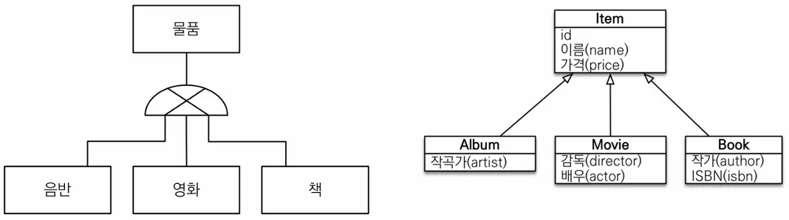
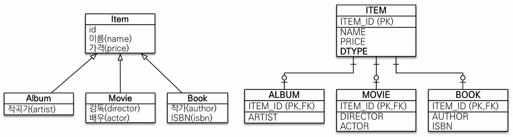
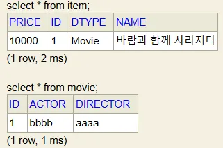
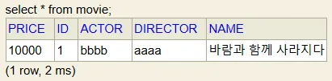
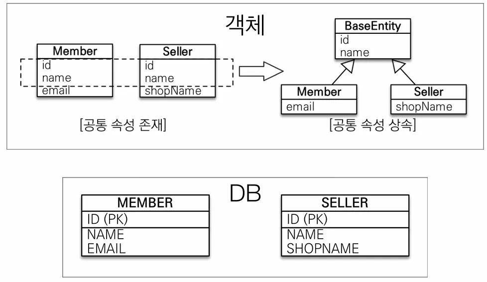

## 상속관계 매핑

관계형 데이터베이스에서는 실제 상속 관계는 없기 때문에 슈퍼타입 서브타입 관계라는 모델링 기법을 활용하여 객체의 상속 구조와 DB의 슈퍼타입 서브타입 관계를 매핑하여 JPA에서는 이를 구현합니다.



데이터베이스에서 논리 모델을 실제 물리 모델로 구현하는 방법에는 세 가지가 있습니다.

1. 각각 테이블로 변환 ⇒ 조인 전략
2. 통합 테이블로 변환 ⇒ 단일 테이블 전략
3. 서브타입 테이블로 변환 ⇒ 구현 클래스마다 테이블 전략

### 조인전략

ITEM 테이블에 DTYPE이라는 데이터 타입을 둬서 ALBUM ITEM인지, MOVIE ITEM인지 등 구분하는 방법입니다.



```java
@Entity
@Inheritance(strategy = InheritanceType.JOINED) // 조인전략 사용
@DiscriminatorColumn // DTYPE 생성
public abstract class Item {
    @Id
    @GeneratedValue
    private Long id;

    private String name;
    private int price;
}

@Entity
// @DiscriminatorValue("M") // DTYPE에 들어가는 Value 지정가능
public class Movie extends Item{
	private String director;
	private String actor;
}

Movie movie = new Movie();
movie.setDirector("aaaa");
movie.setActor("bbbb");
movie.setName("바람과 함께 사라지다");
movie.setPrice(10000);

em.persist(movie);

tx.commit();
```

**실행결과**


- **장점**
    - 테이블 정규화
    - 외래 키 참조 무결성 제약조건 활용가능
    - 조장공간 효율화
- **단점**
    - 조회시 조인을 많이 사용, 성능 저하
    - 조회 쿼리가 복잡함
    - 데이터 저장시 INSERT SQL 2번 호출

### 단일 테이블 전략

필요한 모든 데이터를 하나의 논리 모델로 합쳐버리는 전략입니다.



```java
@Entity
@Inheritance(strategy = InheritanceType.SINGLE_TABLE) // 단일 테이블 전략, 생략 가능
@DiscriminatorColumn // DTYPE 생성, 단일 테이블 전략에서는 생략 가능
public abstract class Item {
    @Id
    @GeneratedValue
    private Long id;

    private String name;
    private int price;
}

@Entity
// @DiscriminatorValue("M") // DTYPE에 들어가는 Value 지정가능
public class Movie extends Item{
	private String director;
	private String actor;
}

Movie movie = new Movie();
movie.setDirector("aaaa");
movie.setActor("bbbb");
movie.setName("바람과 함께 사라지다");
movie.setPrice(10000);

em.persist(movie);

tx.commit();

// JPA 실행결과
Hibernate: 
  create table Item (
      price integer not null,
      id bigint not null,
      DTYPE varchar(31) not null,
      actor varchar(255),
      artist varchar(255),
      author varchar(255),
      director varchar(255),
      isbn varchar(255),
      name varchar(255),
      primary key (id)
  )
```

**실행결과**


- **장점**
    - 조인이 필요 없으므로 일반적으로 조회 성능이 빠름
    - 조회 쿼리가 단순함
- **단점**
    - 자식 엔티티가 매핑한 컬럼은 모두 null 허용
    - 단일 테이블에 모든 것을 저장하므로 테이블이 커질 수 있다. 상황에 따라서 조회 성능이 오히려 느려질 수 있다.

### 구현 클래스마다 테이블 전략

컬럼이 중복되지만 각 테이블마다 고유한 NAME, PRICE등을 가지게 하는 전략입니다. 다만, ITEM_ID 하나로 특정 데이터를 찾아야 한다면 관련 모든 테이블들을 찾아봐야 하는 등의 이유로 이 전략은 `데이터베이스 설계자와 ORM 전문가 둘 다 추천하지 않는 방법`입니다.


```java
@Entity
@Inheritance(strategy = InheritanceType.TABLE_PER_CLASS) // 클래스별 테이블 전략 사용
// @DiscriminatorColumn // 위 전략에서는 사용하지 않음.
public abstract class Item {
    @Id
    @GeneratedValue
    private Long id;

    private String name;
    private int price;
}

@Entity
public class Movie extends Item{
	private String director;
	private String actor;
}

Movie movie = new Movie();
movie.setDirector("aaaa");
movie.setActor("bbbb");
movie.setName("바람과 함께 사라지다");
movie.setPrice(10000);

em.persist(movie);

tx.commit();

// JPA 실행결과 (Item 테이블 생성되지 않음)
Hibernate: 
  create table Movie (
      price integer not null,
      id bigint not null,
      actor varchar(255),
      director varchar(255),
      name varchar(255),
      primary key (id)
  )
```

**실행결과**



- **장점**
    - 서브 타입을 명확하게 구분해서 처리할 때 효과적
    - not null 제약조건 사용 가능
- **단점**
    - 여러 자식 테이블을 함께 조회할 때 성능이 느린(UNION SQL 필요)
    - 자식 테이블을 통합해서 쿼리하기 어려움

## @MappedSuperclass

사실 상속관계 매핑과는 관련이 없고 공통 매핑 정보가 필요할 때 사용합니다. 부모 클래스를 상속 받는 자식 클래스에 매핑 정보만 제공하며 단독으로 사용할 일이 없기 때문에 추상 클래스로 생성하는 것을 권장하고 있습니다.



```java
@MappedSuperclass
public class BaseEntity {
	private String createdBy;
	private LocalDateTime createdDate;
	private String modifiedBy;
	private LocalDateTime modifiedDate;
}

@Entity
public class Member extends BaseEntity { // 공통 엔티티 상속
    @Id
    @GeneratedValue
    @Column(name = "MEMBER_ID")
    private Long id;

    private String name;
    private String city;
    private String street;
    private String zipcode;
}
```

정리입니다.

- 테이블과 관계 없고, 단순히 엔티티가 공통으로 사용하는 매핑 정보를 모으는 역할
- 주로 등록일, 수정일, 등록자, 수정자 같은 전체 엔티티에서 공통으로 적용하는 정보를 모을 때 사용
- 참고: @Entity 클래스는 엔티티나 @MappedSuperclass로 지정한 클래스만 상속 가능

**이 링크를 통해 구매하시면 제가 수익을 받을 수 있어요. 🤗**

https://inf.run/4Sbno