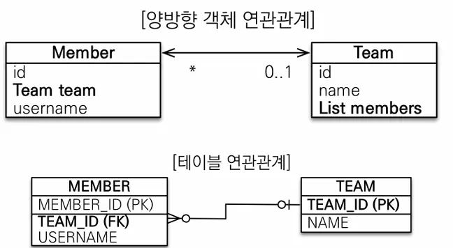

객체와 테이블 연관관계의 차이를 이해하고 참조와 외래 키를 매핑하는 방법에 대해 알아보겠습니다. 아래 용어는 연관관계 설명시 나오는 용어이니 숙지하고 넘어가도록 합니다.

- 방향(Direction) : 단방향, 양방향
- 다중성(Multiplicity) : 다대일(N:1), 일대다(1:N), 일대일(1:1), 다대다(N:M) 이해
- 연관관계의 주인(Owner) : 객체 양방향 연관관계는 관리 주인이 필요

예제 시나리오를 통해 연관관계 매핑에 대해 알아보겠습니다.

### 예제 시나리오

1. 회원과 팀이 있다.
2. 회원은 하나의 팀에만 소속될 수 있다.
3. 회원과 팀은 다대일 관계다.

먼저 객체를 정말 단순하게 테이블에 맞춰 연관관계 없이 모델링 해보겠습니다.


```java
@Entity
public class Member {
	@Id @GeneratedValue
	private Long id;
	
	@Column(Name = "USERNAME")
	private String name;
	
	@Column(Name = "TEAM_ID")
	private Long teamId;
	...
}
===============================================================
@Entity
public class Team {
	@Id @GeneratedValue
	private Long id;
	private String name;
}
===============================================================
// 팀 저장
Team team = new Team();
team.setName("TeamA");
em.persist(team);

// 회원 저장
Member member = new Member();
member.setName("member1");
member.setTeamId(team.getId());
em.persist(member)
===============================================================
// 조회
Member findMember = em.find(Member.class, member.getId()); 
// 연관관계가 없음
Team findTeam = em.find(Team.class, team.getId()); 
```

보신바와 같이 객체를 테이블에 맞춰 데이터 중심으로 모델링하면 협력 관계를 만들 수 없습니다. 그 이유로는 **테이블**의 경우 **외래 키**로 **조인**을 사용하여 연관된 테이블을 찾는 방식이지만 **객체**는 **참조**를 사용해서 연관된 객체를 찾습니다. 이렇듯 테이블과 객체의 패러다임의 차이를 인식해야 합니다.

### 단방향 연관관계

이제 연관관계를 사용하여 **객체지향스럽게** 모델링하면 Member는 더 이상 참조 키인 teamId가 아닌 Team 자체를 참조하고 있습니다.


```java
@Entity
public class Member { 
  @Id @GeneratedValue
  private Long id;
  
  @Column(name = "USERNAME")
  private String name;
  private int age;
  
//    @Column(name = "TEAM_ID")
//    private Long teamId;

  @ManyToOne
  @JoinColumn(name = "TEAM_ID")
  private Team team;
  ...
}
===============================================================
//팀 저장
Team team = new Team();
team.setName("TeamA");
em.persist(team);
//회원 저장
Member member = new Member();
member.setName("member1");
member.setTeam(team); //단방향 연관관계 설정, 참조 저장
em.persist(member)

===============================================================
 //조회
Member findMember = em.find(Member.class, member.getId()); 
//참조를 사용해서 연관관계 조회
Team findTeam = findMember.getTeam();

===============================================================
 // 새로운 팀B
Team teamB = new Team();
teamB.setName("TeamB");
em.persist(teamB);
// 회원1에 새로운 팀B 설정
member.setTeam(teamB)
```

JoinColumn 어노테이션을 사용하여 테이블과 매핑된 그림을 보면 다음과 같습니다.


### 양방향 연관관계와 연관관계의 주인

단방향 연관관계의 경우 조금의 이해로도 쉽게 사용할 수 있지만 양방향 연관관계는 이해하면 어렵지 않지만 jpa계의 포인터라고 할만큼 많이 헷갈려하는 부분입니다.

Team은 Member를 모르는 단방향과는 달리 Team 또한 members를 알고 있는 양방향 관계가 되었습니다.


```java
// Member Entity의 변화는 없음
@Entity
public class Member { 
  @Id @GeneratedValue
  private Long id;
  
  @Column(name = "USERNAME")
  private String name;
  private int age;
  
  @ManyToOne
  @JoinColumn(name = "TEAM_ID")
  private Team team;
  … 
}
// members 컬렉션 추가
@Entity
public class Team {
  @Id @GeneratedValue
  private Long id;
  
  private String name;
  
  @OneToMany(mappedBy = "team") // Member Entity의 "team"으로 매핑되어 있다
  List<Member> members = new ArrayList<Member>();
  … 
} 
===============================================================
Team findTeam = em.find(Team.class, team.getId());  //조회
int memberSize = findTeam.getMembers().size(); //역방향 조회

```

여기서 Team도 Member를 참조하려 사용한 mappedBy에 대해 정확하게 짚고 넘어가야 합니다. mappedBy는 JPA의 멘탈붕괴급 난이도로 처음에 이해하기 좀 어려우며 **객체**와 **테이블**간에 **연관관계**를 맺는 **차이**를 반드시 이해해야 합니다.

객체와 테이블이 관계를 맺는 차이를 쉽게 풀어보겠습니다.

먼저 객체는 다음과 같이 연관관계를 맺습니다.

- Member → Team (단방향 연관관계)
- Team → Member (단방향 연관관계)

**양방향 연관관계**라 부르지만 사실은 그냥 서로 연결되어 있는 **단방향 연관관계가 두 개인 관계**입니다.  간단한 코드로 보면 이해가 더욱 쉽습니다.

```java
class A {
	B b;
}

class B {
	A a;
}

a.getB(); // A -> B의 연관관계
b.getA(); // B -> A의 연관관계
```

테이블은 어떻게 연관관계를 맺을까요?

- Member ↔ Team (양방향 연관관계)

객체의 연관관계와는 달리 양방향으로 열려있는 연관관계 하나가 전부입니다. 연관관계를 나타내는 그림을 다시 보시면 객체는 Member는 Team을, Team은 Member를 서로 참조하고 있는 두 개의 연관관계가 있고. 테이블은 MEMBER.TEAM_ID **외래 키 하나**로 양방향 모두 JOIN하여 조회할 수 있기 때문에 한 개의 연관관계가 있습니다.



```sql
// 외래키인 TEAM_ID 하나로 모두 다 조회할 수 있다.

SELECT * 
FROM MEMBER M
JOIN TEAM T ON M.TEAM_ID = T.TEAM_ID 
 
SELECT * 
FROM TEAM T
JOIN MEMBER M ON T.TEAM_ID = M.TEAM_ID
```

이 차이를 이해해야 하는 이유는 다음과 같습니다.

만약 A라는 Member의 Team을 바꿔주고 싶을 때 테이블은 그저 MEMBER.TEAM_ID 외래키만 업데이트하면 됩니다.  하지만 객체에서는 Member가 참조하고 있는 Team을 업데이트 해도 되고 Team이 참조하고 있는 Member의 Team을 업데이트 해도 됩니다.

이러한 딜레마로 인해 JPA에서는 둘 중 하나로만 외래 키를 관리하는 룰이 생겼습니다. 이를 **양방향 관계에서의 주인**이라 표현합니다.

양방향 연관관계를 맺을 때는 다음과 같은 매핑 규칙이 있습니다.

- 객체는 두 관계 중 하나를 연관관계의 주인으로 지정
- **연관관계의 주인만이 외래 키를 관리**(등록, 수정)
- **주인이 아닌 쪽은 읽기만 가능**
- 주인은 mappedBy 속성 사용 X
- 주인이 아니면 mappedBy 속성으로 주인 지정


이러한 차이나 개념을 이해하지 못하고 양방향 연관관계를 사용시 연관관계의 주인에 값을 입력하지 않는 실수들을 많이 합니다.

```sql
Team team = new Team();
team.setName("TeamA");
em.persist(team);

Member member = new Member();
member.setName("member1");

// 역방향(주인이 아닌 방향)만 연관관계 설정
team.getMembers().add(member);

em.persist(member);

// 실행결과
ID : 1
USERNAME : member1
TEAM_ID : null

===============================================================

Team team = new Team();
team.setName("TeamA");
em.persist(team);

Member member = new Member();
member.setName("member1");

team.getMembers().add(member); 

member.setTeam(team); // 연관관계의 주인에 값 설정 
em.persist(member)

// 실행결과
ID : 1
USERNAME : member1
TEAM_ID : 2
```

### 양방향 매핑 정리

- 단방향 매핑만으로도 이미 연관관계 매핑은 완료
- 양방향 매핑은 반대 방향으로 조회(객체 그래프 탐색) 기능이 추가된 것 뿐임
- JPQL에서 역방향으로 탐색할 일이 많음
- 단방향 매핑을 잘 하고 양방향은 필요할 때 추가해도 됨

  (테이블에 영향 X)

- 연관관계의 주인 선택시 비즈니스 로직이 아닌 `외래 키의 위치`를 기준으로 정해야함
 
**이 링크를 통해 구매하시면 제가 수익을 받을 수 있어요. 🤗**

https://inf.run/ZVGV8