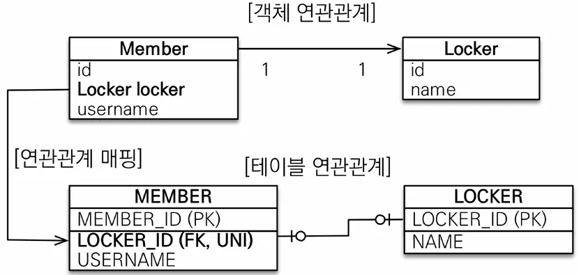
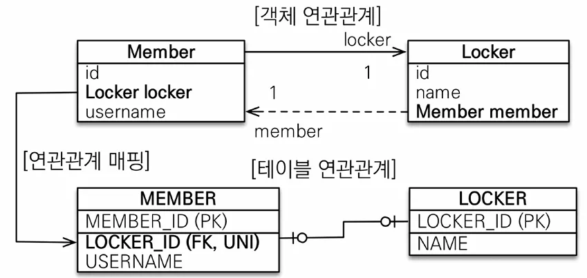
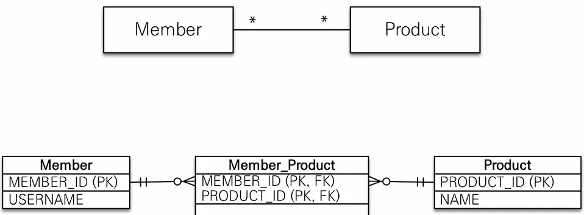
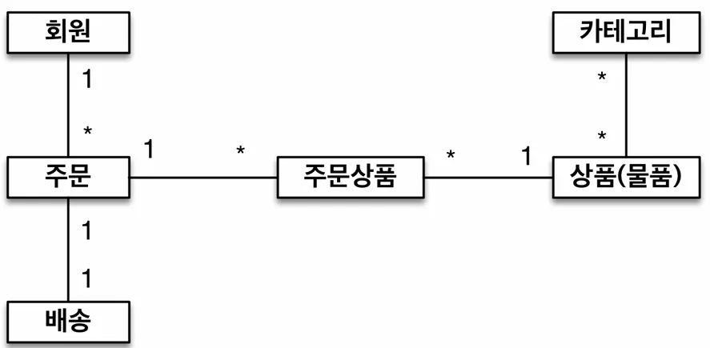
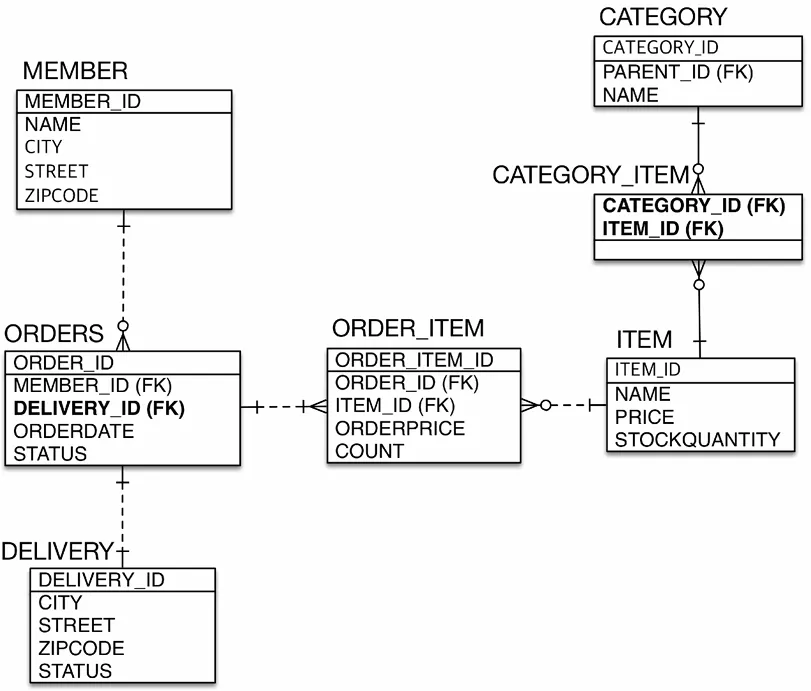

JPA에서는 다양한 연관관계를 통해 객체간의 참조를 정할 수 있으며 매핑시 대표적인 고려사항 세 가지가 있습니다.

- 다중성
    - 다대일: @ManyToOne
    - 일대다: @OneToMany
    - 일대일: @OneToOne
    - 다대다: @ManyToMany
- 단방향, 양방향
    - 테이블 : 외래 키 하나로 양쪽 조인 가능하며 방향이라는 개념이 없음
    - 객체 : 참조용 필드가 있는 쪽으로만 참조 가능하며 한쪽만 참조시 단방향, 서로 참조시 양방향
- 연관관계의 주인
    - 테이블은 외래 키 하나로 두 테이블이 연관관계를 맺음
    - 객체 양방향 관계는 A → B, B → A 처럼 참고가 2군데
    - 객체 양방향 관계는 참조가 2군데 있음. 둘 중 테이블의 외래 키를 관리할 곳을 지정해야 함
    - 연관관계의 주인 : 외래 키를 관리하는 참조
    - 주인의 반대편: 외래 키에 영향을 주지 않음, 단순 조회만 가능

## 다대일 [N:1]

### 단방향


여기서 반대로 다양한 비즈니스 로직에 의해 참조할 일이 있어서 다대일 양방향으로 사용시 Team Entity에 Members만 추가해주면 되며 **테이블에는 영향이 전혀 없습니다.** 따라서 처음엔 무조건 단방향으로 설계 후 필요시에만 양방향 관계를 맺는게 좋습니다.

### 양방향


## 일대다 [1:N]

먼저 일대다 단방향입니다. 다대일에서 멤버가 팀을 알고 있던 구조와는 달리 팀이 멤버들을 알고 있는 구조입니다.

### 단방향


멤버와 팀을 생성하고 서로의 연관 관계를 맺는 간단한 코드와 실행 결과를 살펴보겠습니다.

```java
Member member = new Member();
member.setName("member1");

em.persist(member);

Team team = new Team();
team.setName("team1");
team.getMembers().add(member); // ????????

em.persist(team);

tx.commit();

================================================
Hibernate: 
insert 
    into
        Member (USERNAME, MEMBER_ID) 
    values
        (?, ?)
Hibernate: 
insert 
    into
        Team (name, TEAM_ID) 
    values
        (?, ?)
Hibernate: 
    update // ?????????????????????????
        Member 
    set
        TEAM_ID=? 
    where
        MEMBER_ID=?
```

발생한 쿼리를 살펴보면 테이블 설계상 외래 키는 멤버에 있기 때문에 팀에 멤버를 추가하게 되면 어쩔 수 없이 멤버 테이블에 update 쿼리가 발생하게 됩니다. 또한 지금은 간단한 코드이지만 수십 개의 연관 관계를 맺는 실무에서 본다면 `팀에 대한 비즈니스 로직을 수행하는데 이 업데이트 쿼리는 뭐지?`라는 운영상 이슈가 발생할 수 있습니다.

일대다 단방향에 대해 정리하자면 다음과 같습니다.

- 일대다 단방향은 일대다(1:N)에서 `일(1)이 연관관계의 주인`
- 테이블 일대다 관계는 항상 `다(N) 쪽에 외래 키가 있음`
- 객체와 테이블의 차이 때문에 반대편 테이블의 외래 키를 관리하는 특이한 구조
- @JoinColumn을 사용하지 않으면 중간에 테이블을 추가하는 조인 테이블 방식을 사용함
- 단점
    - 엔티티가 관리하는 외래 키가 다른 테이블에 있음
    - 연관관계 관리를 위해 추가로 UPDATE SQL 실행
- 일대다 단방향 매핑보다는 `다대일 양방향 매핑을 사용`하자

### 양방향


사실 이런 매핑은 공식적으로 존재하지 않으며 JoinColumn 옵션 중 insertable= false와 updatable = false를 이용해 insert와 update를 막아버린 `읽기 전용 필드`를 사용해서 마치 양방향처럼 사용하는 방법입니다. 이 방법 역시 잘 사용하지 않으며 `다대일 양방향을 사용하는걸 권장`합니다.

## 일대일 [1:1]

일대일 단방향 매핑은 그 반대도 일대일이기 때문에 주 테이블, 대상 테이블 상관하지 않고 연관관계의 주인이 될 수 있습니다.

### 단방향



양방향 매핑의 경우도 앞서 다대일 양방향 매핑에서 봤던 것 처럼 외래 키가 있는 곳을 연관관계의 주인으로 설정해주면 됩니다.

### 양방향


일대일 연관관계를 정리입니다.

- **주 테이블에 외래 키 설정**
    - 주 객체가 대상 객체의 참조를 가지는 것 처럼

      주 테이블에 외래 키를 두고 대상 테이블을 찾음

    - 객체지향 개발자 선호
    - JPA 매핑 편리
    - 장점 : 주 테이블만 조회해도 대상 테이블에 데이터가 있는지 확인 가능
    - 단점: 값이 없으면 외래 키에 null 허용
- **대상 테이블에 외래 키**
    - 대상 테이블에 외래 키가 존재
    - 전통적인 데이터베이스 개발자 선호
    - 장점: 주 테이블과 대상 테이블을 일대일에서 일대다 관계로 변경할 때 테이블 구조 유지
    - 단점: 프록시 기능의 한계로 지연 로딩으로 설정해도 항상 즉시 로딩됨(프록시는 이후 설명)

## **다대다[N:M]**

기본적으로 관게형 데이터베이스는 정규화된 테이블 2개로 다대 관계를 표현할 수 없기 때문에 또 다른 연결 테이블을 추가해 일대다, 다대일 관계로 풀어내야 합니다.



하지만 객체 자체는 객체 2개로 다대 관계를 설정할 수 있습니다.


### **단방향**

```java
@Entity
public class Product {

	@Id 
	@GeneratedValue
	private Long id;

	private String name;

}

@Entity
public class Member {

    @Id
    @GeneratedValue
    @Column(name = "MEMBER_ID")
    private Long id;

    @ManyToMany
    @JoinTable(name = "MEMBER_PRODUCT")
		private List<Product> products = new ArrayList<>();
}
```

### **양방향**

```java
@Entity
public class Product {

	@Id
	@GeneratedValue
	private Long id;

	private String name;

	@ManyToMany(mappedBy = "products")
	private List<Member> members = new ArrayList<>(); // 반대로도 연관관계 설정

}
```

다대다는 겉보기에 서로 비즈니스가 확장되더라도 유연하게 대처할 수 있기 때문에 편리해보이지만 실무에서는 사용하면 안되는 연관관계 입니다.

실제 업무에서는 연결 테이블이 단순한 연결만 하고 끝나는게 아닌 Prodct를 예시로 상품의 수량, 주문 일시 등 추가적인 데이터가 필요할 수 있는데 중간 테이블에는 그러한 데이터를 넣는것이 불가능합니다. 또한, 단순 서로의 FK를 갖고 있는 중간 테이블이 숨겨져 있기 때문에 개발자가 의도하지 않은 쿼리가 발생할 수 있습니다.

따라서 다대다 관계를 맺고자 한다면 반드시 중간 테이블을 엔티티로 올리고 OneToMany와 mayToOne을 통해 연관 관계를 맺어서 사용해야 합니다.



```java
@Entity
public class Member {

    @Id
    @GeneratedValue
    @Column(name = "MEMBER_ID")
    private Long id;

    @OneToMany(mappedBy = "member")
    private List<MemberProduct> memberProducts = new ArrayList<>();

}

@Entity
public class Product {

	@Id
	@GeneratedValue
	private Long id;

	private String name;

	@OneToMany(mappedBy = "product")
	private List<MemberProduct> memberProducts = new ArrayList<>();

}

// 단순 연결 테이블에서 엔티티로 승격
@Entity
public class Order {

	@Id
	@GeneratedValue
	private Long id;

	@ManyToOne
	@JoinColumn(name = "MEMBER_ID")
	private Member member;

	@ManyToOne
	@JoinColumn(name = "PRODUCT_ID")
	private Product product;

}
```

`※강사의 경험상 중간 테이블 내 PK는 유연성 확보를 위해서라도 웬만하면 GeneratedValue와 같이 비즈니스적으로 의미 없는 컬럼을 설정하는것이 좋음`

## **실전 예제**

### **엔티티**


### ERD



### 엔티티 상세



### Member Entity

```java
@Entity
public class Member {

    @Id
    @GeneratedValue
    @Column(name = "MEMBER_ID")
    private Long id;

    private String name;
    private String city;
    private String street;
    private String zipcode;

    @OneToMany(mappedBy = "member")
    private List<Order> orders = new ArrayList<>();

}
```

### Order Entity

```java
@Entity
@Table(name = "ORDERS")
public class Order {

    @Id
    @GeneratedValue
    @Column(name = "ORDER_ID")
    private Long id;

    @Column(name = "MEMBER_ID")
    private Long memberId;

    @OneToMany(mappedBy = "order")
    private List<OrderItem> orderItems = new ArrayList<>();

    @OneToOne
    @JoinColumn(name = "DELIVERY_ID")
    private Delivery delivery;

    private LocalDateTime orderDate;

    @Enumerated(EnumType.STRING)
    private OrderStatus status;

}
```

### Delivery

```java
@Entity
public class Delivery {

	@Id
	@GeneratedValue
	private Long id;

	private String city;
	private String street;
	private String zipcode;
	private DeliveryStatus status;

	@OneToOne(mappedBy = "delivery")
	private Order order;

}
```

### OrderItem

```java
@Entity
public class OrderItem {

    @Id
    @GeneratedValue
    @Column(name = "ORDER_ITEM_ID")
    private Long id;

    @ManyToOne
    @JoinColumn(name = "ITEM_ID")
    private Item item;

    @ManyToOne
    @JoinColumn(name = "ORDER_ID")
    private Order order;

    private int orderPrice;

    private int count;

}
```

### Item

```java
@Entity
public class Item {

    @Id
    @GeneratedValue
    @Column(name = "ITEM_ID")
    private Long id;

    private String name;
    private int price;
    private int sockQuantity;

    @ManyToMany(mappedBy = "items")
    private List<Category> categories = new ArrayList<>();
    
}
```

### Category

```java
@Entity
public class Category {

	@Id
	@GeneratedValue
	private Long id;

	private String name;

	@ManyToMany
	@JoinTable(name = "CATEGORY_ITEM",
		joinColumns = @JoinColumn(name = "CATEGORY_ID"),
		inverseJoinColumns = @JoinColumn(name = "ITEM_ID"))
	private List<Item> items = new ArrayList<>();

	@ManyToOne
	@JoinColumn(name = "PARENT_ID")
	private Category parent;

	@OneToMany(mappedBy = "parent")
	private List<Category> child = new ArrayList<>();

}
```

다대다 설명에서 언급했든 테이블의 N:M 관계는 반드시 중간 테이블을 이용해서 일대다, 다대일로 풀어내야 합니다.

**이 링크를 통해 구매하시면 제가 수익을 받을 수 있어요. 🤗**

https://inf.run/ZVGV8