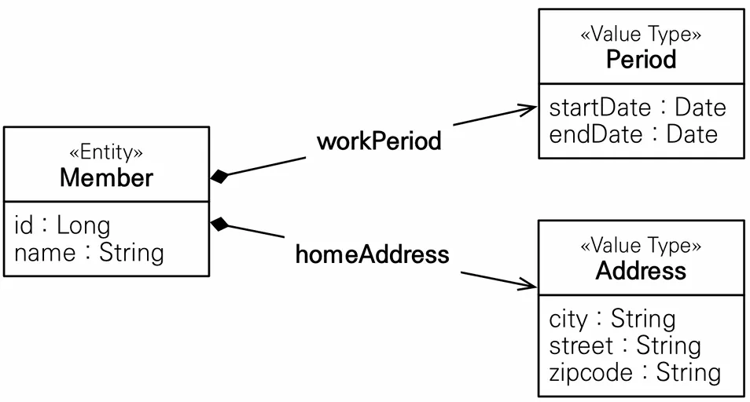
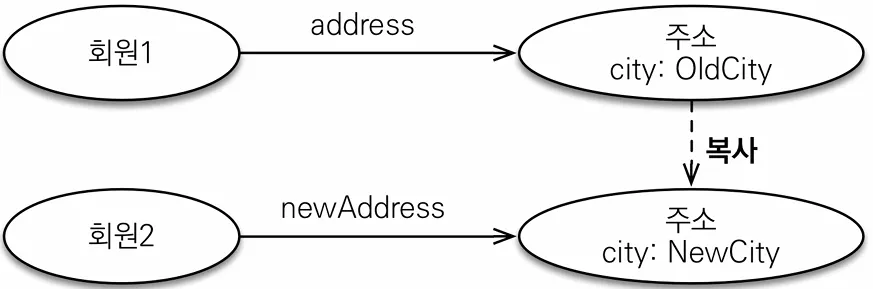

## 엔티티 타입

- @Entity로 정의하는 객체
- 데이터가 변해도 식별자로 지속해서 추적 가능
- 예) 회원 엔티티의 키나 나이 값을 변경해도 식별자로 인식 가능

## 값 타입

- int, Integer, String처럼 단순히 값으로 사용하는 자바 기본 타입이나 객체
- 식별자가 없고 값만 있으므로 변경시 추적 불가
- 예) 숫자 100을 200으로 변경하면 완전히 다른 값으로 대체

### 값 타입 분류

- 기본 값 타입
    - 자바 기본 타입(int, double)
    - 래퍼 클래스(Integer, Long)
    - String
- 임베디드 타입(embedded type, 복합 값 타입)
- 컬렉션 값 타입(collection value type)

# 기본값 타입

- 예) String anme, int age
- 생명주기를 엔티티에 의존
    - 예) 회원을 삭제하면 이름, 나이 필드도 함께 삭제
- 값 타입은 공유하면 안됨
    - 예) 회원 이름 변경시 다른 회원의 이름도 함께 변경되면 안됨
- 참고: 자바의 기본 타입은 절대 공유 X
    - int, double 같은 기본 타입(primitive type)은 절대 공유X
    - 기본 타입은 항상 값을 복사함
    - Integer 같은 래퍼 클래스나 String 같은 특수한 클래스는 공유 가능한 객체이지만 변경X

# 임베디드 타입

- 새로운 값 타입을 직접 정의할 수 있음
- JPA는 임베디드 타입(embedded type)이라 함
- 주로 기본 값 타입을 모아서 만들어서 복합 값 타입이라고도 함
- int, String과 같은 값 타입

예제로 이름, 근무 시작일, 근무 종료일, 주소 도시, 주소 번지, 주소 우편번호를 가지는 Member 엔티티가 있다고 가정해보겠습니다. 이 때 Member의 주요 컬럼인 id, name은 두고 성격이 비슷한 startDate, endDate를 period 클래스로, city, street, zipcode를 address 클래스로 묶어 다음과 같이 사용할 수 있습니다.



## 임베디드 타입 사용법

- @Embeddable : 값 타입을 정의하는 곳에 표시
- @Embedded : 값 타입을 사용하는 곳에 표시
- **기본 생성자 필수**

### 임베디드 타입 미사용

```java
@Entity
public class Member {

    @Id
    @GeneratedValue
    @Column(name = "MEMBER_ID")
    private Long id;

    @Column(name = "USERNAME")
    private String name;

		// 기간
    private LocalDateTime startDate;
    private LocalDateTime endDate;

		// 주소
    private String city;
    private String street;
    private String zipcode;

}
```

### 임베디드 타입 사용

```java
// 기간을 사용하는 타 엔티티에서 활용 가능
@Embeddable
public class Period {
	private LocalDateTime startDate;
	private LocalDateTime endDate;
}

// 주소를 활용하는 타 엔티티에서 활용 가능
@Embeddable
public class Address {
	private String city;
	private String street;
	private String zipcode;
}

@Entity
public class Member {
    @Id
    @GeneratedValue
    @Column(name = "MEMBER_ID")
    private Long id;

    @Column(name = "USERNAME")
    private String name;

    @Embedded
    private Period period;

    @Embedded
    private Address address;
}
```

## 임베디드 타입의 장점

- 재사용
- 높은 응집도
- Period.isWork()처럼 해당 값 타입만 사용하는 의미 있는 메소드를 만들 수 있음
- 임베디드 타입을 포함한 모든 값 타입은, 값 타입을 소유한 엔티티에 생명 주기를 의존함

## 임베디드 타입과 테이블 매핑


- 임베디드 타입은 엔티티의 값일 뿐이다.
- 임베디드 타입을 사용하기 전과 후에 **매핑하는 테이블은 같다.**
- 객체와 테이블을 아주 세밀하게(find-grained) 매핑하는 것이 가능
- 잘 설계한 ORM 어플리케이션은 매핑한 테이블의 수보다 클래스의 수가 더 많음

## 임베디드 타입과 연관관계

### 속성 재정의

한 엔티티에서 같은 값 타입을 사용하면 컬럼 명이 중복되기 때문에 같이 사용할 수 없습니다. 이럴 때 @AttributeOverrides, @AttributeOverride를 사용하여 컬럼 명 속성을 재정의하여 사용해야 합니다.

```java
@Entity
public class Member {

    @Id
    @GeneratedValue
    @Column(name = "MEMBER_ID")
    private Long id;

    @Column(name = "USERNAME")
    private String name;

    @Embedded
    private Period period;

		// ❌ 컬럼명 중복
    @Embedded
    private Address homeAddress;

    @Embedded
    private Address workAddress;

}

@Entity
public class Member {

    @Id
    @GeneratedValue
    @Column(name = "MEMBER_ID")
    private Long id;

    @Column(name = "USERNAME")
    private String name;

    @Embedded
    private Period period;

		// ✅ 속성 재정의
		@Embedded
    @AttributeOverrides({
            @AttributeOverride(name = "city", column = @Column(name = "WORK_CITY")),
            @AttributeOverride(name = "street", column = @Column(name = "WORK_STREET")),
            @AttributeOverride(name = "zipcode", column = @Column(name = "WORK_ZIPCODE"))
    })
    private Address homeAddress;

    @Embedded
    @AttributeOverrides({
            @AttributeOverride(name = "city", column = @Column(name = "HOME_CITY")),
            @AttributeOverride(name = "street", column = @Column(name = "HOME_STREET")),
            @AttributeOverride(name = "zipcode", column = @Column(name = "HOME_ZIPCODE"))
    })
    private Address workAddress;

}
```

# 값 타입과 불변 객체

값 타입은 복잡한 객체 세상을 조금이라도 단순화하려고 만든 개념입니다. 따라서 값 타입은 **단순하고 안전하게** 다룰 수 있어야 합니다.

## 값 타입 공유 참조

임베디드 타입 같은 값 타입을 여러 엔티티에서 공유하면 사이드 이펙트가 발생하여 위험합니다.


```java
Address address = new Address("city", "street", "zipcode");

Member member1 = new Member();
member1.setUsername("member1");
member1.setHomeAddress(address);
em.persist(member);

Member member2 = new Member();
member2.setUsername("member2");
member2.setHomeAddress(address);
em.persist(member2);

// member1의 city를 변경
member1.getHomeAddress().setCity("newCity");

// 값 타입을 공유하고 있었으니 member1의 city를 변경하면 member2의 city도 변경된다.
// 의도와는 달리 update 쿼리 두 번 발생
Hibernate: 
    /* update
        for hellojpa.Member */update Member 
    set
        city=?,
        street=?,
        zipcode=?,
        endDate=?,
        startDate=?,
        USERNAME=? 
    where
        MEMBER_ID=?
Hibernate: 
    /* update
        for hellojpa.Member */update Member 
    set
        city=?,
        street=?,
        zipcode=?,
        endDate=?,
        startDate=?,
        USERNAME=? 
    where
        MEMBER_ID=?
```

## 값 타입 복사

값 타입의 실제 인스턴스인 값을 공유하는 것은 위의 예제처럼 사이드 이펙트 발생으로 위험하니 대신 값(인스턴스)를 **복사**해서 사용해야 합니다.



```java
Address address = new Address("city", "street", "zipcode");

Member member = new Member();
member.setUsername("member1");
member.setHomeAddress(address);
em.persist(member);

// 기존 Address가 아닌 복사해서 사용
Address copyAddress = new Address(
    address.getCity(), address.getStreet(), address.getZipcode()
);
Member member2 = new Member();
member2.setUsername("member2");
member2.setHomeAddress(copyAddress);
em.persist(member2);

member.getHomeAddress().setCity("newCity");
```

## 객체 타입의 한계

위 예제처럼 항상 값을 복사해서 사용하면 공유 참조로 인해 발생하는 부작용을 피할 수 있습니다. 다만, 임베디드 타입처럼 **직접 정의한 값 타입은 자바의 기본 타입이 아닌 객체 타입**입니다. 자바 기본 타입에 값을 대입하면 값을 복사하는데 객체 타입은 참조 값을 **직접 대입하는 것을 막을 방법이 없어** **객체의 공유 참조는 피할 수 없습니다.**

```java
// 기본 타입(primitive type)
int a = 10;
int b = a; // 기본 타입은 값을 복사
b = 4;

// 객체 타입
Address a = new Address("Old");
Address b = a; // 객체 타입은 참조를 전달
b.setCity("New"); // 복사가 아닌 참조이기에 a Address에도 영향이 감
```

## 불변 객체

객체 타입에서 직접 대입하는 것을 막을 방법이 없기 때문에 안전하게 사용하기 위해서는 **수정할 수 없게 만들어 부작용을 원천 차단**해야 합니다. 따라서 모든 값 타입은 생성자로만 값을 설정하고 수정자(Setter)를 애초에 만들지 않는 **불변 객체(immutable object)로 설계**해야 합니다. 이러한 불변이라는 작은 제약으로 사이드 이펙트라는 큰 재앙을 막을 수 있습니다.

- 참고
    - Integer, String이 자바가 제공하는 대표적인 불변 객체
    - 정 setter가 필요하면 private으로 생성하자

# 값 타입의 비교

값 타입은 인스턴스가 달라도 그 안에 값이 같으면 같은 것으로 봐야하기 때문에 `동일성` 비교가 아닌 equals를 사용하여 `동등성`을 비교해야 합니다.

`※ 기본 equals는 == 비교이기 때문에 반드시 equals override 필요`

```java
int a = 10;
int b = 10;
// 값의 비교, a == b = true
✅ a == b

Address a = new Address("서울시");
Address b = new Address("서울시");
// 객체의 비교, a == b = false
❌ a == b
✅ a.equals(b)
```

- 동일성? 동등성?
    - 동일성 비교 : 인스턴스의 `참조 값`을 비교, == 사용
    - 동등성 비교 : 인스턴스의 `값`을 비교, equals() 사용

# 값 타입 컬렉션

값 타입을 하나 이상 저장할 때 사용하며 DB에 따라 다르긴 하지만 컬렉션을 같은 테이블에 저장할 수 없기 때문에 별도의 테이블이 필요합니다.


```java
@Entity
public class Member {

    @Id
    @GeneratedValue
    @Column(name = "MEMBER_ID")
    private Long id;

    @Column(name = "USERNAME")
    private String username;

    @Embedded
    private Address homeAddress;

    @ElementCollection // 값 타입 컬렉션 지정
    @CollectionTable(name = "FAVORITE_FOOD", // 별도 테이블 지정
	    joinColumns = @JoinColumn(name = "MEMBER_ID") // 외래키 설정
    )
    @Column(name = "FOOD_NAME") // String 단일 컬럼이니 이름 지정
    private Set<String> favoriteFoods = new HashSet<>();

    @ElementCollection
    @CollectionTable(name = "ADDRESS", joinColumns =
        @JoinColumn(name = "MEMBER_ID")
    )
    private List<Address> addressHistory = new ArrayList<>();
}
```

## 값 타입 컬렉션 사용예제

### 값 타입 저장

```java
Member member = new Member();
member.setUsername("member1");
member.setHomeAddress(new Address("homeCity", "street", "10000"));

member.getFavoriteFoods().add("치킨");
member.getFavoriteFoods().add("족발");
member.getFavoriteFoods().add("피자");

member.getAddressHistory().add(new Address("old1", "street", "10000"));
member.getAddressHistory().add(new Address("old2", "street", "10000"));

em.persist(member);

// member만 persist 했음에도
// 값 타입들(favoriteFood, addressHistory)도 insert 된다.
Hibernate: 
    /* insert for
        hellojpa.Member */insert 
    into
        Member (city, street, zipcode, USERNAME, MEMBER_ID) 
    values
        (?, ?, ?, ?, ?)
Hibernate: 
    /* insert for
        hellojpa.Member.addressHistory */insert 
    into
        ADDRESS (MEMBER_ID, city, street, zipcode) 
    values
        (?, ?, ?, ?)
Hibernate: 
    /* insert for
        hellojpa.Member.addressHistory */insert 
    into
        ADDRESS (MEMBER_ID, city, street, zipcode) 
    values
        (?, ?, ?, ?)
Hibernate: 
    /* insert for
        hellojpa.Member.favoriteFoods */insert 
    into
        FAVORITE_FOOD (MEMBER_ID, FOOD_NAME) 
    values
        (?, ?)
Hibernate: 
    /* insert for
        hellojpa.Member.favoriteFoods */insert 
    into
        FAVORITE_FOOD (MEMBER_ID, FOOD_NAME) 
    values
        (?, ?)
Hibernate: 
    /* insert for
        hellojpa.Member.favoriteFoods */insert 
    into
        FAVORITE_FOOD (MEMBER_ID, FOOD_NAME) 
    values
        (?, ?)
```

### 값 타입 조회 (지연 로딩)

```java
System.out.println("============== START ==============");
Member findMember = em.find(Member.class, member.getId());

// Member에 대한 쿼리만 발생하고 값 타입은 자동적으로 '지연로딩' 된다.
============== START ==============
Hibernate: 
    select
        m1_0.MEMBER_ID,
        m1_0.city,
        m1_0.street,
        m1_0.zipcode,
        m1_0.USERNAME 
    from
        Member m1_0 
    where
        m1_0.MEMBER_ID=?

// 프록시 객체로 실제 사용해야 실제 쿼리 발생
List<Address> addressHistory = findMember.getAddressHistory();
Set<String> favoriteFoods = findMember.getFavoriteFoods();
```

### 값 타입 수정

```java
// 수정이 아닌 기존 항목을 제거하고 새로 추가
findMember.getFavoriteFoods().remove("치킨");
findMember.getFavoriteFoods().add("한식 ");

// remove로 인한 delete
Hibernate: 
    /* delete for hellojpa.Member.favoriteFoods */delete 
    from
        FAVORITE_FOOD 
    where
        MEMBER_ID=? 
        and FOOD_NAME=?
        
// add로 인한 insert
Hibernate: 
    /* insert for
        hellojpa.Member.favoriteFoods */insert 
    into
        FAVORITE_FOOD (MEMBER_ID, FOOD_NAME) 
    values
        (?, ?)
```

단순 String만 가지고 있는 favoriteFood의 경우 remove 후 add시 기대한대로  치킨만 delete 후 한식을 add 합니다. 하지만 객체의 경우 조금 다르게 동작합니다.

```java
// 동일하게 remove 후 add
findMember.getAddressHistory().remove(new Address("old1", "street", "10000"));
findMember.getAddressHistory().add(new Address("newCity1", "street", "10000"));

// 전부 지운 후 두 번의 insert
Hibernate: 
    /* one-shot delete for hellojpa.Member.addressHistory */delete 
    from
        ADDRESS 
    where
        MEMBER_ID=?
Hibernate: 
    /* insert for
        hellojpa.Member.addressHistory */insert 
    into
        ADDRESS (MEMBER_ID, city, street, zipcode) 
    values
        (?, ?, ?, ?)
Hibernate: 
    /* insert for
        hellojpa.Member.addressHistory */insert 
    into
        ADDRESS (MEMBER_ID, city, street, zipcode) 
    values
        (?, ?, ?, ?)
```

### 값 타입 컬렉션의 제약사항

위에서 보았듯 값 타입은 엔티티와 다르게 **식별자 개념이 없습니다.** 별도로 식별할 수 없기 때문에 값을 변경하면 추적하기 어렵습니다. 값 타입 컬렉션에 변경 사항이 발생하면, 주인 엔티티와 **연관된 모든 데이터를 삭제**하고, 값 타입 컬렉션에 있는 **현재 값을 모두 다시 저장**합니다. 따라서 이러한 문제를 방지하려면 다양한 방법이 있겠지만 값 타입 컬렉션을 매핑하는 테이블은 모든 컬럼을 묶어서 기본 키를 구성해야 합니다. **(null 입력X, 중복 저장X)**

- 참고

  값 타입 컬렉션은 영속성 전이(Cascade) + 고아 객체 제거 기능을 필수로 가진다고 볼 수 있다


### 값 타입 컬렉션 대안

사용하기 번거로운 제약 사항이 있기 때문에 실무에서는 상황에 따라 **값 타입 컬렉션 대신 일대다 관계**를 먼저 고려하는게 좋을 수 있습니다. 값 타입이 아닌 일대다 관계를 위한 **엔티티**를 만들고, 여기에서 값 타입을 사용하는 방식입니다.

```java
// 값 타입 컬렉션
@ElementCollection
@CollectionTable(name = "ADDRESS", joinColumns =
  @JoinColumn(name = "MEMBER_ID")
)
private List<Address> addressHistory = new ArrayList<>();

@Entity
public class AddressEntity {
	@Id
	@GeneratedValue
	private Long id;

	private Address address;
}

// 일대다 관계로 변경
@OneToMany(cascade = CascadeType.ALL, orphanRemoval = true)
@JoinColumn(name = "MEMBER_ID")
// 값 타입 컬렉션이 아닌 Entity 참조
private List<AddressEntity> addressHistory = new ArrayList<>();
```

# 정리

- 엔티티 타입의 특징
    - 식별자가 있음
    - 생명 주기 관리
    - 공유 할 수 있음
- 값 타입의 특징
    - 식별자가 없음
    - 생명 주기를 엔티티에 의존
    - 공유하지 않는 것이 안전(복사하여 사용)
    - 사이드 이펙트로 인해 불변 객체로 만드는 것이 안전

값 타입은 정말 수정이 필요없는 값 타입이라 판단될 때만 사용해야 하며 엔티티와 값 타입을 혼동해서 엔티티를 값 타입으로 만들면 안됩니다. 또한 **식별자가 필요**하고, 지속해서 **값을 추적, 변경**해야 한다면 그것은 값 타입이 아닌 엔티티입니다.

**이 링크를 통해 구매하시면 제가 수익을 받을 수 있어요. 🤗**

https://inf.run/4Sbno