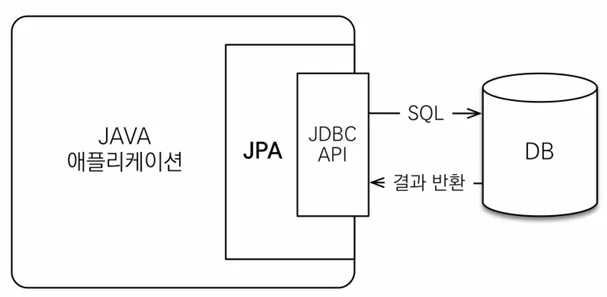
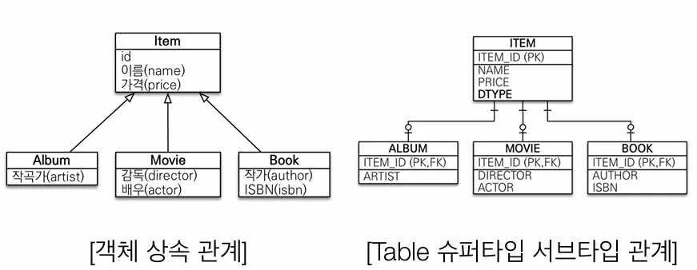

JPA의 탄생 배경에 대해 알아봤으니 이제 본격적으로 JPA에 대해 알아보도록 하겠습니다. JPA란 Java Persistencet API의 약자로 자바 진영의 `ORM` 기술 표준입니다.

## ORM

- Object-relational mapping(객체 관계 매핑)
- 객체는 객체대로 설계
  관계형 데이터베이스는 관계형 데이터베이스대로 설계
- ORM 프레임워크가 중간에서 매핑
- 대중적인 언어에는 대부분 ORM 기술이 존재

사실 특정 기술은 아니고 JPA의 표준 명세를 구현한 하이버네이트, EclipseLink, DataNucleus 와 같은 3가지 구현체를 쓰기위한 인터페이스의 모음이며 이 중에서 JPA 등장 이전에 하이버네이트를 통해 거의 모든 기술이 구현되어 있었기에 그냥 쉽게 JPA는 `JPA 인터페이스에 하이버네이트 구현체를 쓴다.` 정도로만 이해해도 무방할 것 같습니다.

JPA는 완전히 새로운 기술이 아니고 애플리케이션과 JDBC 사이에서 동작하는 프레임워크로 생각하면 편합니다.



애플리케이션과 JDBC 사이에 위치한 JPA는 실제 데이터 저장과 조회시 다음과 같은 역할을 개발자 대신 수행해줍니다.


JPA에 대해 대략적으로 알아봤으니 왜 사용해야 하는가? 에 대해서도 간단한 예제와 함께 알아보겠습니다. 먼저 JPA를 사용함으로서 얻는 이점들은 다음과 같습니다.

- SQL 중심적인 개발에서 객체 중심으로 개발
- 생산성
- 유지보수
- 패러다임의 불일치 해결
- 성능
- 데이터 접근 추상화와 벤더 독립성
- 표준

### 생산성

별도의 쿼리 생성 없이 마치 자바 컬렉션을 사용하듯 쉽게 사용할 수 있습니다.

- 저장 : jpa.persist(member)
- 조회 : Member member = jpa.find(memberId)
- 수정: member.setName(”변경할 이름”)
- 삭제: jpa.remove(member)

### 유지보수

다음과 같은 Member class가 있을 때 그에 따른 쿼리는 다음과 같습니다.

```java
// 초기 Member Class와 그에 따른 Query
public class Member {
	private String memberId;
	private String name;
}

INSERT INTO MEMBER(MEMBER_ID, NAME) VALEUS ...
SELECT MEMBER_ID, NAME FROM MEMBER M
UPDATE MEMBER SET ...

// 필드가 추가된다면 ?
	private String memberId;
	private String name;
	private String tel; // <------------
}

// 쿼리도 모두 변경되어야 한다.
INSERT INTO MEMBER(MEMBER_ID, NAME, "TEL") VALEUS ...
SELECT MEMBER_ID, NAME, "TEL" FROM MEMBER M
UPDATE MEMBER SET ...
```

이를 JPA를 사용한다면?

```java
public class Member {
	private String memberId;
	private String name;
	private String tel;
}

// Member Entity만 변경해주면 쿼리는 JPA가 알아서 해준다.
~~INSERT INTO MEMBER(MEMBER_ID, NAME, "TEL") VALEUS ...
SELECT MEMBER_ID, NAME, "TEL" FROM MEMBER M
UPDATE MEMBER SET ...~~
```

### JPA와 패러다임의 불일치 해결

1. JPA와 상속

   

    ```java
    // 1. 저장
    
    // 개발자가 할 일
    jpa.persist(album);
    
    // 나머진 JPA가 알아서...
    INSERT INTO ITEM ...
    INSERT INTO ALBUM ...
    
    // 2. 조회
    
    // 개발자가 할 일
    Album album = jpa.find(Album.class, albumId);
    
    // 나머진 JPA가 알아서...
    SELECT I.*, A.*
      FROM ITEM I
      JOIN ALBUM A ON I.ITEM_ID = A.ITEM_ID
    ```


1. JPA와 연관관계, 객체 그래프 탐색

    ```java
    // 연관관계 저장
    member.setTeam(team);
    jpa.persist(member);
    
    // 객체 그래프 탐색
    Member member = jpa.find(Member.class, memberId);
    Team team = member.getTeam();
    
    // 직접 쿼리를 작성해 탐색 범위를 지정하던 JAP 이전과는 다르게
    // JPA가 알아서 성능까지 고려해 처리해주니 엔티티를 신뢰하고 쓸 수 있다.
    class MemberService {
    	public void process() {
    	  // 이전과는 다르게 memberDao.find의 쿼리를 궁금해 할 필요가 없다.
    		Member member = memberDao.find(memberId);
    		member.getTeam(); // 자유로운 객체 그래프 탐색
    		member.getOrder().getDelivery();
    	}
    }
    ```

2. JPA와 비교

    ```java
    // 동일 트랜잭션에서 조회한 엔티티는 같음을 보장한다.
    String memberId = "100";
    Member member1 = jpa.find(Member.class, memberId);
    Member member2 = jpa.find(Member.class, memberId);
    
    member1 == member2; // same
    ```


### 성능

JPA는 성능 최적화를 위해 대표적으로 세 가지의 최적화 기능을 제공합니다.

- 1차 캐시와 동일성(identity) 보장
- 트랜잭션을 지원하는 쓰기 지연(transactional write-behind)
- 지연 로딩(Lazy loading)

1. 1차 캐시와 동일성 보장

   JPA는 같은 트랙재션 안에서는 같은 엔티티를 반환하여 약간의 조회 성능을 향상시키고 DB 격리 레벨이 Read Commit이어도 애플리케이션 자체적으로 Repetable Read를 보장

    - (참고) DB 격리레벨

      **READ UNCOMMITTED**

      타 트랜잭션의 커밋이나 롤백 상관없이 그냥 읽어간다.

      **READ COMMITTED**

      타 트랜잭션의 변경 내영이 COMMIT 되어야만 다른 트랜잭션에서 조회할 수 있다.

      **REPETABLE READ (대부분 DB의 기본 격리수준)**

      트랜잭션이 시작되기 전에 커밋된 내용에 대해서만 조회할 수 있다.

      **SERIALIZABLE**

      가장 엄격한 격리 수준으로 단순 SELECT에도 Lock을 걸어 동시 작업시 타 트랜잭션에서 접근할 수 없다


    ```java
    String memberId = "100";
    String memberId = "100";
    Member member1 = jpa.find(Member.class, memberId); // SQL을 통한 데이터 반환
    Member member2 = jpa.find(Member.class, memberId); // 같은 트랜잭션이니 캐싱된 데이터 반환
    
    member1 == member2; // same
    // 결국 SQL은 한 번만 실행
    ```

2. 트랜잭션을 지원하는 쓰기 지연

   트랜잭션을 커밋할 때까지 INSERT SQL을 모으고 JDBC BATCH SQL 기능을 사용해 한번에 SQL 실행

    ```java
    transaction.begin(); // 트랜잭션 시작
    
    em.persist(memberA);
    em.persist(memberB);
    em.persist(memberC);
    // 여기까지 INSERT는 실행되지 않는다.
    
    // 커밋한 순간 모아서 쿼리 실행
    transaction.commit(); // 트랜잭션 커밋
    ```

3. 지연 로딩과 즉시 로딩
    - 지연로딩 : 객체가 실제 사용될 때 로딩
    - 즉시 로딩: JOIN SQL로 한번에 연관된 객체까지 미리 조회

    ```java
    // 지연 로딩
    Member member = memberDAO.find(memberId); // SELECT * FROM MEMBER
    Team team = member.getTeam();
    String temName = team.getName();          // SELECT * FROM TEAM
    
    // 즉시 로딩
    Member member = memberDAO.find(memberId); // SELECT M.*, T.*
    Team team = member.getTeam();             //   FROM MEMBER
    String temName = team.getName();          //   JOIN TEAM ...
    ```

**이 링크를 통해 구매하시면 제가 수익을 받을 수 있어요. 🤗**

https://inf.run/ZVGV8