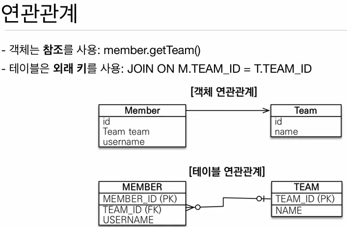

지금 시대는 `객체`를 `관계형 DB`에 관리합니다. 근데 이 객체를 관계형 DB에 저장하려면 수 많은 SQL을 직접 작성해야 하는 SQL 중심적인 개발이 됩니다.

일반적으로 `회원`이라는 기능이 있다고 가정했을 때 SQL 중심적 개발 과정은 아래와 같습니다.

```java
// Member Class
public class Member {
	private String memberId;
	private String name;
	
	...
}

// SQL
INSERT INTO MEMBER (MEMBER_ID, NAME) VALUES ...
SELECT MEMBER_ID, NAME FROM MEMBER M ...
UPDATE MEMBER SET ...
```

열심히 개발하다가 갑자기 기획자가 `아! 사용자 번호도 관리해야 할 것 같아요!` 라고 한다면…? 개발자가 직접 다시 모든 select, update 등 모든 쿼리를 수정해야 합니다.

프로그래밍은 `객체`기반 언어를 사용하면서 데이터는 `관계`형 데이터베이스에 저장합니다. 일반적으로 Java를 처음 배울 때 아래와 같은 특징들을 배웁니다.

- 추상화
- 캡슐화
- 정보은닉
- 상속
- 다형성
- …

이러한 객체를 관계형 데이터베이스에 저장할 때 데이터베이스는 아까 언급한 특징들을 활용할 수 없기 때문에 개발자가 직접 SQL 매핑을 진행해야 합니다. (노가다…) 그래서 관계형 데이터베이스에 객체지향적 데이터를 관리하려면 슈퍼 타입, 서브 타입 관계로 부모, 자식 관계를 가진 테이블 설계를 진행합니다.

먼저 다음과 같은 부모, 자식 관계의 테이블이 있다고 가정해보겠습니다.


여기서 Album 테이블에 `데이터를 저장`하려면 어떻게 해야할까요?

1. 객체를 분해한다.
2. INSERT INTO ITEM …
3. INSERT INTO ALBUM …

데이터의 저장은 차라리 두 개의 테이블에 하나 하나 깔끔하게 넣어주면 되는데 `데이터 조회`는 어떻게 될까요 ?

1. 각각의 테이블에 따른 Join SQL 작성
2. 각각 객체 생성
3. 각각의 데이터 세팅
4. …….ㅠㅠ

글로 쓰기만 해도 벌써부터 복잡한데 이걸 쿼리도 짜고 코드단에서 조합하려면 훨씬 더 많은 복잡성과 코드가 필요합니다.

하지만 이걸 자바 컬렉션에서 사용하면 굉장히 쉽게 사용할 수 있습니다.

```java
// Album 추가
list.add(album);

// Album 조회
Album album = list.get(albumId);

// 부모 타입으로 조회 후 다형성 활용
Item item = list.get(albumId);
```

갑자기 굳이 Java에서 사용시에는 간단하게 쓸 수 있다! 라고 설명한 이유는 사실 가장 복잡해질 수 있는 `연관관계`에 대한 설명 때문입니다.

## 연관관계

팀원과 팀이라는 연관 관계가 있다고 가정해보겠습니다.



DB에서의 연관 관게로 조회시 `Join`을 사용해서 가져오지만 객체에서는 member.getTeam()과 같이 `참조`를 통해 가져옵니다.

보통 개발시 이 멤버 객체와 팀 객체를 DB에 저장할 때 `객체`를 `테이블`에 맞춰서 모델링을 하게 됩니다. 아래와 같이 Member와 Team을 모델링 할 때 테이블에는 `참조`라는 개념이 없기 때문에 나중에 Join을 위해 아래와 같이 모델링을 합니다.

```java
public class Member {
	String id;
	Long teamId;     // TEAM과 연관 관계를 위한 FK
	String username;
}

public class Team {
	Long id;
	String name;
}

INSERT INTO MEMBER (MEMBER_ID, TEAM_ID, USERNAME) VALUES ...
```

이제 테이블에 맞춘 모델링이 아닌 좀 더 객체다운 모델링은 어떻게 될까요?

```java
public class Member {
	String id;
	Team team;       // FK가 아닌 `참조`로 연관관계를 맺는다.
	String username;
	
	...
	
	Team getTeam() {
		return team;
	}
}

public class Team {
	Long id;
	String name;
}
```

물론 이렇게 하게 되면 코드에서 DB 조회해 사용할 때 상당히 번거로워 집니다.

```java
SELECT M.*, T.*
  FROM MEMBER M
  JOIN TEAM T ON M.TEAM_ID = T.TEAM_ID
  
public Member find(String memberId) {
	// SQL 실행
	Member member = new Member();
	// DB에서 조회한 회원 정보 입력
	...
	
	TEAM team = new Team();
	// DB에서 조회한 팀 관련 정보 입력
	...
	
	// 회원과 팀 관계 설정
	member.setTeam(team);
	return member;
}
```

계속 DB에 객체를 보관하다 보면 Member와 Team 뿐만 아니라 더 다양하고 복잡한 참조 관계가 있다면 쿼리와 코드는 더더욱 복잡해질 수 있습니다.

```java
public class Member {
	String id;
	Team team;       
	String username;
	Order order;      // 연관 관계가 추가되었다!
	
	...
	
	Team getTeam() {
		return team;
	}
	
	Order getOrder() {
		return order;
	}
}

// Member Class 내 Order는 있지만 쿼리에 따라 탐색 범위가 결정되어 버린다.
SELECT M.*, T.*
  FROM MEMBER M
  JOIN TEAM T ON M.TEAM_ID = T.TEAM_ID
  
member.getTeam(); // OK!
member.getOrder(); // null
```

결국 코드는 쿼리에 의존적이게 되고 다수와 함께 개발을 진행하면 엔티티에 대한 신뢰 문제가 생기거나 신뢰 문제를 해결하기 위해 무지막지한 쿼리가 발생할 수 있습니다.

```java
// memberDao.find를 모르는 상태에서 member entity를 자유롭게 쓸 수 있을까?
public class MemberService{

	private final MemberDao memberDao;
	
	public void process() {
		Member member = memberDao.find(memberId);
		member.getTeam(); // ????
		member.getOrder().getDelivery(); // ????????
	}
}

// 아 몰랑 못믿겠어
memberDao.getMember(); // Member만 조회
memberDao.getMemberWithTeam(); // Member와 Team만 조회
memberDao.getMemberWithOrderWithDelibery(); // Member와 Team과 주문 내 배송현황 조회
memberDao.get...With...With...With...With...With...(); // ??????????
```

즉, 객체 지향적으로 데이터 모델링 할수록 맵핑 작업이 어마어마하게 늘어나게 됩니다. 이론적으로는 `객체 지향적으로 설계하는게 좋다!`라고 얘기는 하는데 실무에서 이 작업이나 과정이 너무 복잡하고 결국 포기하게 됩니다.

이러한 `객체를 자바 컬렉션에 저장하듯 DB에 저장할 수는 없을까?` 라고 하는 고민은 전세계 공통적으로 많은 개발자들이 하게 됐고 이 고민을 해결하기 위해 JPA(Java Persistence API)가 탄생하게 됩니다.

**이 링크를 통해 구매하시면 제가 수익을 받을 수 있어요. 🤗**

https://inf.run/ZVGV8