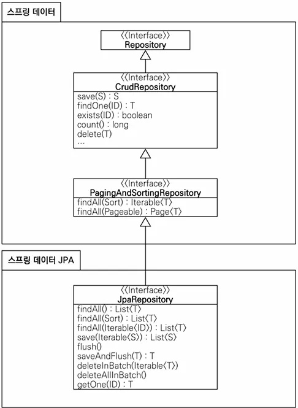

## 순수 JPA 기반 리포지토리 만들기

- 순수한 JPA 기반 리포지토리 생성
- 기본 CRUD
    - 저장
    - 변경 ⇒ 더티체킹
    - 삭제
    - 전체 조회
    - 단건 조회
    - 카운트

**※ JPA에서 수정은 더티 체킹을 사용. 트랜잭션 안에서 엔티티 조회 후 데이터 변경시 트랜잭션 종료 시점에서 더티체킹 후 자동으로 UPDATE SQL 실행**

### 순수 JPA 기반 리포지토리 - 회원

```java
package stduy.datajpa.repository;

import java.util.List;
import java.util.Optional;

import org.springframework.stereotype.Repository;

import jakarta.persistence.EntityManager;
import jakarta.persistence.PersistenceContext;
import stduy.datajpa.entity.Member;

@Repository
public class MemberJpaRepository {

	@PersistenceContext
	private EntityManager em;

	public Member save(Member member) {
		em.persist(member);
		return member;
	}

	public void delete(Member member) {
		em.remove(member);
	}

	public List<Member> findAll() {
		return em.createQuery("select m from Member m", Member.class)
			.getResultList();
	}

	public Optional<Member> findById(Long id) {
		Member member = em.find(Member.class, id);
		return Optional.ofNullable(member);
	}

	public long count() {
		return em.createQuery("select count(m) from Member m", Long.class)
			.getSingleResult();
	}

	public Member find(Long id) {
		return em.find(Member.class, id);
	}

}
```

### 순수 JPA 기반 리포지토리 - 팀

```java
package stduy.datajpa.repository;

import java.util.List;
import java.util.Optional;

import org.springframework.stereotype.Repository;

import jakarta.persistence.EntityManager;
import jakarta.persistence.PersistenceContext;
import stduy.datajpa.entity.Team;

@Repository
public class TeamJpaRepository {

	@PersistenceContext
	private EntityManager em;

	public Team save(Team team) {
		em.persist(team);
		return team;
	}

	public void delete(Team team) {
		em.remove(team);
	}

	public List<Team> findAll() {
		return em.createQuery("select t from Team t", Team.class)
			.getResultList();
	}

	public Optional<Team> findById(Long id) {
		Team team = em.find(Team.class, id);
		return Optional.ofNullable(team);
	}

	public long count() {
		return em.createQuery("select count(t) from Team t", Long.class)
			.getSingleResult();
	}

	public Team find(Long id) {
		return em.find(Team.class, id);
	}

}
```

### 순수 JPA 기반 테스트

```java
package stduy.datajpa.repository;

import static org.assertj.core.api.Assertions.*;

import java.util.List;

import org.junit.jupiter.api.Test;
import org.springframework.beans.factory.annotation.Autowired;
import org.springframework.boot.test.context.SpringBootTest;
import org.springframework.test.annotation.Rollback;
import org.springframework.transaction.annotation.Transactional;

import stduy.datajpa.entity.Member;

@SpringBootTest
@Transactional
@Rollback(false)
class MemberJpaRepositoryTest {

	@Autowired
	MemberJpaRepository memberJpaRepository;

	@Test
	public void testMember() {
		Member member = new Member("memberA");
		Member savedMember = memberJpaRepository.save(member);

		Member findMember = memberJpaRepository.find(savedMember.getId());

		assertThat(findMember.getId()).isEqualTo(member.getId());
		assertThat(findMember.getUsername()).isEqualTo(member.getUsername());
		assertThat(findMember).isEqualTo(member);
	}

	@Test
	public void baseCRUD() {
		Member member1 = new Member("member1");
		Member member2 = new Member("member1");
		memberJpaRepository.save(member1);
		memberJpaRepository.save(member2);

		// 단건 조회 검증
		Member findMember1 = memberJpaRepository.findById(member1.getId()).get();
		Member findMember2 = memberJpaRepository.findById(member2.getId()).get();
		assertThat(findMember1).isEqualTo(member1);
		assertThat(findMember2).isEqualTo(member2);

		// 리스트 조회 검증
		List<Member> all = memberJpaRepository.findAll();
		assertThat(all.size()).isEqualTo(2);

		// 카운트 검증
		long count = memberJpaRepository.count();
		assertThat(count).isEqualTo(2);

		// 삭제 검증
		memberJpaRepository.delete(member1);
		memberJpaRepository.delete(member2);

		long deleteCount = memberJpaRepository.count();
		assertThat(deleteCount).isEqualTo(0);
	}

}
```

## 공통 인터페이스 설정

### JavaConfig 설정 - 스프링 부트 사용시 생략 가능

```java
@Configuration
@EnableJpaRepositories(basePackages = "jpabook.jpashop.repository")
public class AppConfig {}
```

- 스프링 부트 사용시 `@SpringBootApplication` 위치를 지정 (해당 패키지 및 하위 패키지 인식)
- 위치가 달라지면 `@EnableJpaRepositories` 필요

### 스프링 데이터 JPA가 구현 클래스 대신 생성


- `org.springframework.data.repository.Repository`를 구현한 클래스는 스캔 대상
    - MemberRepository 인터페이스가 동작한 이유
    - 실제 출력해보기(Proxy)
    - memberRepository.getClass ⇒ class com.sun.proxy.$ProxyXXX
- `@Repository` 어노테이션 생략 가능
    - 컴포넌트 스캔을 스프링 데이터 JPA가 자동으로 처리
    - JPA 예외를 스프링 예외로 변환하는 과정도 자동으로 처리

## 공통 인터페이스 적용

순수 JPA로 구현한 `MemberJpaRepository` 대신 스프링 데이터 JPA가 제공하는 공통 인터페이스 사용해보겠습니다.

### 스프링 데이터 JPA 기반 MemberRepository

```java
package stduy.datajpa.repository;

import org.springframework.data.jpa.repository.JpaRepository;

import stduy.datajpa.entity.Member;

public interface MemberRepository extends JpaRepository<Member, Long> {
}
```

### MemberRepository 테스트 (기존 테스트와동일)

```java
package stduy.datajpa.repository;

import static org.assertj.core.api.Assertions.*;

import java.util.List;

import org.junit.jupiter.api.Test;
import org.springframework.beans.factory.annotation.Autowired;
import org.springframework.boot.test.context.SpringBootTest;
import org.springframework.test.annotation.Rollback;
import org.springframework.transaction.annotation.Transactional;

import stduy.datajpa.entity.Member;

@SpringBootTest
@Transactional
@Rollback(false)
class MemberRepositoryTest {

	@Autowired
	MemberRepository memberRepository;

	@Test
	public void testMember() {
		Member member = new Member("memberA");
		Member savedMember = memberRepository.save(member);

		Member findMember = memberRepository.findById(savedMember.getId()).get();

		assertThat(findMember.getId()).isEqualTo(member.getId());
		assertThat(findMember.getUsername()).isEqualTo(member.getUsername());
		assertThat(findMember).isEqualTo(member);
	}
	@Test
	public void baseCRUD() {
		Member member1 = new Member("member1");
		Member member2 = new Member("member1");
		memberRepository.save(member1);
		memberRepository.save(member2);

		// 단건 조회 검증
		Member findMember1 = memberRepository.findById(member1.getId()).get();
		Member findMember2 = memberRepository.findById(member2.getId()).get();
		assertThat(findMember1).isEqualTo(member1);
		assertThat(findMember2).isEqualTo(member2);

		// 리스트 조회 검증
		List<Member> all = memberRepository.findAll();
		assertThat(all.size()).isEqualTo(2);

		// 카운트 검증
		long count = memberRepository.count();
		assertThat(count).isEqualTo(2);

		// 삭제 검증
		memberRepository.delete(member1);
		memberRepository.delete(member2);

		long deleteCount = memberRepository.count();
		assertThat(deleteCount).isEqualTo(0);
	}
}
```

기존 순수 JPA 기반 테스트에서 사용했던 코드 그대로 Spring data JPA 리포지토리 기반 테스트로 변경해도 동일한 방식으로 동작하는걸 확인할 수 있습니다.

### TeamRepository 생성

```java
package stduy.datajpa.repository;

import org.springframework.data.jpa.repository.JpaRepository;

import stduy.datajpa.entity.Team;

public interface TeamRepository extends JpaRepository<Team, Long> {
}
```

- TeamRepository는 테스트 생략 (테스트 코드가 동일)
- Generic
    - T: 엔티티 타입
    - ID: 식별자 타입(PK)

## 공통 인터페이스 분석

- JpaRepository 인터페이스: 공통 CRUD 제공
- 제너릭은 <엔티티 타입, 식별자 타입> 설정

### 공통 인터페이스 구성



### 이전 버전 사용점

- `T findOne(ID)` ⇒ `Optional<T> findById(ID)` 변경
- `boolean exists(ID)` ⇒ `boolean existsById(ID)` 변경

### 제너릭 타입

- `T`: 엔티티
- `ID`: 엔티티의 식별자 타입
- `S`: 엔티티와 그 자식 타입

### 주요 메서드

- `save(S)`: 새로운 엔티티는 저장하고 이미 있는 엔티티는 병합
- `delete(T)`: 엔티티 하나를 삭제. 내부에서 `EntityManager.remove()` 호출
- `findById(ID)`: 엔티티 하나를 조회. 내부에서 `EntityManager.find()` 호출
- `getOne(ID)`: 엔티티를 프록시로 조회. 내부에서 `EntityManager.getReference()` 호출
- `findAll(…)`: 모든 엔티티를 조회. 정렬(`Sort`)이나 페이징(`Pageable`) 조건을 파라미터로 제공 가능

즉, `JpaRepository`는 대부분의 공통 메서드를 제공합니다.

**이 링크를 통해 구매하시면 제가 수익을 받을 수 있어요. 🤗**

https://inf.run/XjTuV