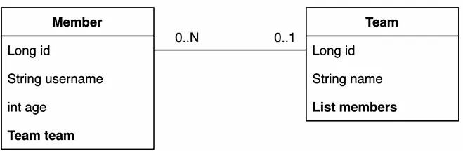
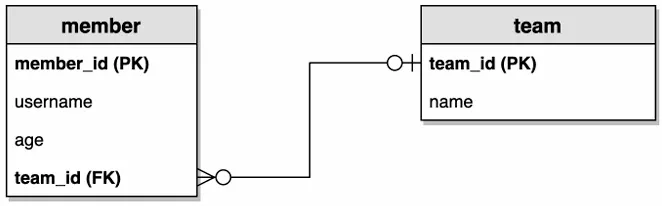

## 엔티티 클래스



## ERD



### **Member - 추가**

```java
package stduy.datajpa.entity;

import jakarta.persistence.Column;
import jakarta.persistence.Entity;
import jakarta.persistence.FetchType;
import jakarta.persistence.GeneratedValue;
import jakarta.persistence.Id;
import jakarta.persistence.JoinColumn;
import jakarta.persistence.ManyToOne;
import lombok.AccessLevel;
import lombok.Getter;
import lombok.NoArgsConstructor;
import lombok.Setter;
import lombok.ToString;

@Entity
@Getter
@Setter // 실습을 위한 Setter
@NoArgsConstructor(access = AccessLevel.PROTECTED)
@ToString(of = {"id", "username", "age"})
public class Member {

	@Id
	@GeneratedValue
	@Column(name = "member_id")
	private Long id;

	private String username;
	private int age;

	@ManyToOne(fetch = FetchType.LAZY)
	@JoinColumn(name = "team_id")
	private Team team;

	public Member(String username) {
		this.username = username;
	}

	public Member(String username, int age, Team team) {
		this.username = username;
		this.age = age;
		if (team != null) {
			changeTeam(team);
		}
	}

	public void changeTeam(Team team) {
		this.team = team;
		team.getMembers().add(this);
	}

}
```

### Team

```java
package stduy.datajpa.entity;

import java.util.ArrayList;
import java.util.List;

import jakarta.persistence.Column;
import jakarta.persistence.Entity;
import jakarta.persistence.GeneratedValue;
import jakarta.persistence.Id;
import jakarta.persistence.OneToMany;
import lombok.AccessLevel;
import lombok.Getter;
import lombok.NoArgsConstructor;
import lombok.Setter;
import lombok.ToString;

@Entity
@Getter
@Setter
@NoArgsConstructor(access = AccessLevel.PROTECTED)
@ToString(of = {"id", "name"})
public class Team {

	@Id
	@GeneratedValue
	@Column(name = "team_id")
	private Long id;
	private String name;

	@OneToMany(mappedBy = "team")
	private List<Member> members = new ArrayList<>();

	public Team(String name) {
		this.name = name;
	}
}
```

### JPA 테스트

```java
package stduy.datajpa.entity;

import java.util.List;

import org.junit.jupiter.api.Test;
import org.springframework.boot.test.context.SpringBootTest;
import org.springframework.test.annotation.Rollback;
import org.springframework.transaction.annotation.Transactional;

import jakarta.persistence.EntityManager;
import jakarta.persistence.PersistenceContext;

@SpringBootTest
@Transactional
@Rollback(false)
class MemberTest {

	@PersistenceContext
	EntityManager em;

	@Test
	public void testEntity() {
		Team teamA = new Team("teamA");
		Team teamB = new Team("teamB");
		em.persist(teamA);
		em.persist(teamB);

		Member member1 = new Member("member1", 10, teamA);
		Member member2 = new Member("member1", 10, teamA);
		Member member3 = new Member("member1", 10, teamA);
		Member member4 = new Member("member1", 10, teamA);
		em.persist(member1);
		em.persist(member2);
		em.persist(member3);
		em.persist(member4);

		// 초기화
		em.flush();
		em.clear();

		// 확인
		List<Member> members = em.createQuery("select m from Member m", Member.class)
			.getResultList();

		for (Member member : members) {
			System.out.println("member = " + member);
			System.out.println("-> member.team = " + member.getTeam());
		}

	}

}
```

- Spring data JPA의 동작은 이후 수정
- rollback false로 설정했으니 테스트 후 실제 데이터 insert 확인
- Team Lazy Loading 확인

**이 링크를 통해 구매하시면 제가 수익을 받을 수 있어요. 🤗**

https://inf.run/XjTuV