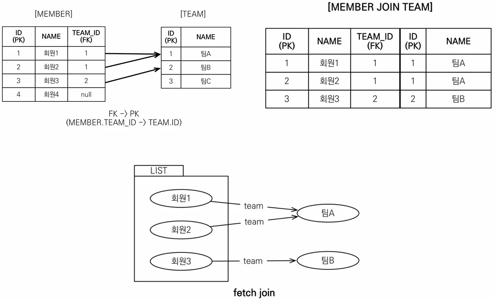

실무에서 굉장히 중요한 기능으로 SQL의 조인 종류가 아닌 JPQL에서 `성능 최적화`를 위해 제공하는 기능입니다. 연관된 엔티티나 컬렉션을 `SQL 한 번에 함께 조회`하는 기능으로 `join fetch` 명령어를 통해 사용할 수 있습니다.

### 엔티티 페치 조인



```java
// member에서 Team 조회시마다 1차 캐시에 없다면 쿼리 발생
// N + 1
String query = "select m from Member m";
List<Member> result = em.createQuery(query, Member.class)
        .getResultList();

for (Member member : result) {
    System.out.println("username = " + member.getUsername() + ", " +
        "teamName = " + member.getTeam().getName());
}
=======================================================================

// join을 통해 프록시 객체가 아닌 실제 객체를 얻어 추가 쿼리 X
// 이전에 배운 **즉시 로딩** 개념으로 생각하면 됨
String query = "select m from Member m **join fetch m.team**";
List<Member> result = em.createQuery(query, Member.class)
        .getResultList();

for (Member member : result) {
    System.out.println("username = " + member.getUsername() + ", " +
        "teamName = " + member.getTeam().getName());
}
```

### 컬렉션 페치 조인


```java
// 원래는 Collection에서 같은 데이터가 나와야 하지만
// Hibernate 6 버전부터 자동으로 중복을 제거해줌
String query = "select t from Team t join fetch t.members";
List<Team> result = em.createQuery(query, Team.class)
        .getResultList();

for (Team team : result) {
    System.out.println("team = " + team.getName() + "|members = " + team.getMembers().size());
    for (Member member : team.getMembers()) {
        System.out.println("-> member = " + member);
    }
}

=============================================
team = 팀A|members = 2
-> member = Member{id=1, username='회원1', age=0}
-> member = Member{id=2, username='회원2', age=0}
team = 팀B|members = 1
-> member = Member{id=3, username='회원3', age=0}
```

### 페치 조인과 일반 조인의 차이

일반 조인 실행시에는 연관된 엔티티를 함께 조회하지 않고 페치 조인은 연관된 엔티티도 즉시 로딩처럼 함께 조회합니다. 즉 `페치 조인은 객체 그래프를 SQL 한번에 조회하는 개념`입니다.

```java
// 일반 조인
// Team 엔티티만 조회하고 회원은 조회하지 않음
String query = "select t from Team t join t.members m";
Hibernate: 
    /* select
        t    
    from
        Team t 
    join
        t.members m */ select
            t1_0.id,
            t1_0.name 
        from
            Team t1_0 
        join
            Member m1_0 
                on t1_0.id=m1_0.TEAM_ID
                
// 페치 조인
// 회원도 같이 조회함
String query = "select t from Team t join fetch t.members m";
Hibernate: 
    /* select
        t 
    from
        Team t 
    join
        
    fetch
        t.members m */ select
            t1_0.id,
            m1_0.TEAM_ID,
            m1_0.id,
            m1_0.age,
            m1_0.username,
            t1_0.name 
        from
            Team t1_0 
        join
            Member m1_0 
                on t1_0.id=m1_0.TEAM_ID
```

### 페치 조인의 특징과 한계

- 페치 조인 대상에는 별칭을 줄 수 없다.
    - 하이버네이트에는 가능하지만 가급적 사용하면 안된다.
    - `왜 사용하면 안될까?`

      JPA는 객체 그래프 탐색시 연관된 모든 엔티티를 조회했다고 가정하고 설계되었다.

      만약 A에서 별칭을 통해 조건을 줘서 10개의 엔티티만 조회하고, B에서는 모두 조회했다고 가정했을 때 영속성 컨텍스트 입장에서는 처리하기가 어렵기 때문에 데이터의 정합성을 보장하지 않는다.

- 둘 이상의 컬렉션은 페치 조인 할 수 없다.
- 컬렉션을 페치 조인하면 페이징 API를 사용할 수 없다.
    - 일대일, 다대일 같은 단일 값 연관 필드들은 페치 조인해도 페이징 가능
    - 하이버네이트는 경고 로그를 남기고 메모리에서 페이징(매우 위험)
- 연관된 엔티티들을 SQL 한 번으로 조회
- 엔티티에 직접 적용하는 글로벌 로딩 전략보다 운선함
    - @OneToMany(fetch = FetchType.LAZY) // 글로벌 로딩 전략
- 실무에서 글로벌 로딩 전략은 모두 지연 로딩
- 최적화가 필요한 곳은 페치 조인 적용
    - N + 1 문제가 발생하는 곳에 페치 조인 적용 ( 실무에서 7~80% 해결)
    - 혹은 1000 이하의 적당한 BatchSize를 지정해 in 절로 해결

모든 것을 페치 조인으로 해결할 수는 없기 때문에 객체 그래프를 유지할 때 사용하면 효과적입니다. 특히 여러 테이블을 조인해서 엔티티가 가진 모양이 아닌 전혀 다른 결과를 내야 하면, 페치 조인 보다는 일반 조인을 사용하고 필요한 데이터들만 조회해서 DTO로 반환하는 것이 효과적입니다.

**이 링크를 통해 구매하시면 제가 수익을 받을 수 있어요. 🤗**

https://inf.run/4Sbno