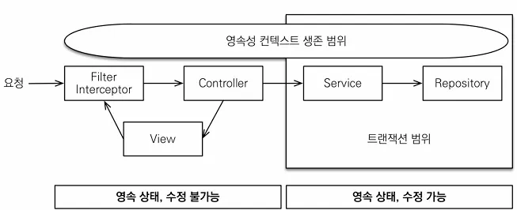
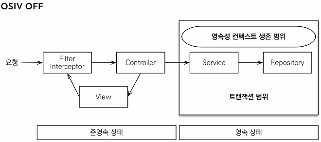

## OSIV와 성능 최적화

- Open Session In View : 하이버네이트
- Open EntityManage In View : JPA

### OSIV ON

- `spring.jpa.open-in-view`: true 기본값

이 기본값을 뿌리면서 애플리케이션 시작 시점에 warn 로그를 남기는 것은 이유가 있습니다.

OSIV 전략은 트랜잭션 시작처럼 **최초 데이터베이스 커넥션 시작 시점부터 API 응답이 끝날 때까지 영속성 컨텍스트와 데이터베이스 커넥션을 유지**합니다. 그래서 지금까지 View Template이나 API 컨트롤러에서 지연 로딩이 가능했던 것입니다.

지연 로딩은 영속성 컨텍스트가 살아있어야 가능하고, 영속성 컨텍스트는 기본적으로 데이터베이스 커넥션을 유지하며 이것 자체가 큰 장점입니다.

하지만 이 전략은 너무 **오랜시간동안 데이터베이스 커넥션 리소스를 사용**하기 때문에, 실시간 트래픽이 중요한 애플리케이션에서는 커넥션이 모자랄 수 있고 이것은 결국 장애로 이어질 수 있습니다.

예를 들어서 컨트롤러에서 외부 API를 호출하면 외부 API 대기 시간 만큼 커넥션 리소스를 반환하지 못하고 유지해야 합니다.

### OSIV OFF

- `spring.jpa.open-in-view`: fasle OSIV 종료

OSIV를 끄면 **트랜잭션을 종료할 때 영속성 컨텍스트를 닫고, 데이터베이스 커넥션도 반환**합니다. 따라서 커넥션 리소스를 낭비하지 않게 됩니다.

OSIV를 끄면 모**든 지연로딩을 트랜잭션 안에서 처리**해야 합니다. 따라서 지금까지 작성한 많은 지연 로딩 코드를 트랜잭션 안으로 넣어야 하는 단점이 있습니다. 그리고 view template에서 지연로딩이 동작하지 않습니다. 결론적으로 트랜잭션이 끝나기 전에 지연 로딩을 강제로 호출해 두어야 합니다.

### 커맨드와 쿼리 분리

실무에서는 **OSIV를 끈 상태**로 복잡성을 관리하는 좋은 방법이 있는데 바로 Command와 Query를 분리하는 것입니다.

참고: [https://en.wikipedia.org/wiki/Command–query_separation](https://en.wikipedia.org/wiki/Command%E2%80%93query_separation)

보통 비즈니스 로직은 특정 엔티티 몇 개를 등록하거나 수정하는 것이므로 성능이 크게 문제가 되지 않습니다. 그런데 복잡한 화면을 출력하기 위한 쿼리는 화면에 맞추어 성능을 최적화 하는 것이 중요합니다. 하지만 그 복잡성에 비해 핵심 비즈니스에 큰 영향을 주는 것은 아닙니다.

그래서 크고 복잡한 애플리케이션을 개발한다면, 이 둘의 관심사를 명확하게 분리하는 선택은 유지보수 관점에서 충분히 의미가 있습니다.

단순하게 설명하자면 다음처럼 분리하는 것입니다.

- OrderService
    - OrderSerivce: 핵심 비즈니스 로직
    - OrderQueryService: 화면이나 API에 맞춘 서비스 (주로 읽기 전용 트랜잭션)

보통 서비스 계층에서 트랜잭션을 유지하며 두 서비스 모두 트랜잭션을 유지하면서 지연 로딩을 사용할 수 있습니다. 실무에서는 일반적으로 고객 서비스의 실시간 API는 OSIV를 끄고, Admin처럼 커넥션을 많이 사용하지 않는 곳에서는 OSIV를 켜둡니다.

**이 링크를 통해 구매하시면 제가 수익을 받을 수 있어요. 🤗**

https://inf.run/4Sbno