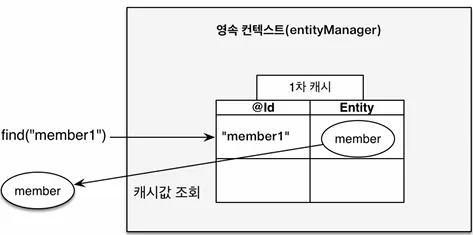
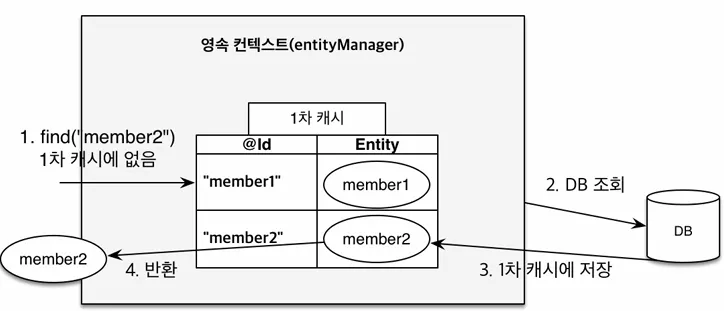
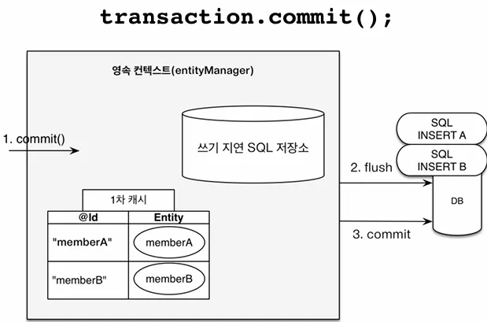

JPA에서는 `객체와 관계형 데이터베이스 매핑하기` 와 `영속성 컨텍스트` 가 제일 중요합니다.

그 중에서 영속성 컨텍스트에 대해서 먼저 알아보도록 하겠습니다.

## 영속성 컨텍스트란?

JPA를 이해하기 위한 가장 중요한 용어이며 굳이 쉽게 설명하면 `엔티티를 영구 저장하는 환경` 이라는 뜻으로 설명할 수 있습니다.

EntityManager를 직접 만들어 사용할 때 persist(entity)를 통해 데이터를 저장합니다. 사실 이는 DB에 저장하는게 아닌 `영속성 컨텍스트` 라는 곳에 저장하게 됩니다. 영속성 컨텍스트는 한 번 사용하고 버리는 EntityManager를 생성할 때 1:1로 생성하는 `실체가 없는 논리적인 개념` 입니다.

영속성 컨텍스트를 이해하기에 앞서 엔티티의 생명주기를 알아야 합니다.

- **비영속(new)** : 영속성 컨텍스트와 전혀 관계가 없는 `새로운` 상태
- **영속(managed)** : 영속성 컨텍스트에 `관리`되는 상태
- **준영속(detached)** : 영속성 컨텍스트에 저장되었다가 `분리`된 상태
- **삭제(removed)** : `삭제`된 상태


이해를 위해 코드를 통해 각 상태를 알아보겠습니다.

```java
// 비영속 (new)
// JPA와 연관이 전혀 없다.
Member member = new Member();
member.setId("member1");
member.setUsername("회원1");

// 영속 (managed)
EntityManager em = emf.createEntityManager();
em.getTransaction().begin();

// 객체를 저장 (엔티티 매니저에 저장)
em.persist(member);

// 준영속 (detached)
// 객체를 영속성 컨텍스트로부터 "분리"
em.detach(member);

// 삭제 (removed)
em.remove(member);
```

위 그림처럼 실제 commit(flush)이 되기 전까지는 persist 만으로는 DB에 저장되지 않습니다. 즉 실제 동작하는 어플리케이션과 DB 사이에 `중간계층` 으로서 동작하고 있으며 JPA를 사용하는 이유에 잠깐 언급했지만 이 영속성 컨텍스트로 인해 다음과 같은 이점을 얻을 수 있습니다.

- 1차 캐시
- 동일성(identity) 보장
- 트랜잭션을 지원하는 쓰기 지연 (transactional write-behind)
- 변경 감지 (Dirty Checking)
- 지연 로딩 (Lazy Loading)

### 1차 캐시

영속성 컨텍스트는 내부에 1차 캐시라는 것을 들고 있습니다. 이 1차 캐시에 Member 엔티티를 저장하는 간단한 코드를 보겠습니다.

```java
Member member = new Member();
member.setId("member1");
member.setUsername("회원1");

// 1차 캐시에 저장
em.persist(member);
```


영속성 컨텍스트에 member를 저장한 이후 조회시에는 jpa는 1차 캐시에서 먼저 찾습니다.

```java
Member member = new Member();
member.setId("member1");
member.setUsername("회원1");

// 1차 캐시에 저장
em.persist(member);

// 1차 캐시에서 조회
Member findMember = em.find(Member.class, "member1");
```



만약 다음과 같이 영속성 컨텍스트에 없는 데이터를 조회하면 어떻게 동작할까요?

```java
Member findMember2 = em.find(Member.class, "member2");
```



그림과 같이 member2는 1차 캐시에 존재하지 않기 때문에 DB에서 조회 후 영속성 컨텍스트에 저장하고 그 값을 반환하게 됩니다.

사실 엔티티 매니저라는건 DB 트랜잭션 단위로 매 커넥션이 맺고 끊길 때 영속성 컨텍스트도 같이 지워지기 때문에 같은 트랜잭션 안에서 동작하는 굉장히 복잡한 비즈니스 로직을 제외하면 굉장히 짧은 찰나에서만 캐시가 동작하기에 성능상 큰 이점을 얻을 수 있는 장점까지는 아닙니다.

때문에 지금은 성능상 이점보다는 이후에 설명될 `객체 지향적 코드 작성시 이점이 있는 컨셉` 정도로 이해하고 넘어가면 됩니다.

### 동일성 보장

1차 캐시로 반복 가능한 읽기(REPETABLE READ) 등급의 트랜잭션 격리 수준울 데이터베이스가 아닌 어플리케이션 차원에서 제공해줍니다.

```java
Member a = em.find(Member.class, "member1");
Member b = em.find(Member.class, "member1");

System.out.println(a == b); // true
```

### 쓰기 지연

영속성 컨텍스트 안에는 1차 캐시 말고도 `쓰기 지연 SQL 저장소` 라는 것도 있습니다.

```java
EntityManager em = emf.createEntityManager();
EntityTransaction transaction = em.getTransaction();

//엔티티 매니저는 데이터 변경시 트랜잭션을 시작해야 한다.
transaction.begin();  // 트랜잭션 시작

em.persist(memberA);
em.persist(memberB);
//여기까지 INSERT SQL을 데이터베이스에 보내지 않는다.

//커밋하는 순간 데이터베이스에 INSERT SQL을 보낸다.
transaction.commit();
```

그림으로 살펴본다면 매 persist시 쿼리를 DB에 날리는게 아닌 SQL 저장소에 쿼리만 생성해서 저장해 놓은 후 `commit(flush)`이 발생할 때 일괄적으로 DB에 보냅니다.




### 변경 감지

영속성 컨텍스트는 엔티티의 변경을 알아서 감지해서 SQL문을 자동으로 생성합니다.

```java
EntityManager em = emf.createEntityManager();
EntityTransaction transaction = em.getTransaction();

transaction.begin();  // [트랜잭션] 시작

// 영속 엔티티 조회
Member memberA = em.find(Member.class, "memberA");

// 영속 엔티티 데이터 수정
memberA.setUsername("hi");
memberA.setAge(10);

//em.update(member) 이런 코드가 있어야 하지 않을까?

transaction.commit(); // [트랜잭션] 커밋
```


### 지연로딩

지연 로딩의 경우 연관 관계에 있는 엔티티를 `실제 사용시` 조회 쿼리를 날리는 방식인데 실무에서도 굉장히 중요한 개념으로 이후에 자세히 설명하도록 하겠습니다.

**이 링크를 통해 구매하시면 제가 수익을 받을 수 있어요. 🤗**

https://inf.run/ZVGV8