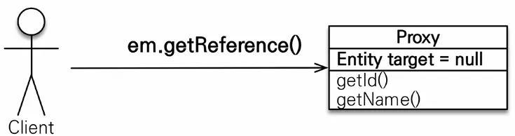
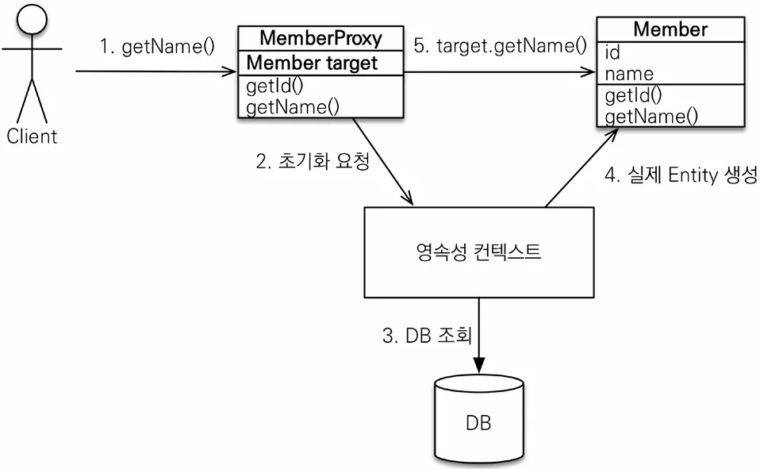
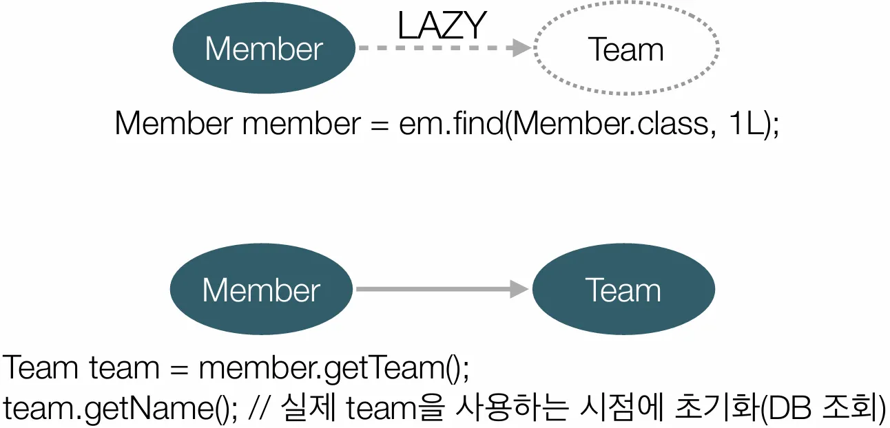
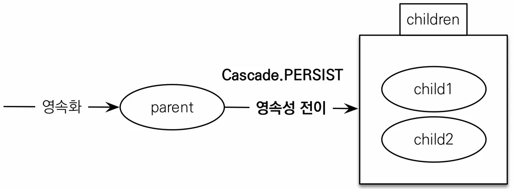

## 프록시

**em.find() vs em.getReference()**

- em.find(): 데이터베이스를 통해서 실제 엔티티 객체 조회
- em.getReference(): 데이터베이스 조회를 미루는 가짜(프록시) 엔티티 객체 조회


```java
**// em.find
Member member = new Member();
member.setUsername("member1");

em.persist(member);

em.flush();
em.clear();

Member findMember = em.find(Member.class, member.getId());
// 조회쿼리 발생

tx.commit();

=========================================================================

// em.getReference
Member member = new Member();
member.setUsername("member1");

em.persist(member);

em.flush();
em.clear();

Member findMember = em.getReference(Member.class, member.getId());
// 여기까지는 조회쿼리 미발생

System.out.println("findMember.id = " + findMember.getId());
System.out.println("findMember.username = " + findMember.getUsername());
// 실제 사용시 조회쿼리 발생

tx.commit();**
```

프록시는 실제 클래스를 상속 받아서 만들어졌기 때문에 겉 모양이 같습니다. 따라서 **이론상** 사용하는 입장에서는 진짜 객체인지 프록시 객체인지 구분하지 않고 사용할 수 있습니다.

이름에서 유추할 수 있듯 프록시 객체는 실제 객체의 참조를 보관하며 호출시 실제 객체의 메소드를 호출하는 방식으로 동작합니다.



```java
Member member = em.getReference(Member.class, "id1");
member.getName();
```



### 프록시의 특징

- 프록시 객체는 처음 사용할 때 한 번만 초기화
- 프록시 객체를 초기화 할 때, 프록시 객체가 `실제 엔티티로 바뀌는 것은 아님`, 초기화되면 프록시 객체를 통해서 실제 엔티티에 접근 가능
- 프록시 객체는 원본 엔티티를 상속받음, 따라서 타입 체크시 주의해야함 (== 비교 실패, 대신 instance of 사용)
- 영속성 컨텍스트에 찾는 엔티티가 이미 있으면 `em.getReference()`를 호출해도 실제 엔티티 반환
- 영속성 컨텍스트의 도움을 받을 수 없는 준영속 상태일 때, 프록시를 초기화하면 문제 발생

  (하이버네이트는 org.hibernate.LazyInitializationException 예외를 터트림)


## 즉시 로딩과 지연 로딩

Member와 Team이 있을 때 단순히 Member 정보만 사용하는 비즈니스 로직에서 반드시 Team도 함께 조회해야만 한다면 아무리 연관 관계를 맺고 있다고 해도 불필요한 정보를 조회하게 되는 셈인데 이런 경우를 대비해 JPA는 `지연 로딩`이라는 옵션을 제공합니다.

### 지연로딩

```java

@Entity
public class Member {
	@Id
	@GeneratedValue
	private Long id;
	
	@Column(name = "USERNAME")
	private String name;
	
	@ManyToOne(fetch = FetchType.LAZY) // **
	@JoinColumn(name = "TEAM_ID")
	private Team team;
	...
}

Member m = em.find(Member.class, member1.getId());

// Team과 연관 관계를 맺고 있음에도 Member만 조회
Hibernate: 
    select
        m1_0.MEMBER_ID,
        m1_0.TEAM_ID,
        m1_0.USERNAME 
    from
        Member m1_0 
    where
        m1_0.MEMBER_ID=?
        
// Team은 단순히 Proxy로 조회
System.out.println("m = " + m.getTeam().getClass());
Hibernate: 
    select
        m1_0.MEMBER_ID,
        m1_0.team_TEAM_ID,
        m1_0.USERNAME 
    from
        Member m1_0 
    where
        m1_0.MEMBER_ID=?
m = class hellojpa.Team$HibernateProxy$vPVnRJF5 // **

// 실제 사용시에 조회
System.out.println("=====================");
System.out.println("m = " + m.getTeam().getName());
System.out.println("=====================");
=====================
Hibernate: 
    select
        t1_0.TEAM_ID,
        t1_0.name 
    from
        Team t1_0 
    where
        t1_0.TEAM_ID=?
m = teamA
=====================
```

코드로 본 것처럼 연관 관계를 맺었어도 자주 조회되지 않는다면 `지연 로딩`을 통해 성능상의 이점을 가져갈 수 있습니다.



하지만 자주 쓰이는 코드에 `지연 로딩`을 사용한다면 join이 아닌 매번 별도의 쿼리가 발생하기 때문에 `즉시 로딩`을 사용해야 합니다.

### 즉시로딩

```java

@Entity
public class Member {
	@Id
	@GeneratedValue
	private Long id;
	
	@Column(name = "USERNAME")
	private String name;
	
	@ManyToOne(fetch = FetchType.EAGER) // **
	@JoinColumn(name = "TEAM_ID")
	private Team team;
	...
}

Member m = em.find(Member.class, member1.getId());

// Join 쿼리를 통해 한 번에 데이터 조회
Hibernate: 
    select
        m1_0.MEMBER_ID,
        t1_0.TEAM_ID,
        t1_0.name,
        m1_0.USERNAME 
    from
        Member m1_0 
    left join
        Team t1_0 
            on t1_0.TEAM_ID=m1_0.team_TEAM_ID 
    where
        m1_0.MEMBER_ID=?
m = class hellojpa.Team // 프록시 객체게 아닌 실제 객체
```


프록시와 즉시로딩 주의사항입니다.

- 실무에서는 ~~가급적~~ 지연 로딩만 사용
- 즉시 로딩을 적용하면 예상하지 못한 SQL이 발생
- 즉시 로딩은 JPQL에서 N+1 문제를 일으킨다.

  ~~그냥 즉시 로딩 쓰지마세요.~~

- @ManyToOne, @OneToOne은 기본이 즉시 로딩 ⇒ LAZY로 설정
- @OneToMany, @ManyToMany는 기본이 지연 로딩
- N+1 문제란?

  JPA에서 연관된 엔티티를 조회할 때, 예상보다 많은 추가적인 쿼리가 실행되는 문제를 의미합니다.

  ### **발생 원리**

    1. `findAll()`과 같은 메서드를 실행하면 기본 엔티티 리스트를 조회하는 **단일 쿼리**가 실행됩니다.
    2. 조회된 엔티티의 연관 데이터를 가져올 때, **각 엔티티마다 추가적인 N개의 쿼리**가 실행됩니다.

  예를 들어, `Team`과 `Member`가 **1:N 관계**인 경우,

    ```java
    List<Team> teams = teamRepository.findAll();
    ```

  위 코드를 실행하면:

    1. `teams`를 가져오는 **1개의 쿼리**가 실행됩니다.
    2. 이후 `team.getMembers()`를 호출할 때마다 **각 팀별로 N개의 추가 쿼리**가 발생합니다.

`이론상` 다음과 같이 간단히 정리할 수 있습니다.

- 자주 조회된다? ⇒ 즉시 로딩(Eager)
- 가끔 조회한다? ⇒ 지연 로딩(Lazy)

## 영속성 전이: CASCADE

영속성 전이란 앞서 설명한 지연, 즉시 로딩과는 관계 없고 특정 엔티티를 영속 상태로 만들 때 연관된 엔티티도 함께 영속 상태로 만들고 싶을 때 사용합니다.

`예) 부모 엔티티를 저장할 때 자식 엔티티도 함께 저장`

### 영속성 전이 미사용

```java
@Entity
public class Child {

	@Id
	@GeneratedValue
	private Long id;

	private String name;

	@ManyToOne
	@JoinColumn(name = "PARENT_ID")
	private Parent parent;
}

@Entity
public class Parent {

	@Id
	@GeneratedValue
	private Long id;

	@OneToMany(mappedBy = "parent")
	private List<Child> childList = new ArrayList<Child>();

	public void addChild(Child child) {
		childList.add(child);
		child.setParent(this);
	}
}

Child child1 = new Child();
Child child2 = new Child();

Parent parent = new Parent();
parent.addChild(child1);
parent.addChild(child2);

// 각각의 영속성 생성
em.persist(parent);
em.persist(child1);
em.persist(child2);
```

### 영속성 전이 사용

```java
@OneToMany(mappedBy="parent", cascade=CascadeType.PERSIST)
```



```java
Child child1 = new Child();
Child child2 = new Child();

Parent parent = new Parent();
parent.addChild(child1);
parent.addChild(child2);

// parent만 persist
em.persist(parent);

// Child insert 쿼리도 함께 발생
Hibernate: 
    /* insert for
        hellojpa.Parent */insert 
    into
        Parent (name, id) 
    values
        (?, ?)
Hibernate: 
    /* insert for
        hellojpa.Child */insert 
    into
        Child (name, PARENT_ID, id) 
    values
        (?, ?, ?)
Hibernate: 
    /* insert for
        hellojpa.Child */insert 
    into
        Child (name, PARENT_ID, id) 
    values
        (?, ?, ?)
```

CASCADE는 다음과 같은 옵션이 존재합니다.

- **ALL: 모두 적용**
- **PERSIST: 영속**
- **REMOVE: 삭제**
- MERGE: 병합
- REFRESH: REFRESH
- DETACH: DETACH

## 고아 객체

고아 객체란 부모 엔티티와 연관관계가 끊어진 자식 엔티티를 뜻하며 orphanRemoval 옵션을 통해 자동으로 삭제할 수 있습니다.

```java
@OneToMany(mappedBy = "parent", cascade = CascadeType.ALL, orphanRemoval = true) // **
private List<Child> childList = new ArrayList<>();

Parent parent1 = em.find(Parent.class, id);
parent1.getChildren().remove(0);
// 자식 엔티티를 컬렉션에서 제거

Hibernate: 
    select
        cl1_0.PARENT_ID,
        cl1_0.id,
        cl1_0.name 
    from
        Child cl1_0 
    where
        cl1_0.PARENT_ID=?
Hibernate: 
    /* delete for hellojpa.Child */delete 
    from
        Child 
    where
        id=?
```

### 고아 객체 주의사항

- 참조가 제거된 엔티티는 다른 곳에서 참조하지 않는 고아 객체로 보고 삭제하는 기능
- **참조하는 곳이 하나일 때 사용해야함**
- **특정 엔티티가 개인 소유할 때 사용**
- @OneToOen, @OneToMany만 가능
- **참고 (CascadeType.REMOVE)**

  개념적으로 부모를 제거하면 자식은 고아가 된다. 따라서 고아 객체 제거 기능을 활성화 하면, 부모를 제거할 때 자식도 함께 제거된다. 이것은 **CascadeType.REMOVE**처럼 동작한다.

    ```java
    Parent findParent = em.find(Parent.class, parent.getId());
    em.remove(findParent);
    
    Hibernate: 
        /* delete for hellojpa.Child */delete 
        from
            Child 
        where
            id=?
    Hibernate: 
        /* delete for hellojpa.Child */delete 
        from
            Child 
        where
            id=?
    Hibernate: 
        /* delete for hellojpa.Parent */delete 
        from
            Parent 
        where
            id=?
    ```


### 영속성 전이 + 고아 객체, 생명주기

- **CascadeType.ALL + orphanRemoval = true**
- 스스로 생명주기를 관리하는 엔티티는 em.persist()로 영속화, em.remove()로 제거
- 두 옵션을 모두 활성화 하면 부모 엔티티를 통해서 자식의 생명 주기를 관리할 수 있음
- 도메인 주도 설계(DDD)의 Aggregate Root 개념을 구현할 때 유용

**이 링크를 통해 구매하시면 제가 수익을 받을 수 있어요. 🤗**

https://inf.run/4Sbno