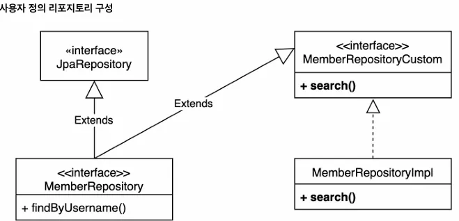

## 스프링 데이터 JPA 리포지토리로 변경

**스프링 데이터 JPA - MemberRepository 생성**

```java
package stduy.querydsl.repository;

import java.util.List;

import org.springframework.data.jpa.repository.JpaRepository;

import stduy.querydsl.entity.Member;

public interface MemberRepository extends JpaRepository<Member, Long> {

	List<Member> findByUsername(String username);
}
```

**스프링 데이터 JPA 테스트**

```java
package stduy.querydsl.repository;

import static org.assertj.core.api.Assertions.*;
import static org.junit.jupiter.api.Assertions.*;

import java.util.List;

import org.junit.jupiter.api.Test;
import org.springframework.beans.factory.annotation.Autowired;
import org.springframework.boot.test.context.SpringBootTest;

import jakarta.persistence.EntityManager;
import jakarta.transaction.Transactional;
import stduy.querydsl.entity.Member;

@SpringBootTest
@Transactional
class MemberRepositoryTest {
	
	@Autowired
	EntityManager em;

	@Autowired
	MemberRepository memberRepository;

	@Test
	public void basicTest() throws Exception {
		Member member = new Member("member10", 10);
		memberRepository.save(member);

		Member findMember = memberRepository.findById(member.getId()).get();
		assertEquals(member, findMember);

		List<Member> result1 = memberRepository.findAll();
		assertThat(result1).containsExactly(member);

		List<Member> result2 = memberRepository.findByUsername("member10");
		assertThat(result2).containsExactly(member);
	}

}
```

- Querydsl 전용 기능인 회원 search를 작성할 수 없음 ⇒ 사용자 정의 리포지토리 필요함

## 사용자 정의 리포지토리

**사용자 정의 리포지토리 사용법**

1. 사용자 정의 인터페이스 작성
2. 사용자 정의 인터페이스 구현
3. 스프링 데이터 리포지토리에 사용자 정의 인터페이스 상속



### 1. 사용자 정의 인터페이스 작성

```java
package stduy.querydsl.repository;

import java.util.List;

import stduy.querydsl.dto.MemberSearchCondition;
import stduy.querydsl.dto.MemberTeamDto;

public interface MemberRepositoryCustom {
	List<MemberTeamDto> search(MemberSearchCondition condition);
}
```

### 2. 사용자 정의 인터페이스 구현

```java
package stduy.querydsl.repository;

import static org.springframework.util.StringUtils.*;
import static stduy.querydsl.entity.QMember.*;
import static stduy.querydsl.entity.QTeam.*;

import java.util.List;

import com.querydsl.core.types.dsl.BooleanExpression;
import com.querydsl.jpa.impl.JPAQueryFactory;

import lombok.RequiredArgsConstructor;
import stduy.querydsl.dto.MemberSearchCondition;
import stduy.querydsl.dto.MemberTeamDto;
import stduy.querydsl.dto.QMemberTeamDto;

@RequiredArgsConstructor
public class MemberRepositoryImpl implements MemberRepositoryCustom {

	private final JPAQueryFactory queryFactory;

	@Override
	public List<MemberTeamDto> search(MemberSearchCondition condition) {
		return queryFactory
			.select(new QMemberTeamDto(
				member.id,
				member.username,
				member.age,
				team.id,
				team.name))
			.from(member)
			.leftJoin(member.team, team)
			.where(
				usernameEq(condition.getUsername()),
				teamNameEq(condition.getTeamName()),
				ageGoe(condition.getAgeGoe()),
				ageLoe(condition.getAgeLoe())
			)
			.fetch();
	}

	private BooleanExpression usernameEq(String username) {
		return hasText(username) ? member.username.eq(username) : null;
	}

	private BooleanExpression teamNameEq(String teamName) {
		return hasText(teamName) ? member.team.name.eq(teamName) : null;
	}

	private BooleanExpression ageGoe(Integer ageGoe) {
		return ageGoe != null ? member.age.goe(ageGoe) : null;
	}

	private BooleanExpression ageLoe(Integer ageLoe) {
		return ageLoe != null ? member.age.loe(ageLoe) : null;
	}
}
```

**※ 이 경우 커스텀한 이름이 아닌 JPA Repository 뒤에 Impl만 붙여 사용해야 정상동작**

### 3. 스프링 데이터 리포지토리에 사용자 정의 인터페이스 상속

```java
package stduy.querydsl.repository;

import java.util.List;

import org.springframework.data.jpa.repository.JpaRepository;

import stduy.querydsl.entity.Member;

public interface MemberRepository extends JpaRepository<Member, Long>, MemberRepositoryCustom {

	List<Member> findByUsername(String username);
}
```

### 커스텀 리포지토리 동작 테스트

```java
@Test
public void searchTest() throws Exception {
	Team teamA = new Team("teamA");
	Team teamB = new Team("teamB");
	em.persist(teamA);
	em.persist(teamB);

	Member member1 = new Member("member1", 10, teamA);
	Member member2 = new Member("member2", 20, teamA);
	Member member3 = new Member("member3", 30, teamB);
	Member member4 = new Member("member4", 40, teamB);
	em.persist(member1);
	em.persist(member2);
	em.persist(member3);
	em.persist(member4);

	MemberSearchCondition condition = new MemberSearchCondition();
	condition.setAgeGoe(35);
	condition.setAgeLoe(40);
	condition.setTeamName("teamB");

	List<MemberTeamDto> result = memberRepository.search(condition);

	assertThat(result).extracting("username").containsExactly("member4");
}
```

## 스프링 데이터 페이징 활용 1 - Querydsl 페이징 연동

- 스프링 데이터의 page, Pageable 활용
- 전체 카운트를 한번에 조회하는 단순한 방법
- 데이터 내용과 전체 카운트를 별도로 조회하는 방법

### 사용자 정의 인터페이스에 페이징 2가지 추가

```java
package stduy.querydsl.repository;

import java.util.List;

import org.springframework.data.domain.Page;
import org.springframework.data.domain.Pageable;

import stduy.querydsl.dto.MemberSearchCondition;
import stduy.querydsl.dto.MemberTeamDto;

public interface MemberRepositoryCustom {
	List<MemberTeamDto> search(MemberSearchCondition condition);
	Page<MemberTeamDto> searchPageSimple(MemberSearchCondition condition, Pageable pageable);
	Page<MemberTeamDto> searchPageComplex(MemberSearchCondition condition, Pageable pageable);
}
```

### 전체 카운트 한번에 조회하는 단순한 방법

searchPageSimple(), fetchResults() 사용

```java
@Override
public Page<MemberTeamDto> searchPageSimple(MemberSearchCondition condition, Pageable pageable) {
	QueryResults<MemberTeamDto> results = queryFactory
		.select(new QMemberTeamDto(
			member.id,
			member.username,
			member.age,
			team.id,
			team.name))
		.from(member)
		.leftJoin(member.team, team)
		.where(
			usernameEq(condition.getUsername()),
			teamNameEq(condition.getTeamName()),
			ageGoe(condition.getAgeGoe()),
			ageLoe(condition.getAgeLoe())
		)
		.offset(pageable.getOffset())
		.limit(pageable.getPageSize())
		.fetchResults();

	List<MemberTeamDto> content = results.getResults();
	long total = results.getTotal();

	return new PageImpl<>(content, pageable, total);
}
```

- Querydsl이 제공하는 `fetchResults()`를 사용하면 내용과 전체 카운트를 한번에 조회할 수 있음(실제 쿼리는 두 번 호출)
- `fetchResults()`는 카운트 쿼리 실행시 필요없는 `order by`는 제거

**※ `fetchResults()`는 현재 deprecated 되어 PageSimpe 방법은 사용 지양**

### 데이터 내용과 전체 카운트를 별도로 조회하는 방법

**searchPageComplex()**

**PageableExecutionUtils.getPage()로 최적화**

```java
@Override
public Page<MemberTeamDto> searchPageComplex(MemberSearchCondition condition, Pageable pageable) {
	List<MemberTeamDto> content = queryFactory
		.select(new QMemberTeamDto(
			member.id,
			member.username,
			member.age,
			team.id,
			team.name))
		.from(member)
		.leftJoin(member.team, team)
		.where(
			usernameEq(condition.getUsername()),
			teamNameEq(condition.getTeamName()),
			ageGoe(condition.getAgeGoe()),
			ageLoe(condition.getAgeLoe())
		)
		.offset(pageable.getOffset())
		.limit(pageable.getPageSize())
		.fetch();

	JPAQuery<Long> countQuery = queryFactory
		.select(member.count())
		.from(member)
		.leftJoin(member.team, team)
		.where(
			usernameEq(condition.getUsername()),
			teamNameEq(condition.getTeamName()),
			ageGoe(condition.getAgeGoe()),
			ageLoe(condition.getAgeLoe())
		);

	return PageableExecutionUtils.getPage(content, pageable, countQuery::fetchOne);
}
```

- 가독성을 위해 내용 쿼리와 카운트 쿼리를 분리해주면 더욱 좋음
- 스프링 데이터 라이브러리가 제공
- count 쿼리가 생략 가능한 경우 생략해서 처리
    - 페이지 시작이면서 컨텐츠 사이즈가 페이지 사이즈보다 작을 때
    - 마지막 페이지 일 때 (offect + 컨텐츠 사이즈를 더해서 전체 사이즈를 구함, 더 정확히는 마지막 페이지이면서 컨텐츠 사이즈가 페이지 사이즈보다 작을 때)

## 스프링 데이터 페이징 활용3 - 컨트롤러 개발

**실제 컨트롤러**

**이 링크를 통해 구매하시면 제가 수익을 받을 수 있어요. 🤗**

https://inf.run/Ybt69