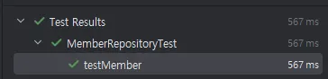

- 프로젝트 환경
    - Spring Boot
    - Gradle - Groovy
    - Group : stduy
    - Artifact : data-jpa
    - JDK : 17
- 의존성
    - Spring Boot 3.4.4
    - Spring Web
    - Spring Data JPA
    - H2 Database
    - Lombk
- H2 Database 설치
    - https://www.h2database.com
    - `jdbc:h2:~/datajpa` (최소 한 번 실행)
    - 이후부터 `jdbc:h2:tcp://localhost/~/datajpa`로 접속
- application.yml

```java
spring:
  datasource:
    url: jdbc:h2:tcp://localhost/~/datajpa
    username: sa
    password:
    driver-class-name: org.h2.Driver
  jpa:
    hibernate:
      ddl-auto: create # 실행 시점에 테이블 drop 및 생성
    properties:
      hibernate:
        #show_sql: true
        format_sql: true
logging:
  level:
    org.hibernate.SQL: debug # logger로 JPA 실행 SQL 출력
    #  org.hibernate.type: trace
```

## 동작 테스트

### 회원 엔티티

**Member**

```java
package stduy.datajpa.entity;

import jakarta.persistence.Entity;
import jakarta.persistence.GeneratedValue;
import jakarta.persistence.Id;
import lombok.Getter;
import lombok.Setter;

@Entity
@Getter
@Setter // 실습을 위한 Setter
public class Member {

	@Id
	@GeneratedValue
	private Long id;

	private String username;

	protected Member() {
	}

	public Member(String username) {
		this.username = username;
	}
}
```

### 회원 Repository

**MemberJpaRepository**

```java
package stduy.datajpa.repository;

import org.springframework.stereotype.Repository;

import jakarta.persistence.EntityManager;
import jakarta.persistence.PersistenceContext;
import stduy.datajpa.entity.Member;

@Repository
public class MemberJpaRepository {

	@PersistenceContext
	private EntityManager em;

	public Member save(Member member) {
		em.persist(member);
		return member;
	}

	public Member find(Long id) {
		return em.find(Member.class, id);
	}

}
```

### JPA 테스트

**MemberJpaRepositoryTest**

```java
package stduy.datajpa.repository;

import static org.assertj.core.api.Assertions.*;

import org.junit.jupiter.api.Test;
import org.springframework.beans.factory.annotation.Autowired;
import org.springframework.boot.test.context.SpringBootTest;
import org.springframework.test.annotation.Rollback;
import org.springframework.transaction.annotation.Transactional;

import stduy.datajpa.entity.Member;

@SpringBootTest
@Transactional
@Rollback(false)
class MemberJpaRepositoryTest {

	@Autowired
	MemberJpaRepository memberJpaRepository;

	@Test
	public void testMember() {
		Member member = new Member("memberA");
		Member savedMember = memberJpaRepository.save(member);

		Member findMember = memberJpaRepository.find(savedMember.getId());

		assertThat(findMember.getId()).isEqualTo(member.getId());
		assertThat(findMember.getUsername()).isEqualTo(member.getUsername());
		assertThat(findMember).isEqualTo(member);
	}

}
```


### 스프링 데이터 JPA Repository

**MemberRepository**

```java
package stduy.datajpa.repository;

import org.springframework.data.jpa.repository.JpaRepository;

import stduy.datajpa.entity.Member;

public interface MemberRepository extends JpaRepository<Member, Long> {
}
```

### 스프링 데이터 JPA Test

**MemberRepositoryTest - 코드 동일**

```java
package stduy.datajpa.repository;

import static org.assertj.core.api.Assertions.*;
import static org.junit.jupiter.api.Assertions.*;

import org.junit.jupiter.api.Test;
import org.springframework.beans.factory.annotation.Autowired;
import org.springframework.boot.test.context.SpringBootTest;
import org.springframework.test.annotation.Rollback;
import org.springframework.transaction.annotation.Transactional;

import stduy.datajpa.entity.Member;

@SpringBootTest
@Transactional
@Rollback(false)
class MemberRepositoryTest {

	@Autowired
	MemberRepository memberRepository;

	@Test
	public void testMember() {
		Member member = new Member("memberA");
		Member savedMember = memberRepository.save(member);

		Member findMember = memberRepository.findById(savedMember.getId()).get();

		assertThat(findMember.getId()).isEqualTo(member.getId());
		assertThat(findMember.getUsername()).isEqualTo(member.getUsername());
		assertThat(findMember).isEqualTo(member);
	}
}
```



### 쿼리 파라미터 로그 남기기

- org.hibernate.type: trace : SQL 실행 파라미터 로그
- 외부 라이브러리 사용
    - https://github.com/gavlyukovskiy/spring-boot-data-source-decorator
    - `implementation 'com.github.gavlyukovskiy:p6spy-spring-boot-starter:1.9.0` 이상

      (운영 사용시 성능 테스트 필수)

**이 링크를 통해 구매하시면 제가 수익을 받을 수 있어요. 🤗**

https://inf.run/XjTuV