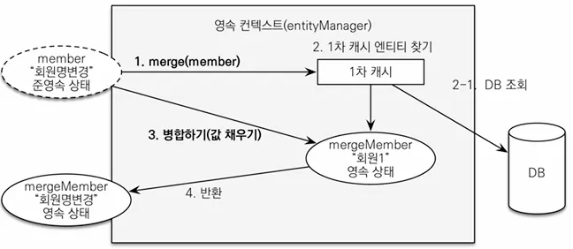

## 홈 화면 및 레이아웃

### HomeController

```java
@Controller
@Slf4j
public class HomeController {

	@RequestMapping("/")
	public String home() {
		log.info("home controller");
		return "home";
	}

}
```

### home

```java
<!DOCTYPE HTML>
<html xmlns:th="http://www.thymeleaf.org">
<head th:replace="fragments/header :: header">
    <title>Hello</title>
    <meta http-equiv="Content-Type" content="text/html; charset=UTF-8" />
</head>

<body>

<div class="container">
    <div th:replace="fragments/bodyHeader :: bodyHeader" />
    <div class="jumbotron">
        <h1>HELLO SHOP</h1>
        <p class="lead">회원 기능</p>
        <p>
            <a class="btn btn-lg btn-secondary" href="/members/new">회원 가입</a>
            <a class="btn btn-lg btn-secondary" href="/members">회원 목록</a>
        </p>
        <p class="lead">상품 기능</p>
        <p>
            <a class="btn btn-lg btn-dark" href="/items/new">상품 등록</a>
            <a class="btn btn-lg btn-dark" href="/items">상품 목록</a>
        </p>
        <p>class="lead">주문 기능</p>
        <p>
            <a class="btn btn-lg btn-info" href="/order">상품 주문</a>
            <a class="btn btn-lg btn-info" href="/orders">주문 내역</a>
        </p>
    </div>
    <div th:replace="fragments/footer :: footer" />
</div> <!-- /container -->

</body>

</html>
```

### fragments/header

```java
<!DOCTYPE html>
<html xmlns:th="http://www.thymeleaf.org">
<head th:fragment="header">
  <!-- Required meta tags -->
  <meta charset="utf-8">
  <meta name="viewport" content="width=device-width, initial-scale=1, shrink
to-fit=no">
  <!-- Bootstrap CSS -->
  <link rel="stylesheet" href="/css/bootstrap.min.css" integrity="sha384
ggOyR0iXCbMQv3Xipma34MD+dH/1fQ784/j6cY/iJTQUOhcWr7x9JvoRxT2MZw1T"
        crossorigin="anonymous">
  <!-- Custom styles for this template -->
  <link href="/css/jumbotron-narrow.css" rel="stylesheet">
  <title>Hello, world!</title>
</head>
```

### fragments/bodyHeader

```java
**<!DOCTYPE html>
<html xmlns:th="http://www.thymeleaf.org">
<div class="header" th:fragment="bodyHeader">
    <ul class="nav nav-pills pull-right">
        <li><a href="/">Home</a></li>
    </ul>
    <a href="/"><h3 class="text-muted">HELLO SHOP</h3></a>
</div>**
```

### fragments/footer

```java
<!DOCTYPE html>
<html xmlns:th="http://www.thymeleaf.org">
<div class="footer" th:fragment="footer">
  <p>&copy; Hello Shop V2</p>
</div>
```

`※ Thymeleaf에서 별도 기능을 통해 레이아웃 사용 가능하나 화면이 주가 아니기에 생략`

`※ 참고 : https://www.thymeleaf.org/doc/articles/layouts.html`

### view 리소스 등록

resources/static 하위에 아래 코드 추가 (bootstrap)

[static.zip](file/static.zip)

## 회원 등록

### MemberForm

```java
@Getter
@Setter
public class MemberForm {

	@NotEmpty(message = "회원 이름은 필수입니다.")
	private String name;

	private String city;
	private String street;
	private String zipcode;

}
```

### MemberController

```java
@Controller
@RequiredArgsConstructor
@Slf4j
public class MemberController {

	private final MemberService memberService;

	@GetMapping("/members/new")
	public String createForm(Model model) {
		model.addAttribute("memberForm", new MemberForm());
		return "members/createMemberForm";
	}

	@PostMapping("/members/new")
	public String create(@Valid MemberForm form, BindingResult result) {
		if (result.hasErrors()) {
			return "members/createMemberForm";
		}

		Address address = new Address(form.getCity(), form.getStreet(), form.getZipcode());

		Member member = new Member();
		member.setName(form.getName());
		member.setAddress(address);

		memberService.join(member);

		return "redirect:/";
	}

}
```

### /members/createMemberForm

```java
<!DOCTYPE HTML>
<html xmlns:th="http://www.thymeleaf.org">
<head th:replace="fragments/header :: header" />
<style>
    .fieldError {
        border-color: #bd2130;
    }
</style>
<body>

<div class="container">
    <div th:replace="fragments/bodyHeader :: bodyHeader"/>

    <form role="form" action="/members/new" th:object="${memberForm}" method="post">
        <div class="form-group">
            <label th:for="name">이름</label>

            <input type="text" th:field="*{name}" class="form-control" placeholder="이름을 입력하세요"
                   th:class="${#fields.hasErrors('name')}? 'form-control fieldError' : 'form-control'">
            <p th:if="${#fields.hasErrors('name')}" th:errors="*{name}">Incorrect date</p>

        </div>
        <div class="form-group">
            <label th:for="city">도시</label>
            <input type="text" th:field="*{city}" class="form-control" placeholder="도시를 입력하세요">
        </div>
        <div class="form-group">
            <label th:for="street">거리</label>
            <input type="text" th:field="*{street}" class="form-control" placeholder="거리를 입력하세요">
        </div>
        <div class="form-group">
            <label th:for="zipcode">우편번호</label>
            <input type="text" th:field="*{zipcode}" class="form-control" placeholder="우편번호를 입력하세요">
        </div>
        <button type="submit" class="btn btn-primary">Submit</button>
    </form>
    <br/>
    <div th:replace="fragments/footer :: footer" />
</div> <!-- /container -->

</body>
</html>

```

## 회원 목록 조회

### MemberController (코드 추가)

```java
@GetMapping("/members")
public String list(Model model) {
	List<Member> members = memberService.findMembers();
	model.addAttribute("members", members);
	return "members/memberList";
}
```

- 조회한 상품을 뷰에 전달하기 위해 스프링 `Model`객체에 보관
- 이후 실행할 뷰 이름 반환 (html)

### /members/MemberList

```java
<!DOCTYPE HTML>
<html xmlns:th="http://www.thymeleaf.org">
<head th:replace="fragments/header :: header" />
<body>

<div class="container">
    <div th:replace="fragments/bodyHeader :: bodyHeader" />
    <div>
        <table class="table table-striped">
            <thead>
            <tr>
                <th>#</th>
                <th>이름</th>
                <th>도시</th>
                <th>주소</th>
                <th>우편번호</th>
            </tr>
            </thead>
            <tbody>
            <tr th:each="member : ${members}">
                <td th:text="${member.id}"></td>
                <td th:text="${member.name}"></td>
                <td th:text="${member.address?.city}"></td>
                <td th:text="${member.address?.street}"></td>
                <td th:text="${member.address?.zipcode}"></td>
            </tr>
            </tbody>
        </table>
    </div>

    <div th:replace="fragments/footer :: footer" />

</div> <!-- /container -->

</body>
</html>

```

## 상품 등록

### BookForm

```java
@Getter
@Setter
public class BookForm {

	private Long id;

	private String name;
	private int price;
	private int stockQuantity;

	private String author;
	private String isbn;

}
```

### ItemController

```java
@Controller
@RequiredArgsConstructor
public class ItemController {

	private final ItemService itemService;

	@GetMapping("/items/new")
	public String createForm(Model model) {
		model.addAttribute("form", new BookForm());
		return "items/createItemForm";
	}

	@PostMapping("/items/new")
	public String create(BookForm form) {
		Book book = new Book();
		book.setName(form.getName());
		book.setPrice(form.getPrice());
		book.setStockQuantity(form.getStockQuantity());
		book.setAuthor(form.getAuthor());
		book.setIsbn(form.getIsbn());

		itemService.saveItem(book);
		return "redirect:/:items";
	}

}
```

### items/createItemForm

```java
<!DOCTYPE HTML>
<html xmlns:th="http://www.thymeleaf.org">
<head th:replace="fragments/header :: header" />
<body>

<div class="container">
    <div th:replace="fragments/bodyHeader :: bodyHeader"/>

    <form th:action="@{/items/new}" th:object="${form}" method="post">
        <div class="form-group">
            <label th:for="name">상품명</label>
            <input type="text" th:field="*{name}" class="form-control" placeholder="이름을 입력하세요">
        </div>
        <div class="form-group">
            <label th:for="price">가격</label>
            <input type="number" th:field="*{price}" class="form-control" placeholder="가격을 입력하세요">
        </div>
        <div class="form-group">
            <label th:for="stockQuantity">수량</label>
            <input type="number" th:field="*{stockQuantity}" class="form-control" placeholder="수량을 입력하세요">
        </div>
        <div class="form-group">
            <label th:for="author">저자</label>
            <input type="text" th:field="*{author}" class="form-control" placeholder="저자를 입력하세요">
        </div>
        <div class="form-group">
            <label th:for="isbn">ISBN</label>
            <input type="text" th:field="*{isbn}" class="form-control" placeholder="ISBN을 입력하세요">
        </div>
        <button type="submit" class="btn btn-primary">Submit</button>
    </form>
    <br/>
    <div th:replace="fragments/footer :: footer" />

</div> <!-- /container -->

</body>
</html>
```

**상품 등록**

- 상품 등록 폼에서 데이터를 입력하고 Submit 버튼 클릭시 `/items/new` POST 방식으로 요청
- 상품 저장이 끝나면 상품 목록 화면(`redirect:/items`)으로 리다이렉트

## 상품 목록

### ItemController (코드 추가)

```java
@GetMapping("/items")
public String list(Model model) {
	List<Item> items = itemService.findItems();
	model.addAttribute("items", items);
	return "items/itemList";
}
```

### items/itemList

```java
<!DOCTYPE HTML>
<html xmlns:th="http://www.thymeleaf.org">
<head th:replace="fragments/header :: header" />
<body>

<div class="container">
    <div th:replace="fragments/bodyHeader :: bodyHeader"/>

    <div>
        <table class="table table-striped">
            <thead>
            <tr>
                <th>#</th>
                <th>상품명</th>
                <th>가격</th>
                <th>재고수량</th>
                <th></th>
            </tr>
            </thead>
            <tbody>
            <tr th:each="item : ${items}">
                <td th:text="${item.id}"></td>
                <td th:text="${item.name}"></td>
                <td th:text="${item.price}"></td>
                <td th:text="${item.stockQuantity}"></td>
                <td>
                    <a href="#" th:href="@{/items/{id}/edit (id=${item.id})}" class="btn btn-primary" role="button">수정</a>
                </td>
            </tr>
            </tbody>
        </table>
    </div>

    <div th:replace="fragments/footer :: footer"/>

</div> <!-- /container -->

</body>
</html>
```

## 상품 수정

### ItemController (코드 추가)

```java
@GetMapping("/items/{itemId}/edit")
	public String updateItemForm(@PathVariable("itemId") Long itemId, Model model) {
		Book item = (Book) itemService.findItem(itemId);

		BookForm form = new BookForm();
		form.setId(item.getId());
		form.setName(item.getName());
		form.setPrice(item.getPrice());
		form.setStockQuantity(item.getStockQuantity());
		form.setAuthor(item.getAuthor());
		form.setIsbn(item.getIsbn());

		model.addAttribute("form", form);
		return "items/updateItemForm";
	}

	@PostMapping("/items/{itemId}/edit")
	public String updateItem(@PathVariable String itemId, @ModelAttribute("form") BookForm form) {
		Book book = new Book();
		book.setId(form.getId());
		book.setName(form.getName());
		book.setPrice(form.getPrice());
		book.setStockQuantity(form.getStockQuantity());
		book.setAuthor(form.getAuthor());
		book.setIsbn(form.getIsbn());
		
		itemService.saveItem(book);
		return "redirect:/items";
	}
```

### items/updateItemForm

```java
<!DOCTYPE HTML>
<html xmlns:th="http://www.thymeleaf.org">
<head th:replace="fragments/header :: header" />
<body>

<div class="container">
    <div th:replace="fragments/bodyHeader :: bodyHeader"/>

    <form th:object="${form}" method="post">
        <!-- id -->
        <input type="hidden" th:field="*{id}" />

        <div class="form-group">
            <label th:for="name">상품명</label>
            <input type="text" th:field="*{name}" class="form-control" placeholder="이름을 입력하세요" />
        </div>
        <div class="form-group">
            <label th:for="price">가격</label>
            <input type="number" th:field="*{price}" class="form-control" placeholder="가격을 입력하세요" />
        </div>
        <div class="form-group">
            <label th:for="stockQuantity">수량</label>
            <input type="number" th:field="*{stockQuantity}" class="form-control" placeholder="수량을 입력하세요" />
        </div>
        <div class="form-group">
            <label th:for="author">저자</label>
            <input type="text" th:field="*{author}" class="form-control"  placeholder="저자를 입력하세요" />
        </div>
        <div class="form-group">
            <label th:for="isbn">ISBN</label>
            <input type="text" th:field="*{isbn}" class="form-control"  placeholder="ISBN을 입력하세요" />
        </div>
        <button type="submit" class="btn btn-primary">Submit</button>
    </form>

    <div th:replace="fragments/footer :: footer" />

</div> <!-- /container -->

</body>
</html>
```

## 변경 감지와 병합(merge)

### 준영속 엔티티?

영속성 컨텍스트가 더는 관리하지 않는 엔티티를 뜻합니다.

(코드에서는 `itemService.saveItem(book)`에서 수정을 시도하는 `Book`객체입니다. `Book`객체는 이미 DB에 한 번 저장되어서 식별자가 존재는 상태입니다. 이렇게 임의로 만들어낸 엔티티도 기존 식별자를 가지고 있으면 준영속 엔티티로 볼 수 있습니다.)

### 준영속 엔티티를 수정하는 2가지 방법

- 변경 감지 기능 사용
- 병합(`merge`) 사용

### 변경 감지 기능 사용

```java
@Transactional
 void update(Item itemParam) { //itemParam: 파리미터로 넘어온 준영속 상태의 엔티티
		Item findItem = em.find(Item.class, itemParam.getId()); //같은 엔티티를 조회한다.
    findItem.setPrice(itemParam.getPrice()); //데이터를 수정한다.
 }
```

트랜잭션 안에서 엔티티를 조회 후 변경할 값 선택 ⇒ 트랜잭션 커밋 시점에 변경 감지가 동작해서 DB에 Update SQL 실행

### 병합 사용

준영속 상태의 엔티티를 영속 상태로 변경할 때 사용하는 기능입니다.

```java
@Transactional
void update(Item itemParam) { //itemParam: 파리미터로 넘어온 준영속 상태의 엔티티
	Item mergeItem = em.merge(itemParam);
}
```

### 병합: 기존에 있는 엔티티



**병합 동작 방식**

1. `merge()` 실행
2. 파라미터로 넘어온 준영속 엔티티의 식별자 값으로 1차 캐시에서 엔티티 조회

   2-1 만약 1차 캐시에 엔티티가 없으면 DB에서 조회 후 1차 캐시에 저장

3. 조회한 영속 엔티티(`mergeMember`)에 `member` 엔티티의 값을 채워넣음

   (member 엔티티의 모든 값을 mergeMember에 밀어 넣음, 이 때 mergeMember의 “회원1”이라는 이름이 “회원명변경”으로 바뀜)

4. 영속 상태인 `mergeMember` 반환

**병합 동작 방식 간단정리**

1. 준영속 엔티티의 식별자 값으로 영속 엔티티 조회
2. 영속 엔티티의 값을 준영속 엔티티의 값으로 교체 (병합)
3. 트랜잭션 커밋 시점에 변경 감지 기능이 동작해서 DB에 Update SQL 실행

`※ 변경 감지 기능 사용시 원하는 속성만 선택해서 변경 가능하지만, 병합시 **모든 속성이 변경**되어 값이 없을 경우 **null로 업데이트** 할 수도 있음`

### 상품 저장 메서드 분석

```java
	public void save(Item item) {
		if (item.getId() == null) {
			em.persist(item);
		} else {
			em.merge(item);
		}
	}
```

- `save()` 메서드는 식별자 값이 없으면(`null`) 새로운 에티티로 판단해 영속화(persist)하고 있으면 병합(merge)
- 지금처럼 준영속 상태인 상품 엔티티를 수정할 때는 `id`값이 있으니 병합 수행

상품 리포지토리에선 `save()`메서드를 유심히 봐야 하는데, 이 메서드 하나로 저장과 수정(병합)을 다 처리하고 있습니다. 코드를 보면 식별자 값이 없으면 새로운 엔티티로 판단해 `persist()`로 영속화 하고, 만약 값이 없으면 이미 한 번 영속화 되었다고 판단해 `merge()`로 수정합니다.

결국 여기서의 저장(`save()`)은 신규 데이트의 저장 뿐만 아니라 변경된 데이터의 저장이라는 의미도 포함하고 있습니다. 이렇게 함으로서 이 메서드를 사용하는 클라이언트는 저장과 수정을 구분하지 않아도 되니 로직이 비교적 단순해집니다.

`※ merge()를 이용하여 데이터 수정시에는 화면으로부터 항상 데이터를 모두 유지하여 null을 방지해야 합니다. 하지만 실무에서는 변경 가능한 데이터만 Form에 노출하니 오히려 병합 기능 자체가 번거롭다.`

### JPA를 사용할 때 가장 좋은 해결 방법

**엔티티를 변경할 때는 항상 변경 감지를 사용한다.**

- 컨트롤러에서 어설프게 엔티티 생성 ❌
- 트랜잭션이 있는 서비스 계층에 식별자(`id`)와 변경할 데이터를 명확하게 전달(파라미터 or dto)
- 트랜잭션이 있는 서비스 계층에서 영속 상태의 엔티티를 조회하고, 엔티티의 데이터를 직접 변경
- 트랜잭션 커밋 시점에 변경 감지가 실행

**Update 로직 수정**

```java
// ❌
@PostMapping("/items/{itemId}/edit")
public String updateItem(@PathVariable String itemId, @ModelAttribute("form") BookForm form) {
	Book book = new Book();
	book.setId(form.getId());
	book.setName(form.getName());
	book.setPrice(form.getPrice());
	book.setStockQuantity(form.getStockQuantity());
	book.setAuthor(form.getAuthor());
	book.setIsbn(form.getIsbn());
	
	return "redirect:/items";
}

// ✅
@PostMapping("/items/{itemId}/edit")
public String updateItem(@PathVariable Long itemId, @ModelAttribute("form") BookForm form) {
	itemService.updateItem(itemId, form.getName(), form.getPrice(), form.getStockQuantity());
	
	return "redirect:/items";
}

// ItemService
// 영속성 컨텍스트가 변경 감지 후 자동 변경
@Transactional
public void updateItem(Long itemId, String name, int price, int stockQuantity) {
	Item item = itemRepository.findOne(itemId);
	item.setName(name);
	item.setPrice(price);
	item.setStockQuantity(stockQuantity);
}
```

## 상품 주문

### OrderController

```java
@Controller
@RequiredArgsConstructor
public class OrderController {

	private final OrderService orderService;
	private final MemberService memberService;
	private final ItemService itemService;

	@GetMapping("/order")
	public String createForm(Model model) {
		List<Member> members = memberService.findMembers();
		List<Item> items = itemService.findItems();

		model.addAttribute("members", members);
		model.addAttribute("items", items);

		return "order/orderForm";
	}
	
	@PostMapping("/order")
	public String order(Long memberId, Long itemId, int count) {
		orderService.order(memberId, itemId, count);
		return "redirect:/orders";
	}

}
```

### order/orderForm

```java
<!DOCTYPE HTML>
<html xmlns:th="http://www.thymeleaf.org">
<head th:replace="fragments/header :: header" />
<body>

<div class="container">
    <div th:replace="fragments/bodyHeader :: bodyHeader"/>

    <form role="form" action="/order" method="post">

        <div class="form-group">
            <label for="member">주문회원</label>
            <select name="memberId" id="member" class="form-control">
                <option value="">회원선택</option>
                <option th:each="member : ${members}"
                        th:value="${member.id}"
                        th:text="${member.name}" />
            </select>
        </div>

        <div class="form-group">
            <label for="item">상품명</label>
            <select name="itemId" id="item" class="form-control">
                <option value="">상품선택</option>
                <option th:each="item : ${items}"
                        th:value="${item.id}"
                        th:text="${item.name}" />
            </select>
        </div>

        <div class="form-group">
            <label for="count">주문수량</label>
            <input type="number" name="count" class="form-control" id="count" placeholder="주문 수량을 입력하세요">
        </div>

        <button type="submit" class="btn btn-primary">Submit</button>
    </form>
    <br/>
    <div th:replace="fragments/footer :: footer" />

</div> <!-- /container -->

</body>
</html>
```

## 주문 목록 검색, 취소

### OrderController (코드 수정)

```java
	@GetMapping("/orders")
	public String orderList(@ModelAttribute("orderSearch") OrderSearch orderSearch, Model model) {
		List<Order> orders = orderService.findOrders(orderSearch);
		model.addAttribute("orders", orders);

		return "order/orderList";
	}

	@PostMapping("/orders/{orderId}/cancel")
	public String cancelOrder(@PathVariable("orderId") Long orderId) {
		orderService.cancelOrder(orderId);
		return "redirect:/orders";
	}
```

### order/orderList

```java
<!DOCTYPE HTML>
<html xmlns:th="http://www.thymeleaf.org">
<head th:replace="fragments/header :: header"/>
<body>

<div class="container">

    <div th:replace="fragments/bodyHeader :: bodyHeader"/>

    <div>
        <div>
            <form th:object="${orderSearch}" class="form-inline">
                <div class="form-group mb-2">
                    <input type="text" th:field="*{memberName}" class="form-control" placeholder="회원명"/>
                </div>
                <div class="form-group mx-sm-1 mb-2">
                    <select th:field="*{orderStatus}" class="form-control">
                        <option value="">주문상태</option>
                        <option th:each="status : ${T(jpabook.jpashop.domain.OrderStatus).values()}"
                                th:value="${status}"
                                th:text="${status}">option
                        </option>
                    </select>
                </div>
                <button type="submit" class="btn btn-primary mb-2">검색</button>
            </form>
        </div>

        <table class="table table-striped">
            <thead>
            <tr>
                <th>#</th>
                <th>회원명</th>
                <th>대표상품 이름</th>
                <th>대표상품 주문가격</th>
                <th>대표상품 주문수량</th>
                <th>상태</th>
                <th>일시</th>
                <th></th>
            </tr>
            </thead>
            <tbody>
            <tr th:each="item : ${orders}">
                <td th:text="${item.id}"></td>
                <td th:text="${item.member.name}"></td>
                <td th:text="${item.orderItems[0].item.name}"></td>
                <td th:text="${item.orderItems[0].orderPrice}"></td>
                <td th:text="${item.orderItems[0].count}"></td>
                <td th:text="${item.status}"></td>
                <td th:text="${item.orderDate}"></td>
                <td>
                    <a th:if="${item.status.name() == 'ORDER'}" href="#" th:href="'javascript:cancel('+${item.id}+')'"
                       class="btn btn-danger">CANCEL</a>
                </td>
            </tr>

            </tbody>
        </table>
    </div>

    <div th:replace="fragments/footer :: footer"/>

</div> <!-- /container -->

</body>
<script>
    function cancel(id) {
        var form = document.createElement("form");
        form.setAttribute("method", "post");
        form.setAttribute("action", "/orders/" + id + "/cancel");
        document.body.appendChild(form);
        form.submit();
    }
</script>
</html>
```

**이 링크를 통해 구매하시면 제가 수익을 받을 수 있어요. 🤗**

https://inf.run/4Sbno