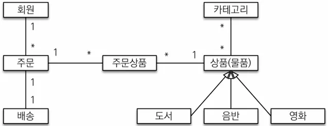

## 요구사항 분석

### 기능 목록

- 회원 기능
    - 회원 등록
    - 회원 조회
- 상품 기능
    - 상품 등록
    - 상품 수정
    - 상품 조회
- 주문 기능
    - 상품 주문
    - 주문 내역 조회
    - 주문 취소
- 기타 요구사항
    - 상품은 재고 관리가 필요하다.
    - 상품의 종류는 도서, 음반, 영화가 있다.
    - 상품을 카테고리로 구분할 수 있다.
    - 상품 주문시 배송 정보를 입력할 수 있다.

### 도메인 모델과 테이블 설계



**회원, 주문, 상품의 관계:** 회원은 여러 상품을 주문할 수 있다. 그리고 한 번 주문할 때 여러 상품을 선택할 수 있으므로 주문과 상품은 다대다 관계다. 하지만 이런 다대다 관계는 관계형 데이터베이스는 물론이고 엔티티에서도 거의 사용하지 않는다. 따라서 그림처럼 주문상품이라는 엔티티를 추가해서 다대다 관계를 일대다, 다대일 관계로 풀어냈다.

상품 분류: 상품은 도서, 음반, 영화로 구분되는데 상품이라는 공통 속성을 사용하므로 상속 구조로 표현했다

### 회원 엔티티 분석


- 그림 참고사항
    - Order와 Delivery가 단방향 관계로 잘못 그려져 있으나 양방향 관계가 맞음.
    - 회원이 주문을 하기 떄문에 회원이 주문 리스트를 가지는 것은 얼핏 보면 잘 설계한 것 같지만, 객체 세상은 실제 세계와는 다르다. 실무에서는 회원이 주문을 참조하지 않고, 주문이 회원을 참조하는 것으로 충분하다. 여기서는 일대다, 다대일의 양방향 연관관계를 설명하기 위해서 추가했다.

**회원(Member)**: 이름과 임베디드 타입인 주소(`Address`), 그리고 주문(`orders`) 리스트를 가진다.

**주문(Order):** 한 번 주문시 여러 상품을 주문할 수 있으므로 주문과 주문상품(`OrderItem`)은 일대다 관계다. 주문은 상품을 주문한 회원과 배송 정보, 주문 날짜, 주문 상태(`status`)를 가지고 있다. 주문 상태는 열거형을 사용했는데 주문(`ORDER`), 취소(`CANCEL`)을 표현할 수 있다.

**주문상품(ORderITem)**: 주문한 상품 정보와 주문 금액(`orderPrice`), 주문 수량(`count`) 정보를 가지고 있다. (보통 `OrderLine`, `LineItem` 으로 많이 표현한다.)

**상품(Item):** 이름, 가격, 재고수량(`stockQuantity`)을 가지고 있다. 상품을 주문하면 재고수량이 줄어준다. 상품의 종류로는 도서, 음반, 영화가 있는데 각각은 사용하는 속성이 조금씩 다르다.

**배송(Delivery):** 주문시 하나의 배송 정보를 생성한ㄷ. 주문과 배송은 일대일 관계다.

**카테고리(Category)**: 상품과 다대다 관계를 맺는다. `parent`, `child`로 부모, 자식 카테고리를 연결한다.

**주소(Address)**: 값 타입(임베디드 타입)이다. 회원과 배송(Delivery)에서 사용한다.

### 회원 테이블 분석


- Order가 아닌 Order’s’인 이유?
    - 테이블명이 `ORDER`가 아닌 `ORDERS`인 것은 DB `order by` 때문에 예약어로 잡고 있기 때문
    - 실제 코드에서는 DB에 소문자 + _(언더스코어) 스타일을 많이 씀

**MEMBER:** 회원 엔티티의 `Address` 임베디드 타입 정보가 회원 테이블에 그대로 들어갔다. 이것은 `DELIVERY` 테이블도 마찬가지다.

**ITEM:** 앨범, 도서, 영화 타입을 통합해서 하나의 테이블로 만들었다. `DTYPE` 컬럼으로 타입을 구분한다.

### 연관관계 매핑 분석

**회원과 주문:** 일대다, 다대일의 양방향 관계다. 따라서 연관관계의 주인을 정해야 하는데, 외래 키가 있는 주문을 연관 관계의 주인으로 정하는 것이 좋다. 그러므러 `Order.member`를 `ORDERS.MEMBER_ID` 외래 키와 매핑한다.

**주문 상품과 주문:** 다대일 양방향 관계다. 외래 키가 주문 상품에 있으므로 주문 상품이 연관 관계의 주인이다. 그러므로 `OrderItem.order`를 `ORDER_ITEM.ORDER_ID` 외래 키와 매핑한다.

**주문 상품과 상품:** 다대일 단방향 관계다. `OrderITem.item`을 `ORDER_ITEM.ITEM_ID` 외래 키와 매핑한다.

**주문과 배송:** 일대일 양방향 관계다. `Order.delivery`를 `ORDERS.DELIVERY_ID` 외래 키와 매핑한다.

**카테고리와 상품:** `@ManyToMany`를 사용해서 매핑한다. (**※실무에서는 사용금지!**)

- 외래 키가 있는 곳을 연관 관계의 주인으로 정하는 이유?

  연관 관계의 주인은 단순히 외래 키를 누가 관리하냐의 문제이지 비즈니스상 우위에 있다고 주인으로 정하면 안된다. 예를 들어 자동차와 바퀴가 있으면, 일대다 관계에서 항상 다쪽에 외래 키가 있으므로 외래 키가 있는 바퀴를 연관 관계의 주인으로 정하면 된다. 물론 자동차를 연관 관계의 주인으로 정하는 것이 불가능 한 것은 아니지만, 자동차를 연관 관계의 주인으로 정하면 자동차가 관리하지 않는 바퀴 테이블의 외래 키 값이 업데이트 되므로 관리와 유지보수가 어렵고, 추가적으로 별도의 업데이트 쿼리가 발생하는 성능 문제도 있다. 자세한 내용은 JPA 기본편을 참고


## 엔티티 클래스 개발

예제에서는 설명을 쉽게하기 위해 엔티티 클래스에 Getter와 Setter를 모두 열고 최대한 단순하게 설계되었으나 실무에서는 Setter의 사용을 지양 (최대한 필요한 곳에서만 사용)

- Getter, Setter 관련 실무 꿀팁

  이론적으로는 Getter와 Setter 모두 제공하지 않고, 꼭 필요한 별도의 메서드를 제공하는게 가장 이상적이다. 하지만 실무에서 엔티티의 데이터는 조회할 일이 너무 많으므로, Getter의 경우 모두 열어두는 것이 편리하다. Getter는 아무리 호출해도 호출 하는 것만으로 어떤 일이 발생하지 않지만 Stter는 데이터가 변하기 때문에 가까운 미래에 엔티티가 도대체 왜 변경되는지 추적하기 점점 힘들어진다. 따라서 엔티티의 변경이 필요시 Setter가 아닌 편의 메서드를 제공해서 사용해야 함


### 회원 엔티티

```java
@Entity
@Getter
@Setter
public class Member {

	@Id
	@GeneratedValue(strategy = GenerationType.IDENTITY)
	@Column(name = "member_id")
	private Long id;

	private String name;

	@Embedded
	private Address address;

	@OneToMany(mappedBy = "member")
	private List<Order> orders = new ArrayList<>();

}
```

### 주문 엔티티

```java
@Entity
@Table(name = "orders")
@Getter
@Setter
public class Order {

	@Id
	@GeneratedValue
	@Column(name = "order_id")
	private Long id;

	@ManyToOne(fetch = FetchType.LAZY)
	@JoinColumn(name = "member_id")
	private Member member;

	@OneToMany(mappedBy = "order", cascade = CascadeType.ALL)
	private List<OrderItem> orderItems = new ArrayList<>();

	@OneToOne(cascade = CascadeType.ALL, fetch = FetchType.LAZY)
	@JoinColumn(name = "delivery_id")
	private Delivery delivery;

	private LocalDateTime orderDate;

	@Enumerated(EnumType.STRING)
	private OrderStatus status;
	
	// 연관관계 메서드
	public void setMember(Member member) {
		this.member = member;
		member.getOrders().add(this);
	}

	public void addOrderItem(OrderItem orderItem) {
		orderItems.add(orderItem);
		orderItem.setOrder(this);
	}

	public void setDelivery(Delivery delivery) {
		this.delivery = delivery;
		delivery.setOrder(this);
	}

}
```

### 주문상태

```java
public enum OrderStatus {
	ORDER, CANCEL
}
```

### 주문상품 엔티티

```java
@Entity
@Getter
@Setter
public class OrderItem {

	@Id
	@GeneratedValue
	@Column(name = "order_item_id")
	private Long id;

	@ManyToOne(fetch = FetchType.LAZY)
	@JoinColumn(name = "item_id")
	private Item item;

	@ManyToOne(fetch = FetchType.LAZY)
	@JoinColumn(name = "order_id")
	private Order order;

	private int orderPrice;

	private int count;
	
}
```

### 상품 엔티티

```java
@Entity
@Inheritance(strategy = InheritanceType.SINGLE_TABLE)
@DiscriminatorColumn(name = "dtype")
@Getter
@Setter
public abstract class Item {

	@Id
	@GeneratedValue
	@Column(name = "item_id")
	private Long id;

	private String name;

	private int price;

	private int stockQuantity;

	@ManyToMany(mappedBy = "items")
	private List<Category> categories = new ArrayList<>();
}
```

### 상품 - 도서 엔티티

```java
@Entity
@DiscriminatorValue("B")
@Getter
@Setter
public class Book extends Item {

	private String author;
	private String isbn;
	
}
```

### 상품 - 음반 엔티티

```java
@Entity
@DiscriminatorValue("A")
@Getter
@Setter
public class Album extends Item {
	
	private String artist;
	private String etc;
	
}
```

### 상품 - 영화 엔티티

```java
@Entity
@DiscriminatorValue("M")
@Getter
@Setter
public class Movie extends Item {
	
	private String director;
	private String actor;
	
}
```

### 배송 엔티티

```java
@Entity
@Getter
@Setter
public class Delivery {

	@Id
	@GeneratedValue
	@Column(name = "delivery_id")
	private Long id;

	@OneToOne(mappedBy = "delivery", fetch = FetchType.LAZY)
	private Order order;

	@Embedded
	private Address address;

	@Enumerated(EnumType.STRING)
	private DeliveryStatus status;

}
```

### 배송 상태

```java
public enum DeliveryStatus {
	READY, COMP
}
```

### 카테고리 엔티티

```java
@Entity
@Getter
@Setter
public class Category {

	@Id
	@GeneratedValue
	@Column(name = "category_id")
	private Long id;

	private String name;

	@ManyToMany
	@JoinTable(name = "category_item",
		joinColumns = @JoinColumn(name = "category_id"),
		inverseJoinColumns = @JoinColumn(name = "item_id")
	)
	private List<Item> items = new ArrayList<>();

	@ManyToOne(fetch = FetchType.LAZY)
	@JoinColumn(name = "parent_id")
	private Category parent;

	@OneToMany(mappedBy = "parent")
	private List<Category> child = new ArrayList<>();
	
	// 연관관계 메서드
	public void addChildCategory(Category child) {
		this.child.add(child);
		child.setParent(this);
	}

}
```

### 주소 값 타입

```java
@Embeddable
@Getter
public class Address {

	private String city;
	private String street;
	private String zipcode;
	
}
```

## 엔티티 설계시 주의점

### 엔티티에는 가급적 Setter 사용 지양

현재는 Setter가 모두 열려있는데 유지보수가 어려워지는 문제가 있기 때문에 나중에 리팩토링으로 Setter 제거 필요

### 모든 연관관계는 지연로딩으로 설정

- 즉시로딩(`EAGER`)은 예측이 어렵고, 어떤 SQL이 실행될지 추적하기 어렵다. 특히 JPQL을 실행할 때 N+1 문제가 자주 발생
- 실무에서는 모든 연관관계는 지연로딩(`LAZY`)로 설정해야 함.
- 연관된 엔티티를 함꼐 DB에서 죄해야 하면, fetch join 또는 엔티티 그래프 기능을 사용해야 함
- @XToOne(OneToOne, ManyToOne) 관계는 기본이 즉시로딩이므로 직접 지연로딩으로 설정

### 컬렉션은 필드에서 초기화

컬렉션은 필드에서 바로 초기화 하는 것이 안전합니다.

- `null`문제에서 안전
- 하이버네이트는 엔티티를 영속화 할 때, 컬랙션을 감싸서 하이버네이트가 제공하는 내장 컬렉션으로 변경한다. 만약 `getOrders()`처럼 임의의 메서드에서 철렉션을 잘못 생성하면 하이버네이트 내부 메커니즘에 문제가 발생할 수 있다. 따라서 필드레벨에서 생성하는 것이 가장 안전하고, 코드도 간결하다.

### 테이블, 컬럼명 생선 전략

스프링 부트에서 하이버네이트 기본 매핑 전략을 변경해서 실제 테이블 필드명은 다름

- 카멜 케이스 ⇒ 언더스코어(memberPoint ⇒ member_point)
- .(점) ⇒ _(언더스코어)
- 대문자 ⇒ 소문자

**스프링 부트 기본 컬럼, 테이블명 전략**

- spring.jpa.hibernate.naming.implicit-strategy

  org.springframework.boot.orm.jpa.hibernate.SpringImplicitNamingStrategy

- spring.jpa.hibernate.naming.physical-strategy
  org.springframework.boot.orm.jpa.hibernate.SpringPhysicalNamingStrategy

이 링크를 통해 구매하시면 제가 수익을 받을 수 있어요. 🤗

    https://inf.run/4Sbno