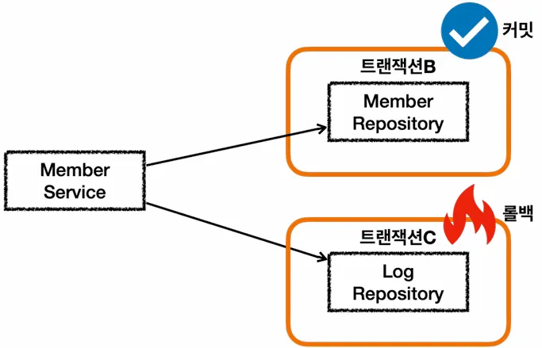
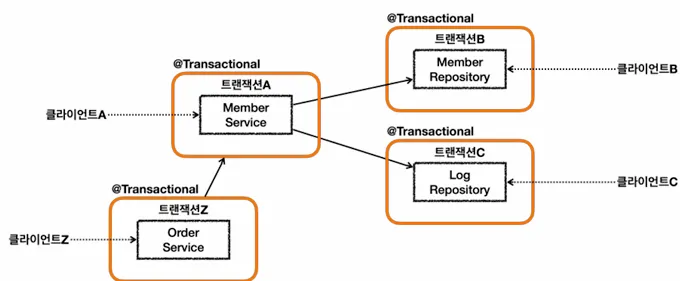
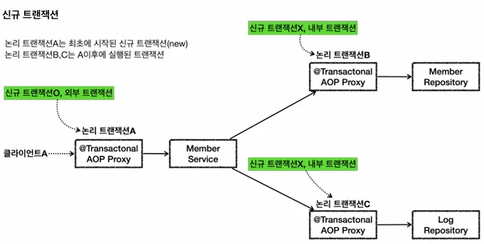
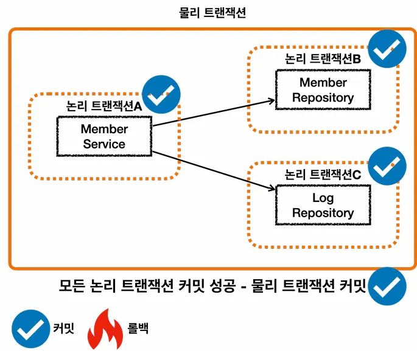
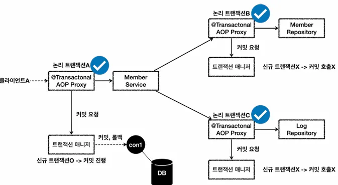
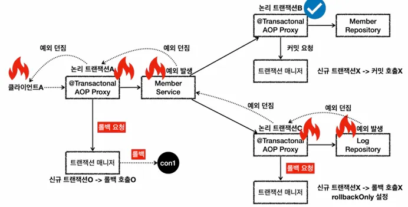

## 예제 프로젝트

지금까지 배운 트랜잭션 전파에 대한 내용을 실제 예제를 통해서 이해해보겠습니다.

**비즈니스 요구사항**

- 회원을 등록하고 조회한다.
- 회원에 대한 변경 이력을 추적할 수 있도록 회원 데이터가 변경될 때 변경 이력을 DB LOG 테이블에 남겨야 한다.
    - 여기서는 예제를 단순화 하기 위해 등록시에만 DB LOG 테이블에 남김

**Member**

```java
@Entity
@Getter
@Setter
@NoArgsConstructor
public class Member {

	@Id
	@GeneratedValue
	private Long id;

	private String username;

	public Member(String username) {
		this.username = username;
	}
}
```

**MemberRepository**

```java
@Slf4j
@Repository
@RequiredArgsConstructor
public class MemberRepository {

	private final EntityManager em;

	@Transactional
	public void save(Member member) {
		log.info("member 저장");
		em.persist(member);
	}

	public Optional<Member> find(String username) {
		return em.createQuery
			("select m from Member m "
				+ "where m.username=:username",
				Member. class)
			.setParameter("username", username)
			.getResultList().stream().findAny();
	}
}
```

**Log**

```java
@Slf4j
@Repository
@RequiredArgsConstructor
public class LogRepository {

	private final EntityManager em;

	@Transactional
	public void save(Log logMessage) {
		log.info("log 저장");
		em.persist(logMessage);

		if (logMessage.getMessage().contains("로그예외")) {
			log.info("log 저장시 예외 발생");
			throw new RuntimeException("예외 발생");
		}
	}

	public Optional<Log> find(String message) {
		return em.createQuery("select l from Log l "
			+ "where l.message =: message",
			Log.class)
			.setParameter("message", message)
			.getResultList().stream().findAny();
	}
}
```

**MemberService**

```java
@Slf4j
@Service
@RequiredArgsConstructor
public class MemberService {
	
	private final MemberRepository memberRepository;
	private final LogRepository logRepository;
	
	public void joinV1(String username) {
		Member member = new Member(username);
		Log logMessage = new Log(username);
		
		log.info("== memberRepository 호출 시작 ==");
		memberRepository.save(member);
		log.info("== memberRepository 호출 종료 ==");

		log.info("== logRepository 호출 시작 ==");
		logRepository.save(logMessage);
		log.info("== logRepository 호출 종료 ==");
	}
	
	public void joinV2(String username) {
		Member member = new Member(username);
		Log logMessage = new Log(username);

		log.info("== memberRepository 호출 시작 ==");
		memberRepository.save(member);
		log.info("== memberRepository 호출 종료 ==");

		log.info("== logRepository 호출 시작 ==");
		try {
			logRepository.save(logMessage);
		} catch (RuntimeException e) {
			log.info(
				"log 저장에 실패했습니다. logMessage={}",
				logMessage.getMessage()
			);
			log.info("정상 흐름 변환");
		}
		log.info("== logRepository 호출 종료 ==");
	}
}
```

- 회원을 등록하면서 동시에 회원 등록에 대한 DB 로그도 함께 남김
- `joinV1()`
    - 회원가 DB 로그를 함께 남기는 비즈니스 로직
    - 현재 별도의 트랜잭션은 설정하지 않음
- `joinV2()`
    - `joinV1()`과 같은 기능을 수행
    - DB로그 저장시 예외가 발생하면 예외를 복구
    - 현재 별도의 트랜잭션은 설정하지 않음

**MemberServiceTest**

```java
@Slf4j
@SpringBootTest
class MemberServiceTest {

	@Autowired
	MemberService memberService;
	@Autowired
	MemberRepository memberRepository;
	@Autowired
	LogRepository logRepository;

	/**
	 * MemberService @Transactional: OFF
	 * MemberRepository @Transactional: ON
	 * LogRepository @Transactional: ON
	 */
	@Test
	public void outerTxOff_success() throws Exception {
	    // given
		String username = "outerTxOff_success";

	    // when
		memberService.joinV1(username);

	    // then
		assertTrue(memberRepository.find(username).isPresent());
		assertTrue(logRepository.find(username).isPresent());
	}
}
```

JPA를 통한 모든 데이터 변경은 트랜잭션이 필요하고 현재 코드에서는 서비스 계층에 트랜잭션이 없기 때문에 리포지토리에 트랜잭션을 정의했으니 기본적인 테스트가 정상 실행되는 것만 확인하고 넘어가도록 하겠습니다.

## 커밋, 롤백

예제를 통해 서비스 계층에 트랜잭션이 없을 때 트랜잭션이 각각 어떻게 작동하는지 확인해보겠습니다.

**상황**

- 서비스 계층에 트랜잭션이 없다.
- 회원, 로그 리포지토리가 각각 트랜잭션을 가지고 있다.
- 회원, 로그 리포지토리 둘 다 커밋에 성곤한다.

**outerTxOff_success**

```java
**/**
 * MemberService @Transactional: OFF
 * MemberRepository @Transactional: ON
 * LogRepository @Transactional: ON
 */
@Test
public void outerTxOff_success() throws Exception {
    // given
	String username = "outerTxOff_success";

    // when
	memberService.joinV1(username);

    // then
	assertTrue(memberRepository.find(username).isPresent());
	assertTrue(logRepository.find(username).isPresent());
}**
```


1. `MemberService`에서 `MemberRepository`를 호출한다. `MemberRepository`에는 `@Transaction` 어노테이션이 있으므로 트랜잭션 AOP가 작동한다. 여기서 트랜잭션 매니저를 통해 트랜잭션을 시작한다. 이렇게 시작한 트랜잭션을 트랜잭션 B라고 한다.
    - 그림에서는 생략했지만, 트랜잭션 매니저에 트랜잭션을 요청하면 데이터소스를 통해 커넥션 `con1`을 획득하고, 해당 커넥션을 후동 커밋 모드로 변경해서 트랜잭션을 시작.
    - 그리고 트랜잭션 동기화 매니저를 통해 트랜잭션을 시작한 커넥션을 보관
    - 트랜잭션 매니저의 호출 결과로 `status`를 반환한다. 여기서는 신규 트랜잭션 여부가 참이 된다.
2. `MemberRepository`는 JPA를 통해 회원을 저장하는데, 이 때 JPA는 트랜잭션이 시작된 `con1`을 사용해서 회원을 저장한다.
3. `MemberRepository`가 정상 응답을 반환했기 때문에 트랜잭션 AOP는 트랜잭션 매니저에 커밋을 요청한다.
4. 트랜잭션 매니저는 `con1`을 통해 물리 트랜잭션을 커밋한다.
    - 물론 이 시점에 앞서 설명한 신규 트랜잭션 여부, `rollbackOnly` 여부를 모두 체크한다.

이렇게 해서 `MemberRepository`와 관련된 모든 데이터는 정상 커밋되고, 트랜잭션 B는 완전히 종료됩니다.

이후에 `LogRepository`를 통해 트랜잭션 C를 시작하고, 정상 커밋합니다. 결과적으로 둘 다 커밋되었으니 `Member`, `Log` 모두 안전하게 저장됩니다.

### **서비스 계층에 트랜잭션이 없을 때 - 롤백**

**상황**

- 서비스 계층에 트랜잭션이 없다.
- 회원, 로그 리포지토리가 각각 트랜잭션을 가지고 있다.
- 회원 리포지토리는 정상 동작하지만 로그 리포지토리에서 예외가 발생한다.

**outerTxOff_fail**

```java
/**
 * MemberService @Transactional: OFF
 * MemberRepository @Transactional: ON
 * LogRepository @Transactional: ON Exception
 */
@Test
public void outerTxOff_fail() throws Exception {
	// given
	String username = "로그예외_outerTxOff_fail";

	// when
	assertThatThrownBy(() -> memberService.joinV1(username))
		.isInstanceOf(RuntimeException.class);

	// then: 완전히 롤백되지 않고, member 데이터가 남아서 저장된다.
	assertTrue(memberRepository.find(username).isPresent());
	assertTrue(logRepository.find(username).isEmpty());
}
```

- 사용자 이름에 `로그예외`라는 단어가 포함되어 있으면 `LogRepository`에서 런타임 예외가 발생한다.
- 트랜잭션 AOP는 해당 런타임 예외를 확인하고 롤백 처리한다.




- `MemberService`에서 `MemberRepository`를 호출하는 부분은 앞서 설명한 내용과 같다. 트랜잭션이 정상 커밋되고, 회원 데이터도 DB에 정상 반영된다.
- `MemberService`에서 `LogRepository`를 호출하는데, `로그예외`라는 이름을 전달한다. 이 과정에서 새로운 트랜잭션 C가 만들어진다.

**LogRepository 응답 로직**

1. `LogRepository`는 트랜잭션 C와 관련된 `con2`를 사용
2. `로그예외`라는 이름을 전달해서 `LogRepository`에 런타임 예외가 발생
3. `LogRepository`는 해당 예외를 밖으로 던진다. 이 경우 트랜잭션 AOP가 예외를 받게 됨
4. 런타임 예외가 발생해서 트랜잭션 AOP는 트랜잭션 매니저에 롤백을 호출
5. 트랜잭션 매니저는 신규 트랜잭션이므로 물리 롤백을 호출

트랜잭션 AOP도 결국 내부에서는 트랜잭션 매니저를 사용하게 됩니다. 이 경우 회원은 저장되지만, 회원 이력 로그는 롤백됩니다. 따라서 데이터 정합성에 문제가 발생할 수 있으니 둘을 하나의 트랜잭션으로 묶어서 처리해보겠습니다.

## 단일 트랜잭션

### 트랜잭션 하나만 사용하기

회원 리포지토리와 로그 리포지토리를 하나의 트랜잭션으로 묶는 가장 간단한 방법은 이 둘을 호출하는 회원 서비스에만 트랜잭션을 사용하는 방법입니다.

**singleTx**

```java
/**
 * MemberService @Transactional: ON
 * MemberRepository @Transactional: OFF
 * LogRepository @Transactional: OFF
 */
@Test
public void singleTx() throws Exception {
	// given
	String username = "singleTx";

	// when
	memberService.joinV1(username);

	// then
	assertTrue(memberRepository.find(username).isPresent());
	assertTrue(logRepository.find(username).isPresent());
}
```


이렇게 처리하면 `MemberService`를 시작할 때 부터 종료할 때 까지의 모든 로직을 하나의 트랜잭션으로 묶을 수 있습니다. 물론 `MemberService`가 `MemberRepository`, `LogRepository`를 호출하므로 이 로직들은 같은 트랜잭션을 사용합니다.

`MemberService`만 트랜잭션을 처리하기 때문에 앞서 배운 논리 트랜잭션, 물리 트랜잭션, 외부 트랜잭션, 내부 트랜잭션, `rollbackOnly`, 신규 트랜잭션, 트랜잭션 전파와 같은 복잡한 것을 고민할 필요 없이 아주 단순하고 깔끔하게 트랜잭션을 묶을 수 있습니다.


`@Transactionl`이 `MemberService`에만 붙어있기 때문에 여기에만 트랜잭션 AOP가 적용됩니다. `MemberService`가 호출하는 `MemberRepository`, `LogRepository`도 같은 커넥션을 사용하면서 자연스럽게 트랜잭션 범위에 포함되게 됩니다.

### 각각 트랜잭션이 필요한 상황

하지만 다음과 같이 각각 트랜잭션이 필요하면 어떻게 처리해야할까요?


- 클라이언트 A는 `MemberService`부터 `MemberRepository`, `LogRepository`를 모두 하나의 트랜잭션으로 묶고 싶다.
- 클라이언트 B는 `MemberRepository`만 호출하고 여기에만 트랜잭션을 사용하고 싶다.
- 클라이언트 C는 `LogRepository`만 호출하고 여기에만 트랜잭션을 사용하고 싶다.
- 클라이언트 A만 생각하면 `MemberService`에 트랜잭션 코드를 남기고, `MemberRepository`, `LogRepository`의 트랜잭션 코드를 제거하면 앞서 배운 것처럼 깔끔하게 하나의 트랜잭션을 적용할 수 있다.
- 하지만 이렇게 되면 클라이언트 B, C가 호출하는 `MemberRepository`, `LogRepository`에는 트랜잭션을 적용할 수 없다.

트랜잭션 전파 없이 이런 문제를 해결하려면 아마도 트랜잭션이 있는 메서드와 트랜잭션이 없는 메서드를 각각 만들어야 합니다.

더 복잡하게 다음과 같은 상황이 발생할 수도 있습니다.



클라이언트 Z가 호출하는 `OrderService`에서도 트랜잭션을 시작할 수 있어야 하고, 클라이언트 A가 호출하는 `MemberService`에서도 트랜잭션을 시작할 수 있어야 합니다.

**이런 문제들을 해결하기 위해 트랜잭션 전파가 필요합니다.**

## 전파 커밋

스프링은 `@Transactional`이 적용되어 있으면 기본으로 `REQUIRED`라는 전파 옵션을 사용합니다. 이옵션은 기존 트랜잭션이 없으면 생성하고, 기존 트랜잭션이 있으면 참여합니다. 참여한다는 뜻은 해당 트랜잭션을 ㅡ그대로 따른다는 뜻이고, 동시에 같은 동기화 커넥션을 사용한다는 뜻입니다.


이렇게 둘 이상의 트랜잭션이 하나의 물리 트랜잭션에 묶이게 되면 둘을 구분하기 위해 논리 트랜잭션과 물리 트랜잭션으록 구분합니다.



- 이 경우 외부에 있는 신규 트랜잭션만 실제 물리 트랜잭션을 시작하고 커밋
- 내부에 있는 트랜잭션은 물리 트랜잭션 시작하거나 커밋하지 않음

### 모든 논리 트랜잭션 커밋



- 모든 논리 트랜잭션을 커밋해야 물리 트랜잭션도 커밋
- 하나라도 롤백되면 물리 트랜잭션은 롤백

먼저 모든 논리 트랜잭션이 정상 커밋되는 경우를 코드로 살펴보겠습니다.

**outerTxOn_success**

```java
/**
 * MemberService @Transactional: ON
 * MemberRepository @Transactional: ON
 * LogRepository @Transactional: ON
 */
@Test
public void outerTxOn_success() throws Exception {
	// given
	String username = "outerTxOn_success";

	// when
	memberService.joinV1(username);

	// then
	assertTrue(memberRepository.find(username).isPresent());
	assertTrue(logRepository.find(username).isPresent());
}
```



- 클라리언트A(여기선 테스트 코드)가 `MemberService`를 호출하면서 트랜잭션 AOP가 호출
    - 여기서 신규 트랜잭션이 생성되고, 물리 트랜잭션도 시작
- `MemberRepository`를 호출하면서 트랜잭션 AOP가 호출
    - 이미 트랜잭션이 있으므로 기존 트랜잭션에 참여
- `MemberRepository`의 로직 호출이 끝나고 정상 응답하면 트랜잭션 AOP가 호출
    - 트랜잭션 AOP는 정상 응답이므로 트랜잭션 매니저에 커밋을 요청. 이 경우 신규 트랜잭션이 아니므로 실제 커밋을 호출하지 않음
- `LogRepository`를 호출하면서 트랜잭션 AOP가 호출
    - 이미 트랜잭션이 있으므로 기존 트랜잭션에 참여
- `LogRepository`의 로직 호출이 끝나고 정상 응답하면 트랜잭션 AOP가 호출
    - 트랜잭션 AOP는 정상 응답이므로 트랜잭션 매니저에 커밋을 요청. 이 경우 신규 트랜잭션이 아니므로 실제 커밋(물리 커밋)을 호출하지 않음
- `MemberService`의 로직 호출이 끝나고 정상 응답하면 트랜잭션 AOP가 호출
    - 트랜잭션 AOP는 정상 응답이므로 트랜잭션 매니저에 커밋을 요청. 이 경우 신규 트랜잭션이므로 물리 커밋을 호출.

## 전파 롤백

이번에는 로그 리포지토리에서 예외가 발생해 전체 트랜잭션이 롤백되는 경우를 알아보겠습니다.


outerTxOn_fail

```java
/**
 * MemberService @Transactional: ON
 * MemberRepository @Transactional: ON
 * LogRepository @Transactional: ON Exception
 */
@Test
public void outerTxOn_fail() throws Exception {
	// given
	String username = "로그예외_outerTxOn_fail";

	// when
	assertThatThrownBy(() -> memberService.joinV1(username))
		.isInstanceOf(RuntimeException.class);

	// then: 모든 데이터 롤백
	assertTrue(memberRepository.find(username).isEmpty());
	assertTrue(logRepository.find(username).isEmpty());
}
```

여기서는 `로그예외`라고 넘겼기 때문에 `LogRepository`에서 런타임 예외가 발생합니다.



- 클라이언트 A가 `MemberService`를 호출하면서 트랜잭션 AOP가 호출
    - 여기서 신규 트랜잭션이 생성되고, 물리 트랜잭션도 시작
- `MemberRepository`를 호출하면서 트랜잭션 AOP가 호출
    - 이미 트랜잭션이 있으므로 기존 트랜잭션에 참여
- `MemberRepository`의 로직 호출이 끝나고 정상 응답하면 트랜잭션 AOP가 호출
    - 트랜잭션 AOP는 정상 응답이므로 트랜잭션 매니저에 커밋을 요청. 이 경우 신규 트랜잭션이 아니므로 실제 커밋을 호출하지는 않음
- `LogRepository`를 호출하면서 트랜잭션 AOP가 호출
    - 이미 트랜잭션이 있으므로 기존 트랜잭션에 참여
- `LogRepositroy` 로직에서 런타임 예외가 발생. 예외를 던지면 트랜잭션 AOP가 해당 예외를 받음.
    - 트랜잭션 AOP는 런타임 예외가 발생했으므로 트랜잭션 매니저에 롤백을 요청. 이 경우 신규 트랜잭션이 아니므로 물리 롤백을 호출하지는 않고 `rollbackOnly`를 설정
    - `LogRepository`가 예외를 던졌기 때문에 트랜잭션 AOP도 해당 예외를 그대로 밖으로 던짐
- `MemberSerivce`에서도 런타임 예외를 받게 되는데, 여기 로직에서는 해당 런타임 예외를 처리하지 않고 밖으로 던짐
    - 트랜잭션 AOP는 런타임 예외가 발생했으므로 트랜잭션 매니저에 롤백을 요청. 이 경우 신규 트랜잭션이므로 물리 롤백을 호출
    - 참고로 이 경우 어차피 롤백이 되었기 때문에, `rollbackOnly` 설정은 참고하지 않음
    - `MemberService`가 예외를 던졌기 때문에 트랜잭션 AOP도 해당 예외를 그대로 밖으로 던짐
- 클라이언트 A는 `LogRepository`부터 넘어온 런타임 예외를 받게 됨

회원과 회원 이력 로그를 처리하는 부분을 하나의 트랜잭션으로 묶은 덕분에 문제를 발생했을 때 회원과 회원 이력 로그가 모두 함께 롤백됩니다. 따라서 데이터 정합성에 문제가 발생하지 않습니다.

## 복구 REQUIRED

앞서 회원과 로그를 하나의 트랜잭션으로 묶어서 데이터 정합성 문제를 깔끔하게 해결했습니다. 그런데 회원 이력 로그를 DB에 남기는 작업에 가끔 문제가 발생해서 회원 가입 자체가 안되는 경우가 가끔 발생하게 되었습니다. 그래서 사용자들이 회원 가입에 실패해서 이탈하는 문제가 발생하기 시작했습니다.

회원 이력 로그의 경우 여러가지 방법으로 추후에 복구가 가능할 것으로 보이기 때문에 비즈니스 요구사항이 변경되었다고 가정하겠습니다. 회원 가입을 시도한 로그를 남기는데 **실패하더라도 회원 가입은 유지**시키는 경우를 살펴보겠습니다.


단순하게 생각해보면 `LogRepository`에서 예외가 발생하면 그것을 `MemberSerivce`에서 예외를 잡아 처리하면 될 것 같습니다. 이렇게 하면 `MemberSerivce`에서 정상 흐름으로 바꿀 수 있기 때문에 `MemberService`의 트랜잭션 AOP에서 커밋을 수행할 수 있습니다.

**여기서 뭔가 이상하게 느껴지고 이 방법으로는 실패할 것으로 생각하셨다면 제대로 학습하고 있습니다.**

이 방법이 왜 실패하는지 예제를 통해서 알아보겠습니다. 참고로 실무에서 많은 개발자가 이 방법을 사용해 실패합니다.

**recoverException_fail**

```java
/**
 * MemberService @Transactional: ON
 * MemberRepository @Transactional: ON
 * LogRepository @Transactional: ON Exception
 */
@Test
public void recoverException_fail() throws Exception {
	// given
	String username = "로그예외_recoverException_fail";

	// when
	assertThatThrownBy(() -> memberService.joinV2(username))
		.isInstanceOf(UnexpectedRollbackException.class);

	// then: 모든 데이터 롤백
	assertTrue(memberRepository.find(username).isEmpty());
	assertTrue(logRepository.find(username).isEmpty());
}
```

여기서는 `MemberService`의 `joinV2()`를 호출하는 부분을 주의해서 봐야 합니다. `joinV2()`는 예외를 잡아 정상 흐름으로 변환하는 로직이 추가되어 있습니다.

```java
try {
	logRepository.save(logMessage);
} catch (RuntimeException e) {
	log.info(
		"log 저장에 실패했습니다. logMessage={}",
		logMessage.getMessage()
	);
	log.info("정상 흐름 변환");
}
```


내부 트랜잭션에서 `rollbackOnly`를 설정하기 때문에 결과적으로 정상 흐름 처리를 해서 외부 트랜잭션에서 커밋을 호출해도 물리 트랜잭션을 롤백되고, `UnExpectedRollbackException`이 던져집니다.

전체 흐름을 좀 더 자세히 알아보겠습니다.


- `LogRepository`에서 예외가 발생. 예외를 던지면 `LogRepository`의 트랜잭션 AOP가 해당 예외를 받음.
- 신규 트랜잭션이 아니므로 물리 트랜잭션을 롤백하지는 않고, 트랜잭션 동기화 매니저에 `rollbackOnly`표시
- 이후 트랜잭션 AOP는 전달 받은 예외를 밖으로 던짐
- 예외가 `MemberService`에 던져지고, `MemberService`는 해당 예외를 복구. 그리고 정상적으로 리턴
- 정상 흐름이 되었으므로 `MemberService`의 트랜잭션 AOP는 커밋을 호출
- 커밋을 호출할 때 신규 트랜잭션이므로 실제 물리 트랜잭션을 커밋해야 함. 이 때 `rollbackOnly`를 체크
- `rollbackOnly`가 체크 되어 있으므로 물리 트랜잭션을 롤백
- 트랜잭션 매니저는 `UnexceptedRollbackException`예외를 던짐
- 트랜잭션 AOP도 전달받은 `UnexceptedRollbackException`을 클라이언트에 던짐

논리 트랜잭션 중 하나라도 롤백되면 전체 트랜잭션은 롤백됩니다. 내부 트랜잭션이 롤백 되었는데, 외부 트랜잭션이 커밋되면 `UnexceptedRollbackException` 예외가 발생합니다. 위 상황에서는 `rollbackOnly`가 켜져있으므로 커밋 시도시 `UnexceptedRollbackException` 예외가 발생하게 됩니다.

그렇다면 어떻게 해야 다음 요구사항을 만족할 수 있을까요?

**회원 가입을 시도한 로그를 남기되, 실패하더라도 회원 가입은 유지되어야 한다.**

## 복구 REQURIES_NEW

위 요구사항을 만족하기 위해서 로그와 관련된 물리 트랜잭션을 `REQUIRES_NEW`를 통해 별도로 분리해보겠습니다.

```java
/**
 * MemberService @Transactional: ON
 * MemberRepository @Transactional: ON
 * LogRepository @Transactional(REQUIRES_NEW) ON Exception
 */
@Test
public void recoverException_success() throws Exception {
	// given
	String username = "로그예외_recoverException_success";

	// when
	memberService.joinV2(username);

	// then: 모든 데이터 롤백
	assertTrue(memberRepository.find(username).isPresent());
	assertTrue(logRepository.find(username).isEmpty());
}
```

```java
@Transactional(propagation = Propagation.REQUIRES_NEW)
public void save(Log logMessage) {
```

기존 save 메서드를 기본 옵션인 `REQUIRED` 대신, 항상 신규 트랜잭션을 생성하는 `REQUIRES_NEW`를 적용했습니다.

예외를 직접 처리하는 `memberService.joinV2()`를 사용한다는 점도 주의해서 확인해야 합니다.


- `MemberRepository`는 `REQUIRED` 옵션을 사용. 따라서 기존 트랜잭션에 참여
- `LogRepository`의 트랜잭션 전파 옵션은 `REQUIRES_NEW`
- `REQUIRES_NEW`는 항상 새로운 트랜잭션을 만듦. 따라서 해당 트랜잭션 안에서는 DB 커넥션도 별도로 사용하게 됨

### **REQURIES_NEW - 복구**


- `REQUIRES_NEW`를 사용하게 되면 물리 트랜잭션 자체가 완전히 분리
- `REQUIRES_NEW`는 신규 트랜잭션이므로 `rollbackOnly`표시가 되지 않으니 해당 트랜잭션이 물리 롤백되고 종료

### **REQURIES_NEW - 상세**


- `LogRepository`에서 예외가 발생. 예외를 던지면 `LogRepository`의 트랜잭션 AOP가 해당 예외를 처리
- `REQUIRES_NEW`를 사용한 신규 트랜잭션이므로 물리 트랜잭션을 롤백. 물리 트랜잭션을 롤백했으므로 `rollbackOnly`를 표시하지 않음. 여기서 `REQUIRES_NEW`를 사용한 물리 트랜잭션은 롤백되고 완전히 끝남
- 이후 트랜잭션 AOP는 전달 받은 예외를 밖으로 던짐
- 예외가 `MemberService`에 던져지고, `MemberService`는 해당 예외를 복구 후 정상 리턴
- 정상 흐름이 되었으니 `MemberService`의 트랜잭션 AOP는 커밋을 호출
- 커밋을 호출할 때 신규 트랜잭션이므로 실제 물리 트랜잭션을 커밋. 이 때 `rollbackOnly`를 체크하지만 해당 옵션이 없으므로 물리 트랜잭션을 커밋
- 이후 정상 흐름 반환

결과적으로 회원 데이터는 저장되고, 로그 데이터는 로백되는 것을 확인할 수 있습니다.

**정리**

논리 트랜잭션은 하나라도 롤백되면 관련된 물리 트랜잭션은 `rollbackOnly`에 의해 롤백되어 집니다. 이 문제를 해결하려면 `REQUIRES_NEW`를 사용해서 **별도의 물리 트랜잭션을 분리**해서 사용해야 합니다. 참고로 예제를 단순화 하기 위해 `MemberService`가 `MemberRepository`, `LogRepository`만 호출하지만 실제로는 더 많은 리포지토리들을 호출하고 그 중에 `LogRepository`만 트랜잭션을 분리한다고 생각하면 이해하는데 도움이 될 것 같습니다.

**주의사항**

`REQUIRES_NEW`를 사용하면 하나의 HTTP 요청에 동시에 2개의 DB 커넥션을 사용하게 됩니다. 따라서 성능이 중요한 곳에서는 이런 부분을 주의해서 사용해야 합니다. 또한 `REQUIRES_NEW`를 사용하지 않고 문제를 해결할 수 있는 단순한 방법이 있다면, 그 방법을 선택하는 것이 더 좋습니다.

예를 들면 다음과 같이 `REQUIRES_NEW`를 사용하지 않고 구조를 변경하는 것입니다.


이렇게 하면 HTTP 요청에 동시에 2개의 커넥션을 사용하지 않고 순차적으로 사용 후 반화하게 됩니다. 물론 구조상 `REQUIRES_NEW`를 사용하는 것이 더 깔끔한 경우도 있으므로 각각의 장단점을 이해하고 적절하게 선택해서 사용하기를 권장합니다.

**이 링크를 통해 구매하시면 제가 수익을 받을 수 있어요. 🤗**

https://inf.run/G1rX9