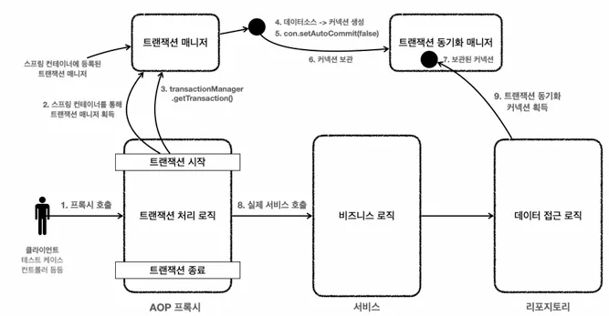

## 스프링 트랜잭션 추상화

각각의 데이터 접근 기술들은 트랜잭션을 처리하는 방식에 차이가 있습니다. 예를 들어 JDBC 기술과 JPA 기술은 트랜잭션을 사용하는 코드 자체가 다릅니다.

### JDBC 트랜잭션 코드 예시

```java
public void accountTransfer(String fromId, String toId, int money) throws 
SQLException {
    Connection con = dataSource.getConnection();
    try {
        con.setAutoCommit(false); //트랜잭션 시작
        //비즈니스 로직
        bizLogic(con, fromId, toId, money);
        con.commit(); //성공시 커밋
		} catch (Exception e) {
        con.rollback(); //실패시 롤백
				throw new IllegalStateException(e);
		} finally {
			 release(con);
		}
}
```

### **JPA 트랜잭션 코드 예시**

```java
public static void main(String[] args) {
	 //엔티티 매니저 팩토리 생성
	EntityManagerFactory emf = 
	Persistence.createEntityManagerFactory("jpabook");
	 EntityManager em = emf.createEntityManager(); //엔티티 매니저 생성
	EntityTransaction tx = em.getTransaction(); //트랜잭션 기능 획득
	try {
      tx.begin(); //트랜잭션 시작
			logic(em);  //비즈니스 로직
      tx.commit();//트랜잭션 커밋
  } catch (Exception e) {
	        tx.rollback(); //트랜잭션 롤백
	} finally {
	        em.close(); //엔티티 매니저 종료
  }
  emf.close(); //엔티티 매니저 팩토리 종료
}
```

따라서 JDBC 기술을 사용하다가 JPA 기술로 변경하게 되면 트랜잭션을 사용하는 코드도 모두 함께 변경되어야 합니다.

스프링은 이런 문제를 해결하기 위해 트랜잭션 추상화를 제공합니다. 트랜잭션을 사용하는 입장에서는 스프링 트랜잭션 추상화를 통해 둘을 동일한 방식으로 사용할 수 있게됩니다.

### **스프링 PlatformTransactionManager 인터페이스**

```java
package org.springframework.transaction;

import org.springframework.lang.Nullable;

public interface PlatformTransactionManager extends TransactionManager {
    TransactionStatus getTransaction(@Nullable TransactionDefinition definition) throws TransactionException;

    void commit(TransactionStatus status) throws TransactionException;

    void rollback(TransactionStatus status) throws TransactionException;
}
```


- 스프링은 트랜잭션을 추상화해서 제공할 뿐만 아니라, 실무에서 주로 사용하는 데이터 접근 기술에 대한 트랜잭션 매니저의 구현체도 제공하기 때문에 필요한 구현체를 빈으로 등록하고 주입 받아 사용하기만 하면 된다.
- 스프링 부트는 어떤 데이터 접근 기술을 사용하는지를 자동으로 인식해서 적절한 트랜잭션 매니저를 선택해 스프링 빈으로 등록해주기 때문에 트랜잭션 매니저를 선택하고 등록하는 과정을 생략할 수 있습니다. 예를 들어 `JdbcTemplate`, `MyBatis`를 사용하면 `DataSourceTransactionManager(JdbcTransactionManager)`를 스프링 빈으로 등록하고, JPA를 사용하면 `JpaTransactionManager`를 스프링 빈으로 등록합니다.

## 스프링 트랜잭션 사용 방식

`PlatformTransactionManager`를 사용하는 방법은 크게 2가지가 있습니다.

### 선언적 트랜잭션 관리 vs 프로그래밍 방식 트랜잭션 관리

- 선언적 트랜잭션 관리(Declarative Transaction Management)
    - `@Transactional` 어노테이션 하나만 선언해서 매우 편리하게 트랜잭션을 적용하는 것을 선언적 트랜잭션 관리
    - 선언적 트랜잭션 관리는 과거 XML에 설정했었음
    - 이름 그대로 해당 로직에 트랜잭션을 적용하겠다 라고 어딘가에 선언하기만 하면 트랜잭션이 적용
- 프래그래밍 방식의 트랜잭션 관리
    - 트랜잭션 매니저 또는 트랜잭션 템플릿 등을 사용해서 트랜잭션 관련 코드를 직접 작성하는 것을 프로그래밍 방식의 트랜잭션 관리라 함
- 프로그래밍 방식의 트랜잭션 관리를 사용하게 되면, 어플리케이션 코드가 트랜잭션이라는 기술 코드와 강하게 결합됨
- 선언적 트랜잭션 관리가 프로그래밍 방식에 비해서 훨씬 간편하고 실용적이기 때문에 실무에서는 대부분 선언적 트랜잭션 관리를 사용

## 선언적 트랜잭션과 AOP

`@Transactional`을 통한 선언적 트랜잭션 관리 방식을 사용하게 되면 기본적으로 프록시 방식의 AOP가 적용됩니다.


트랜잭션을 처리하기 위한 프록시를 도입하기 전에는 서비스의 로직에서 트랜잭션을 직접 시작했습니다.

### 서비스 계층의 트랜잭션 사용 코드 예시

```java
//트랜잭션 시작
TransactionStatus status = transactionManager.getTransaction(new DefaultTransactionDefinition());
try {
	//비즈니스 로직
	bizLogic(fromId, toId, money);
	transactionManager.commit(status); //성공시 커밋
} catch (Exception e) {
	transactionManager.rollback(status); //실패시 롤백
	throw new IllegalStateException(e);
}
```


트랜잭션을 처리하기 위한 프록시를 적용하면 트랜잭션을 처리하는 객체와 비즈니스 로직을 처리하는 서비스 객체를 명확하게 분리할 수 있습니다.

### 트랜잭션 프록시 코드 예시

```java
public class TransactionProxy {
	private MemberService target;
	public void logic() {
		//트랜잭션 시작
		TransactionStatus status = transactionManager.getTransaction(..);
		try {
			//실제 대상 호출
			target.logic();
			transactionManager.commit(status); //성공시 커밋
		}
		catch (Exception e) {
			transactionManager.rollback(status); //실패시 롤백
			throw new IllegalStateException(e);
		}
	}
}
```

### 트랜잭션 프록시 적용 후 서비스 코드 예시

```java
public class Service {

	public void logic() {
		//트랜잭션 관련 코드 제거, 순수 비즈니스 로직만 남음
		bizLogic(fromId, toId, money);
	}
}
```

- 프록시 도입 전 : 서비스에 비즈니스 로직과 트랜잭션 처리 로직이 함께 섞임
- 프록시 도입 후 : 트랜잭션 프록시가 트랜잭션 처리 로직을 모두 가져감. 그리고 트랜잭션을 시작한 후에 실제 서비스를 대신 호출. 덕분에 서비스 게층에는 순수 비즈니스 로직만 남길 수 있음

### 프록시 도입 후 전체 과정



- 트랜잭션은 커넥션에 `con.setAutocommit(false)`를 지정하면서 시작
- 같은 트랜잭션을 유지하려면 같은 데이터베이스 커넥션을 사용해야 함
- 이것을 위해 스프링 내부에서는 트랜잭션 동기화 매니저가 사용됨.
- `JdbcTemplate`을 포함한 대부분의 데이터 접근 기술들은 트랜잭션을 유지하기 위해 내부에서 트랜잭션 동기화 매니저를 통해 리소스(커넥션)을 동기화

### 스프링이 제공하는 트랜잭션 AOP

스프링의 트랜잭션은 매우 중요한 기능이고, 전세계 누구나 다 사용하는 기능입니다. 스프링은 트랜잭션 AOP를 처리하기 위한 모든 기능을 제공합니다. 스프링 부트를 사용하면 트랜잭션 AOP를 처리하기 위해 필요한 스프링 빈들도 자동으로 등록해줍니다.

개발자는 트랜잭션 처리가 필요한 곳에 `@Transactional` 어노테이션만 붙여주면 됩니다. 스프링의 트랜잭션 AOP는 이 어노테이션을 인식해서 트랜잭션을 처리하는 프록시를 적용합니다.

**이 링크를 통해 구매하시면 제가 수익을 받을 수 있어요. 🤗**

https://inf.run/G1rX9